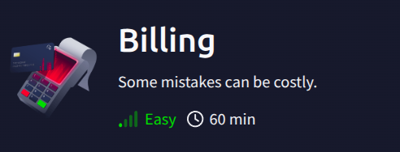
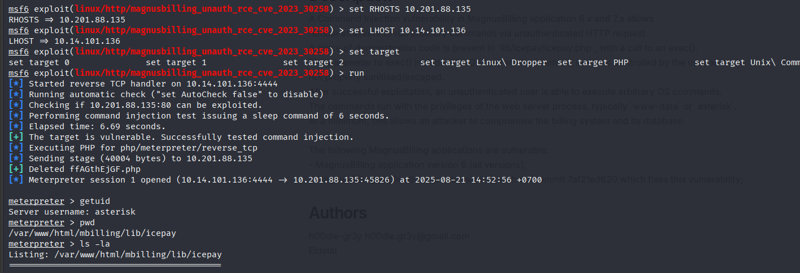
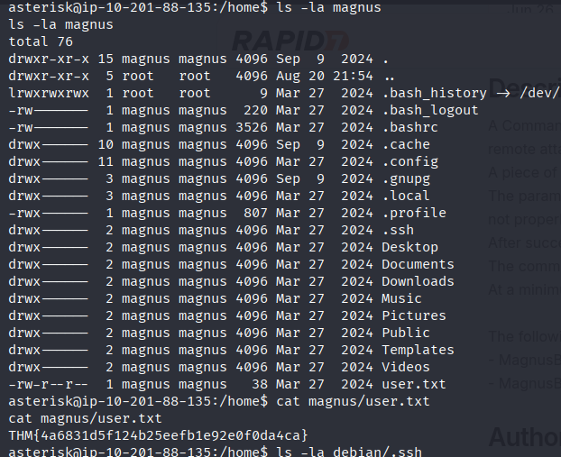
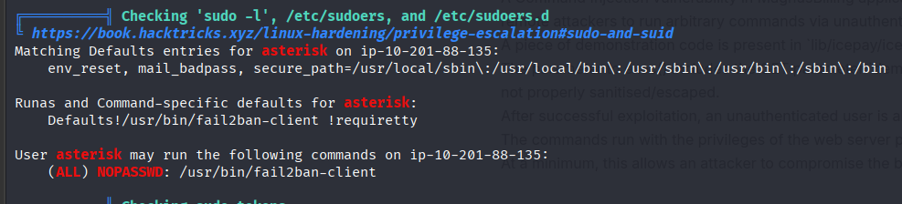
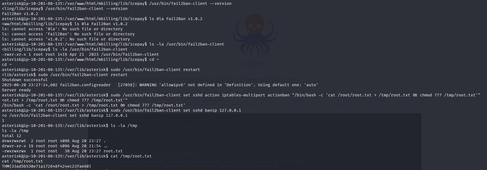

# TryHackMe Billing Writeup



## Overview
+ Web application testing.
+ Gain a shell, find the way and escalate your privileges! 


## Table of Contents
- [Enumeration & Recon](#enumeration)
- [Exploitation](#exploitation)
- [Privilege Escalation](#privilege-escalation)

## Enumeration & Recon

```
nmap -sS -A -vv -T4 -p- <IP>
PORT     STATE SERVICE  REASON         VERSION
22/tcp   open  ssh      syn-ack ttl 61 OpenSSH 9.2p1 Debian 2+deb12u6 (protocol 2.0)
80/tcp   open  http     syn-ack ttl 61 Apache httpd 2.4.62 ((Debian))
| http-methods: 
|_  Supported Methods: GET HEAD POST OPTIONS
| http-title:             MagnusBilling        
|_Requested resource was http://10.201.88.135/mbilling/
| http-robots.txt: 1 disallowed entry 
|_/mbilling/
|_http-server-header: Apache/2.4.62 (Debian)
3306/tcp open  mysql    syn-ack ttl 61 MariaDB 10.3.23 or earlier (unauthorized)
5038/tcp open  asterisk syn-ack ttl 61 Asterisk Call Manager 2.10.6
```

```
gobuster dir -u http://target/mbilling -w /usr/share/wordlists/dirb/common.txt -xtxt,php,html,js -t30
/archive              (Status: 301) [Size: 325] [--> http://10.201.88.135/mbilling/archive/]
/assets               (Status: 301) [Size: 324] [--> http://10.201.88.135/mbilling/assets/]
/cron.php             (Status: 200) [Size: 0]
/development.log      (Status: 403) [Size: 278]
/fpdf                 (Status: 301) [Size: 322] [--> http://10.201.88.135/mbilling/fpdf/]
/icons.js             (Status: 200) [Size: 475]
/index.html           (Status: 200) [Size: 30760]
/lib                  (Status: 301) [Size: 321] [--> http://10.201.88.135/mbilling/lib/]
/LICENSE              (Status: 200) [Size: 7652]
/locale.js            (Status: 200) [Size: 1772]
/production.log       (Status: 403) [Size: 278]
/protected            (Status: 403) [Size: 278]
/resources            (Status: 301) [Size: 327] [--> http://10.201.88.135/mbilling/resources/]
/spamlog.log          (Status: 403) [Size: 278]
/tmp                  (Status: 301) [Size: 321] [--> http://10.201.88.135/mbilling/tmp/]
```


## Exploitation

+ Research service `MagnusBilling`, we've discovered the service has `CVE-2023-30258` which we can run arbitrary commands via unauthenticated HTTP request in the directory `/lib/icepay/icepay.php`.
+ Reading more description: [Magnusbilling_unauth_rce_cve_2023_30258](https://www.rapid7.com/db/modules/exploit/linux/http/magnusbilling_unauth_rce_cve_2023_30258/).

+ Using `Metasploit` to run module exploit:



+ Get the flag:



## Privilege Escalation

+ Running command `sudo -l` or using tool `linpeas.sh` to check the potential vectors privilege:



+ We found the `fail2ban-client` can run sudo without password. Research the service to understand how to running and the flaws can make the `root`.

+ Resources to demonstrate the service and manipulate to privilege escalation:

    [Fail2ban-lpe](https://juggernaut-sec.com/fail2ban-lpe/)

    [Exploit Fail2ban-RCE-Privlige Escalation](https://sploitus.com/exploit?id=PACKETSTORM:189989)

+ Running Poc to privilege escalation:


---