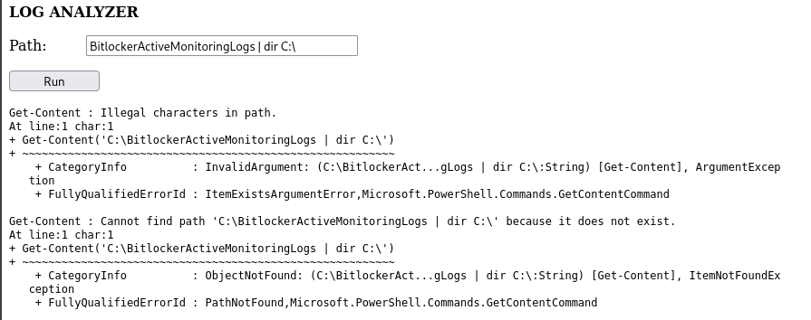
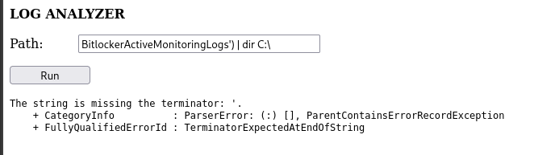
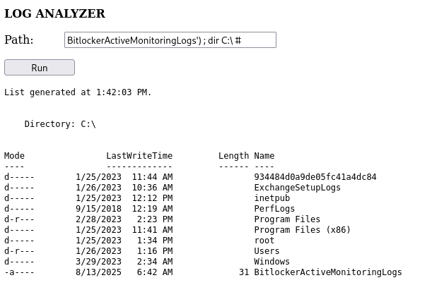
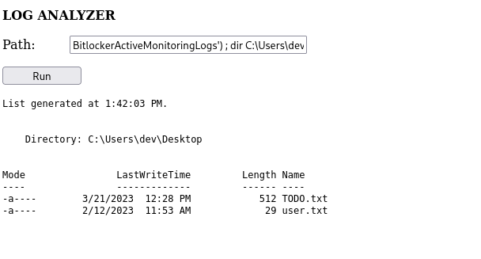
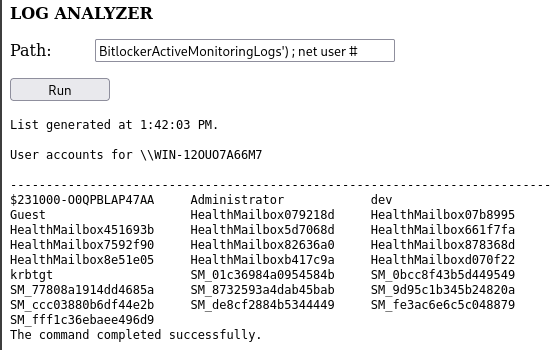
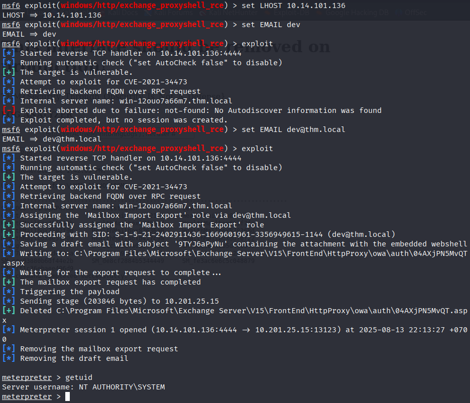
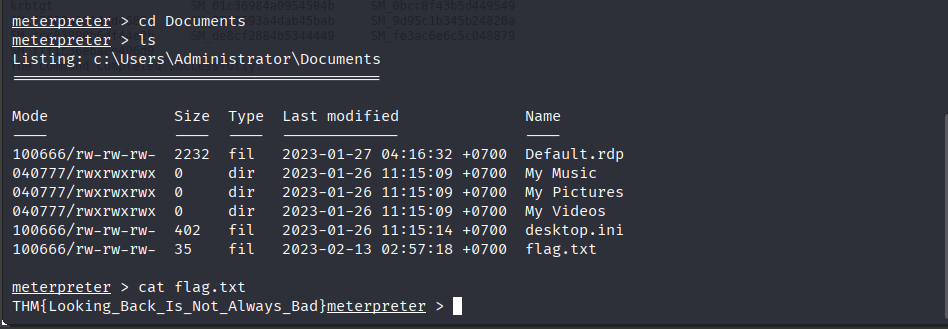

## LookBack Writeup


**Link: https://tryhackme.com/room/lookback**

### Recon:
+ Scan open ports with `Nmap`:
```
nmap -sS -A -vv -T4 -p- <IP>
PORT     STATE SERVICE       REASON          VERSION
80/tcp   open  http          syn-ack ttl 125 Microsoft IIS httpd 10.0
|_http-server-header: Microsoft-IIS/10.0
|_http-title: Site doesn't have a title.
443/tcp  open  ssl/https     syn-ack ttl 125
| ssl-cert: Subject: commonName=WIN-12OUO7A66M7
| Subject Alternative Name: DNS:WIN-12OUO7A66M7, DNS:WIN-12OUO7A66M7.thm.local
| Issuer: commonName=WIN-12OUO7A66M7
| Public Key type: rsa
| Public Key bits: 2048
| Signature Algorithm: sha1WithRSAEncryption
| Not valid before: 2023-01-25T21:34:02
| Not valid after:  2028-01-25T21:34:02
| http-methods: 
|_  Supported Methods: GET HEAD POST
| http-title: Outlook
|_Requested resource was https://10.201.25.15/owa/auth/logon.aspx?url=https%3a%2f%2f10.201.25.15%2fowa%2f&reason=0
3389/tcp open  ms-wbt-server syn-ack ttl 125 Microsoft Terminal Services
| ssl-cert: Subject: commonName=WIN-12OUO7A66M7.thm.local
| Issuer: commonName=WIN-12OUO7A66M7.thm.local
| Public Key type: rsa
| Public Key bits: 2048
| Signature Algorithm: sha256WithRSAEncryption
| Not valid before: 2025-08-12T13:39:39
| Not valid after:  2026-02-11T13:39:39
| rdp-ntlm-info: 
|   Target_Name: THM
|   NetBIOS_Domain_Name: THM
|   NetBIOS_Computer_Name: WIN-12OUO7A66M7
|   DNS_Domain_Name: thm.local
|   DNS_Computer_Name: WIN-12OUO7A66M7.thm.local
|   DNS_Tree_Name: thm.local
|   Product_Version: 10.0.17763
|_  System_Time: 2025-08-13T14:06:17+00:00
```

+ Access port `80`:


--> Nothing but we get something information. Target has `IIS server` and run OS `Windows`

+ Next with port `443`, we redirect to webmail `Outlook`:


+ Try default credential THM\admin but get the error:


--> We get the `OWA-Version:15.2.858.2`

+ Research Outlook Webmail 15.2.858.2, we've found the potential vulnerability [Microsoft Exchange ProxyShell RCE](https://www.rapid7.com/db/modules/exploit/windows/http/exchange_proxyshell_rce/). 

+ We can use `Metasploit` to exploit:


--> The target is vulnerable but we can't exploit because of missing `valid email addresses` so we keep it and back to the website to find the valid email.

### First Flag:
+ Now we can't use `gobuster` or `dirb` to enumerate directories so we will use `Ffuf` to fuzz the hidden directories.
+ But first we run `Nikto` to scan the potential vulnerabilities of target maybe we will have usefull information.


--> We have the /Rpc and account `ID:admin,PW:admin`.


--> Login successfull but nothing happen next !

+ Now we use `Ffuf` to fuzz the hidden directories, we will fuzz 2 ports 80(http) and 443(https):


--> Hidden directory `/test`.

+ Access port 80 with /test we will forbidden so we switch to port 443:


+ Sign in successfull and get the first flag !


### Second Flag:

+ We just read the permission file, can't use command in `Path`. Try some special characters to run command:



--> The vulnerability `Command Injection`. We need to find the way to bypass filter.

+ Try first with `'`:

 

--> `Missing closing ')' in expression`. 

+ Combine `' ) |` to test again



--> `Missing the terminator`.

+ We can use some terminator like `| ; & $ > < ' \ ! >> # `:


--> So close !!! but we have the problem with `pipeline` so we change from `|` to `;`



--> Successfull !!!

***Note: We can read more document Command Injection in here [Command Injection](https://owasp.org/www-project-web-security-testing-guide/stable/4-Web_Application_Security_Testing/07-Input_Validation_Testing/12-Testing_for_Command_Injection.html)***

+ Get second Flag:



### Final Flag:

+ Check user account in the Windows:



--> We can guess `valid email` is `dev@thm.local`.

+ Back to `Metasploit` and run again with email `dev`:



--> Exploit !!!

+ Get the final flag:


