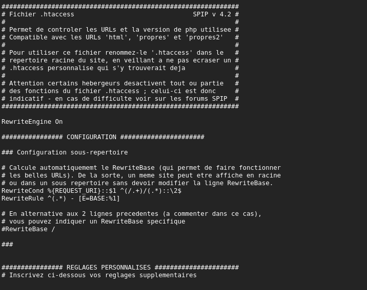
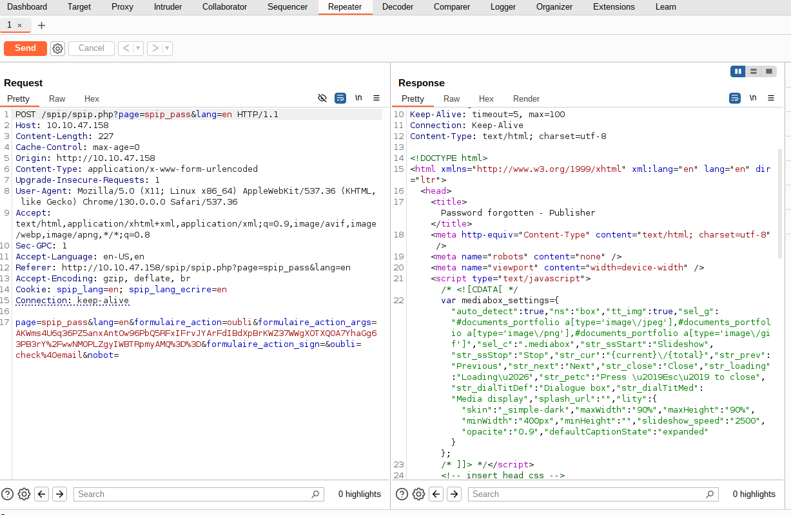
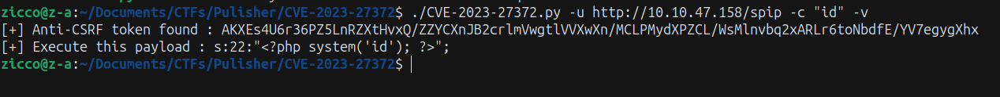
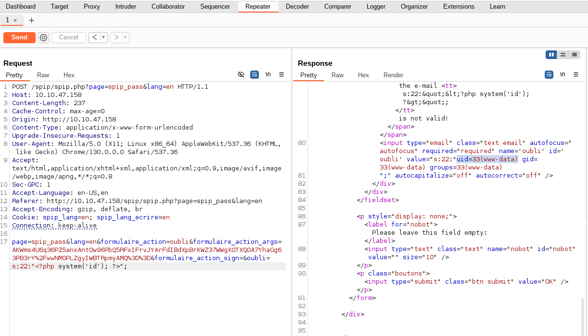
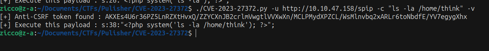
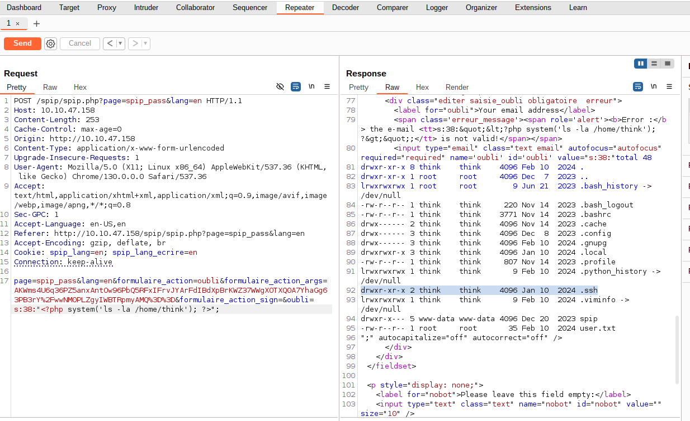
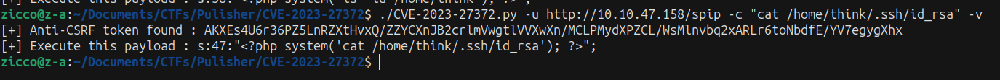
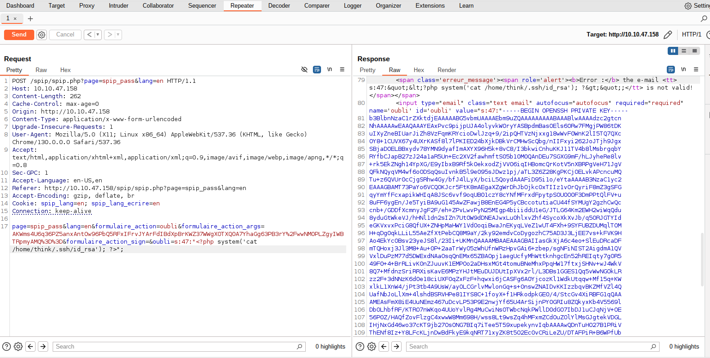
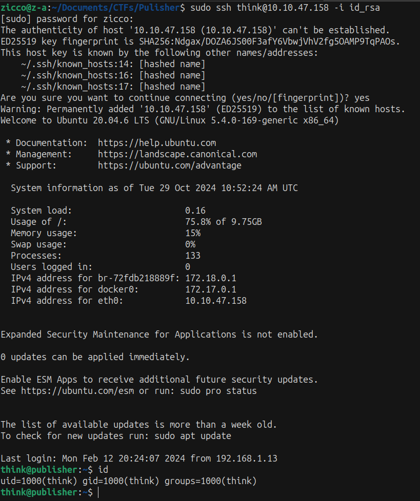

Difficult: Easy
----------------------------------------------

Note: Test your enumeration skills on this boot-to-root machine.
Link: "https://tryhackme.com/r/room/publisher"

##
RECON:

+ Scan the machine with Nmap and Gobuster:

```bash
nmap -sV -vv -A -p- -T4 <IP>
PORT   STATE SERVICE REASON         VERSION
22/tcp open  ssh     syn-ack ttl 63 OpenSSH 8.2p1 Ubuntu 4ubuntu0.10 (Ubuntu Linux; protocol 2.0)
| ssh-hostkey: 
|   3072 44:5f:26:67:4b:4a:91:9b:59:7a:95:59:c8:4c:2e:04 (RSA)
| ssh-rsa AAAAB3NzaC1yc2EAAAADAQABAAABgQDMc4hLykriw3nBOsKHJK1Y6eauB8OllfLLlztbB4tu4c9cO8qyOXSfZaCcb92uq/Y3u02PPHWq2yXOLPler1AFGVhuSfIpokEnT2jgQzKL63uJMZtoFzL3RW8DAzunrHhi/nQqo8sw7wDCiIN9s4PDrAXmP6YXQ5ekK30om9kd5jHG6xJ+/gIThU4ODr/pHAqr28bSpuHQdgphSjmeShDMg8wu8Kk/B0bL2oEvVxaNNWYWc1qHzdgjV5HPtq6z3MEsLYzSiwxcjDJ+EnL564tJqej6R69mjII1uHStkrmewzpiYTBRdgi9A3Yb+x8NxervECFhUR2MoR1zD+0UJbRA2v1LQaGg9oYnYXNq3Lc5c4aXz638wAUtLtw2SwTvPxDrlCmDVtUhQFDhyFOu9bSmPY0oGH5To8niazWcTsCZlx2tpQLhF/gS3jP/fVw+H6Eyz/yge3RYeyTv3ehV6vXHAGuQLvkqhT6QS21PLzvM7bCqmo1YIqHfT2DLi7jZxdk=
|   256 0a:4b:b9:b1:77:d2:48:79:fc:2f:8a:3d:64:3a:ad:94 (ECDSA)
| ecdsa-sha2-nistp256 AAAAE2VjZHNhLXNoYTItbmlzdHAyNTYAAAAIbmlzdHAyNTYAAABBBJNL/iO8JI5DrcvPDFlmqtX/lzemir7W+WegC7hpoYpkPES6q+0/p4B2CgDD0Xr1AgUmLkUhe2+mIJ9odtlWW30=
|   256 d3:3b:97:ea:54:bc:41:4d:03:39:f6:8f:ad:b6:a0:fb (ED25519)
|_ssh-ed25519 AAAAC3NzaC1lZDI1NTE5AAAAIFG/Wi4PUTjReEdk2K4aFMi8WzesipJ0bp0iI0FM8AfE
80/tcp open  http    syn-ack ttl 62 Apache httpd 2.4.41 ((Ubuntu))
|_http-title: Publisher's Pulse: SPIP Insights & Tips
| http-methods: 
|_  Supported Methods: HEAD GET POST OPTIONS
|_http-server-header: Apache/2.4.41 (Ubuntu)
```

```bash
gobuster dir -u http://<IP>/ -w /usr/share/wordlists/dirbuster/directory-list-2.3-small.txt -xtxt -t64
===============================================================
Starting gobuster in directory enumeration mode
===============================================================
/images               (Status: 301) [Size: 313] [--> http://<IP>/images/]
/spip                 (Status: 301) [Size: 311] [--> http://<IP>/spip/]
/index.html           (Status: 200) [Size: 8686]
```
--> Access /spip/ and scan directories again.


```bash
gobuster dir -u http://<IP>/spip/ -w /usr/share/wordlists/dirbuster/directory-list-2.3-small.txt -xtxt -t64
===============================================================
Starting gobuster in directory enumeration mode
===============================================================
/local                (Status: 301) [Size: 317] [--> http://<IP>/spip/local/]
/vendor               (Status: 301) [Size: 318] [--> http://<IP>/spip/vendor/]
/config               (Status: 301) [Size: 318] [--> http://<IP>/spip/config/]
/tmp                  (Status: 301) [Size: 315] [--> http://<IP>/spip/tmp/]
/LICENSE              (Status: 200) [Size: 35147]
/IMG                  (Status: 301) [Size: 315] [--> http://<IP>/spip/IMG/]
/htaccess.txt         (Status: 200) [Size: 4307]
/ecrire               (Status: 301) [Size: 318] [--> http://<IP>/spip/ecrire/]
/prive                (Status: 301) [Size: 317] [--> http://<IP>/spip/prive/]
```

+ We've seen the interested directory /htaccess.txt and access to find more information.



--> We've got the version application SPIP v 4.2

+ Research and we've known the vulnerability SPIP 4.2 that is CVE-2023-27372
+ Link: "https://github.com/nuts7/CVE-2023-27372?tab=readme-ov-file"

+ When we enter any emails into field "Your email address" in page spip_pass to reset password.
 Look at Burpsuite, we've had the POST request and the parameter "oubli" is the vulnerability.
 We can inject command into this to RCE.

  

+ We run script exploit CVE-2023-27372 to get the payload excuted and inject "oubli" to RCE.





--> We're in server 'www-data'.

+ List files in the directory to find some sensitive information





--> We've found the /.ssh and form this we are able to get the key id_rsa to login SSH.





--> We had the key id_rsa so now we will use it to login SSH.




