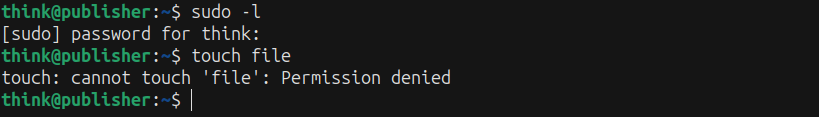
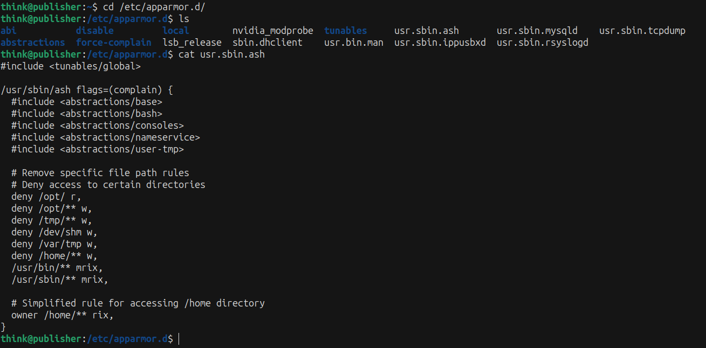
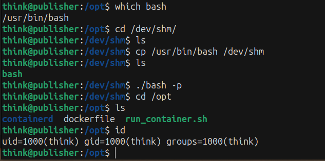
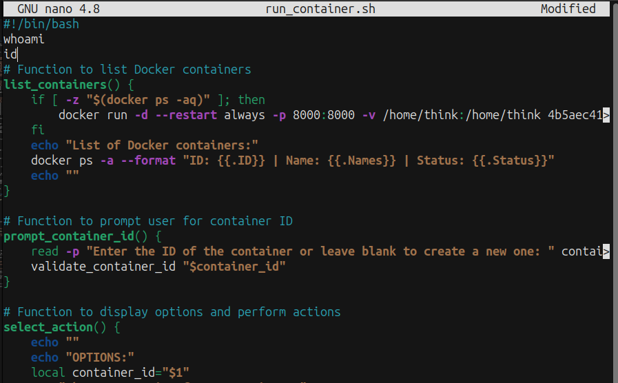
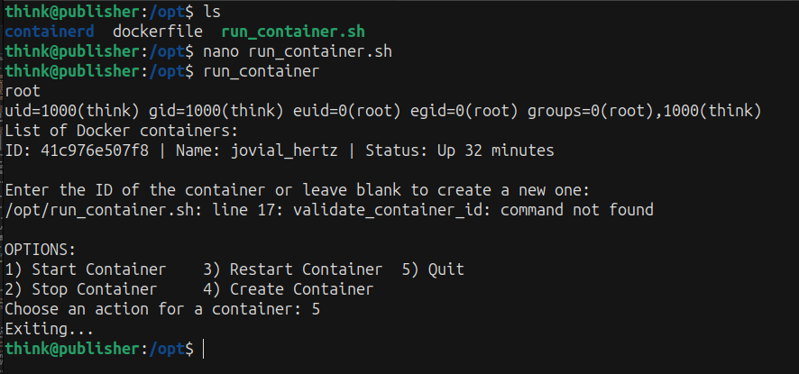
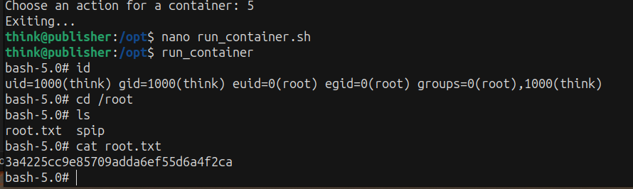

Difficult: Easy
----------------------------------------------

Note: Test your enumeration skills on this boot-to-root machine.
Link: "https://tryhackme.com/r/room/publisher"

##
RECON:

+ Scan the machine with Nmap and Gobuster:

```bash
nmap -sV -vv -A -p- -T4 <IP>
PORT   STATE SERVICE REASON         VERSION
22/tcp open  ssh     syn-ack ttl 63 OpenSSH 8.2p1 Ubuntu 4ubuntu0.10 (Ubuntu Linux; protocol 2.0)
| ssh-hostkey: 
|   3072 44:5f:26:67:4b:4a:91:9b:59:7a:95:59:c8:4c:2e:04 (RSA)
| ssh-rsa AAAAB3NzaC1yc2EAAAADAQABAAABgQDMc4hLykriw3nBOsKHJK1Y6eauB8OllfLLlztbB4tu4c9cO8qyOXSfZaCcb92uq/Y3u02PPHWq2yXOLPler1AFGVhuSfIpokEnT2jgQzKL63uJMZtoFzL3RW8DAzunrHhi/nQqo8sw7wDCiIN9s4PDrAXmP6YXQ5ekK30om9kd5jHG6xJ+/gIThU4ODr/pHAqr28bSpuHQdgphSjmeShDMg8wu8Kk/B0bL2oEvVxaNNWYWc1qHzdgjV5HPtq6z3MEsLYzSiwxcjDJ+EnL564tJqej6R69mjII1uHStkrmewzpiYTBRdgi9A3Yb+x8NxervECFhUR2MoR1zD+0UJbRA2v1LQaGg9oYnYXNq3Lc5c4aXz638wAUtLtw2SwTvPxDrlCmDVtUhQFDhyFOu9bSmPY0oGH5To8niazWcTsCZlx2tpQLhF/gS3jP/fVw+H6Eyz/yge3RYeyTv3ehV6vXHAGuQLvkqhT6QS21PLzvM7bCqmo1YIqHfT2DLi7jZxdk=
|   256 0a:4b:b9:b1:77:d2:48:79:fc:2f:8a:3d:64:3a:ad:94 (ECDSA)
| ecdsa-sha2-nistp256 AAAAE2VjZHNhLXNoYTItbmlzdHAyNTYAAAAIbmlzdHAyNTYAAABBBJNL/iO8JI5DrcvPDFlmqtX/lzemir7W+WegC7hpoYpkPES6q+0/p4B2CgDD0Xr1AgUmLkUhe2+mIJ9odtlWW30=
|   256 d3:3b:97:ea:54:bc:41:4d:03:39:f6:8f:ad:b6:a0:fb (ED25519)
|_ssh-ed25519 AAAAC3NzaC1lZDI1NTE5AAAAIFG/Wi4PUTjReEdk2K4aFMi8WzesipJ0bp0iI0FM8AfE
80/tcp open  http    syn-ack ttl 62 Apache httpd 2.4.41 ((Ubuntu))
|_http-title: Publisher's Pulse: SPIP Insights & Tips
| http-methods: 
|_  Supported Methods: HEAD GET POST OPTIONS
|_http-server-header: Apache/2.4.41 (Ubuntu)
```

```bash
gobuster dir -u http://<IP>/ -w /usr/share/wordlists/dirbuster/directory-list-2.3-small.txt -xtxt -t64
===============================================================
Starting gobuster in directory enumeration mode
===============================================================
/images               (Status: 301) [Size: 313] [--> http://<IP>/images/]
/spip                 (Status: 301) [Size: 311] [--> http://<IP>/spip/]
/index.html           (Status: 200) [Size: 8686]
```
--> Access /spip/ and scan directories again.


```bash
gobuster dir -u http://<IP>/spip/ -w /usr/share/wordlists/dirbuster/directory-list-2.3-small.txt -xtxt -t64
===============================================================
Starting gobuster in directory enumeration mode
===============================================================
/local                (Status: 301) [Size: 317] [--> http://<IP>/spip/local/]
/vendor               (Status: 301) [Size: 318] [--> http://<IP>/spip/vendor/]
/config               (Status: 301) [Size: 318] [--> http://<IP>/spip/config/]
/tmp                  (Status: 301) [Size: 315] [--> http://<IP>/spip/tmp/]
/LICENSE              (Status: 200) [Size: 35147]
/IMG                  (Status: 301) [Size: 315] [--> http://<IP>/spip/IMG/]
/htaccess.txt         (Status: 200) [Size: 4307]
/ecrire               (Status: 301) [Size: 318] [--> http://<IP>/spip/ecrire/]
/prive                (Status: 301) [Size: 317] [--> http://<IP>/spip/prive/]
```

+ We've seen the interested directory /htaccess.txt and access to find more information.


--> We've got the version application SPIP v 4.2

+ Research and we've known the vulnerability SPIP 4.2 that is CVE-2023-27372
+ Link: "https://github.com/nuts7/CVE-2023-27372?tab=readme-ov-file"

+ When we enter any emails into field "Your email address" in page spip_pass to reset password.
 Look at Burpsuite, we've had the POST request and the parameter "oubli" is the vulnerability.
 We can inject command into this to RCE.

  

+ We run script exploit CVE-2023-27372 to get the payload excuted and inject "oubli" to RCE.


--> We're in server 'www-data'.

+ List files in the directory to find some sensitive information


--> We've found the /.ssh and form this we are able to get the key id_rsa to login SSH.


--> We had the key id_rsa so now we will use it to login SSH.


## PRIVILEGE ESCALATION ##
+ First we can not run "sudo -l" because we don't know password user think.
+ We still can not create file because not permission.



+ See the hint and know the server has AppArmor protection.
+ Access /etc/apparmor.d/ to find more information which we need.
+ We've noticed file usr.sbin.ash and check it.



+ Not enough information so let find more.
+ Find SUID binary files:

```bash
think@publisher:/etc/apparmor.d$ find / -uid 0 -perm -4000 -type f 2>/dev/null
/usr/lib/policykit-1/polkit-agent-helper-1
/usr/lib/openssh/ssh-keysign
/usr/lib/eject/dmcrypt-get-device
/usr/lib/dbus-1.0/dbus-daemon-launch-helper
/usr/lib/xorg/Xorg.wrap
/usr/sbin/pppd
/usr/sbin/run_container
/usr/bin/fusermount
/usr/bin/gpasswd
/usr/bin/chfn
/usr/bin/sudo
/usr/bin/chsh
/usr/bin/passwd
/usr/bin/mount
/usr/bin/su
/usr/bin/newgrp
/usr/bin/pkexec
/usr/bin/umount
```
--> The potential SUID binary name "run_container".

+ Try to run "run_container":

```bash
think@publisher:/etc/apparmor.d$ run_container 
List of Docker containers:
ID: 41c976e507f8 | Name: jovial_hertz | Status: Up 35 minutes

Enter the ID of the container or leave blank to create a new one: 
/opt/run_container.sh: line 16: validate_container_id: command not found

OPTIONS:
1) Start Container
2) Stop Container
3) Restart Container
4) Create Container
5) Quit
Choose an action for a container: 5
Exiting...
```
--> When we run container, it will start Docker list. We found the potential file /opt/run_container.sh

+ We can read file /opt/run_container.sh but can not access /opt so we can not be writable permission file run_container.sh
+ Because we are limited permission so we can not create or copy file into /tmp, /home, or some directories.

--> We need to spawn full interactive shell. We can use bash to spawn new shell.

```bash
think@publisher:/etc/apparmor.d$ which bash
/usr/bin/bash
think@publisher:/etc/apparmor.d$ /usr/bin/bash -p
think@publisher:/etc/apparmor.d$ cd /opt
think@publisher:/opt$ ls
ls: cannot open directory '.': Permission denied
```
--> Still not working. Now we look back previous file usr.sbin.ash, after research we've known about ash "This is an AppArmor profile for the ash shell, which is a lightweight alternative to the Bash shell".
We can realize that some directories were be denied to access with ash shell.

+ We've seen /dev/shm was denied writable permission but with include <abstractions/base> and <abstractions/consoles> that still provides permissions for accessing a process like /dev.
+ We access /dev/shm and try to create file and it's worked so it still has permission to copy file.
+ We have idea that we will copy file bash into /dev/shm to spawn full interactive shell.



--> After have full interactive shell, we are able to access and have writable permission file run_container.sh in /opt.

+ Now we can add some command into run_container.sh





+ Write "/bin/bash -p" in run_container.sh and run gain to spawn shell



END!!!