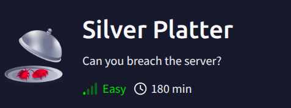
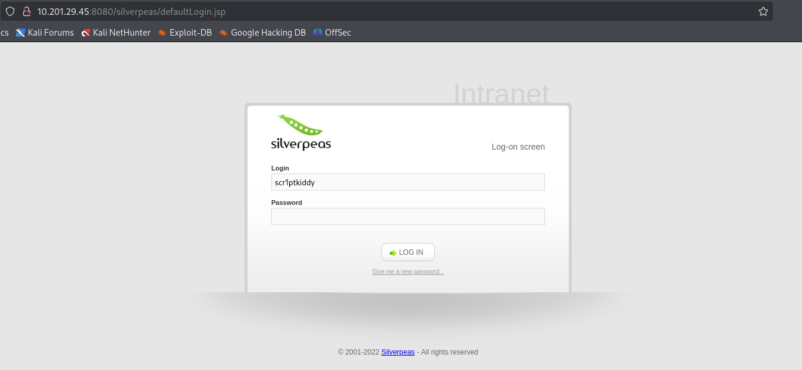
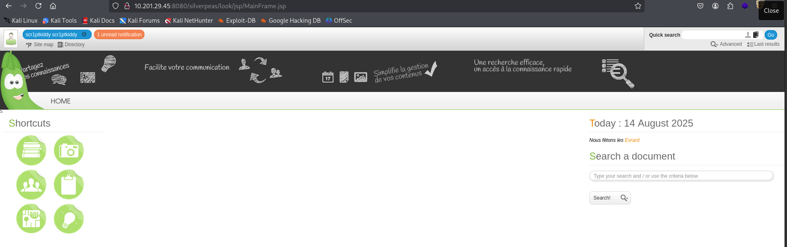

## Silver Platter WriteUp


**Link:https://tryhackme.com/room/silverplatter**

### Recon:
+ Scan open Ports with `Nmap`:
```
nmap -sS -A -vv -p- -T4 <IP>
PORT     STATE SERVICE    REASON         VERSION
22/tcp   open  ssh        syn-ack ttl 61 OpenSSH 8.9p1 Ubuntu 3ubuntu0.4 (Ubuntu Linux; protocol 2.0)
80/tcp   open  http       syn-ack ttl 61 nginx 1.18.0 (Ubuntu)
| http-methods: 
|_  Supported Methods: GET HEAD
|_http-title: Hack Smarter Security
|_http-server-header: nginx/1.18.0 (Ubuntu)
8080/tcp open  http-proxy syn-ack ttl 60
|_http-title: Error
| fingerprint-strings: 
|   FourOhFourRequest: 
|     HTTP/1.1 404 Not Found
|     Connection: close
|     Content-Length: 74
|     Content-Type: text/html
|     Date: Thu, 14 Aug 2025 07:33:43 GMT
|     <html><head><title>Error</title></head><body>404 - Not Found</body></html>
|   GenericLines, Help, Kerberos, LDAPSearchReq, LPDString, RTSPRequest, SMBProgNeg, SSLSessionReq, Socks5, TLSSessionReq, TerminalServerCookie: 
|     HTTP/1.1 400 Bad Request
|     Content-Length: 0
|     Connection: close
|   GetRequest: 
|     HTTP/1.1 404 Not Found
|     Connection: close
|     Content-Length: 74
|     Content-Type: text/html
|     Date: Thu, 14 Aug 2025 07:33:41 GMT
|     <html><head><title>Error</title></head><body>404 - Not Found</body></html>
|   HTTPOptions: 
|     HTTP/1.1 404 Not Found
|     Connection: close
|     Content-Length: 74
|     Content-Type: text/html
|     Date: Thu, 14 Aug 2025 07:33:42 GMT
|_    <html><head><title>Error</title></head><body>404 - Not Found</body></html>
Device type: general purpose
Running: Linux 4.X
OS CPE: cpe:/o:linux:linux_kernel:4.15
OS details: Linux 4.15
```

+ Enumerate hidden directories with `Gobuster` and `Ffuf`:

```
gobuster dir -u http://target/ -w /usr/share/wordlists/dirb/common.txt -xtxt,php,html,js -t35
/assets               (Status: 301) [Size: 178] [--> http://target/assets/]
/images               (Status: 301) [Size: 178] [--> http://target/images/]
/index.html           (Status: 200) [Size: 14124]
/index.html           (Status: 200) [Size: 14124]
/LICENSE.txt          (Status: 200) [Size: 17128]
/README.txt           (Status: 200) [Size: 771]
Progress: 23070 / 23075 (99.98%)
```

```
ffuf -w /usr/share/seclists/Discovery/Web-Content/raft-medium-directories.txt -u http://target:8080/FUZZ  -c
website                 [Status: 302, Size: 0, Words: 1, Lines: 1, Duration: 294ms]
console                 [Status: 302, Size: 0, Words: 1, Lines: 1, Duration: 322ms]
weblib                  [Status: 302, Size: 0, Words: 1, Lines: 1, Duration: 295ms]
:: Progress: [29999/29999] :: Job [1/1] :: 136 req/sec :: Duration: [0:03:46] :: Errors: 1 ::
```

+ Try to access finding directories but nothing usefull, we back to enumerate information in the main page. See what the intersting finding.


+ In /#contact, we find the usefull info project manager `Silverpeas` and username `scr1ptkiddy`.

+ Try access with `/Silverpeas` or `/silverpeas`:



--> Redirect to login webpage `Silverpeas`. 
+ Research Silverpeas, we find the vulnerability [CVE-2024-36042](https://gist.github.com/ChrisPritchard/4b6d5c70d9329ef116266a6c238dcb2d) (Silverpeas CRM - Authentication Bypass).


+ Login successfull !!!



+ Enumerate all around the webpage to find potential information.


+ Find the webpage has user `Administrateur` and email `silveradmin@localhost`.
+ Base on the previous report CVE, we know the default username Administrator is `SilverAdmin`.
+ Back to login and Login with user Administrator:


### Access inital & Get first flag:

+ Enumurate all the features and find the leak credential:


