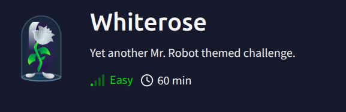
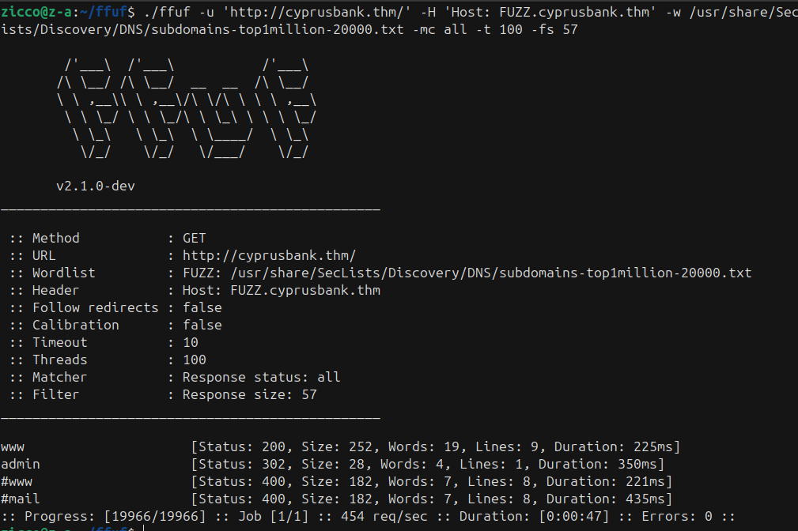
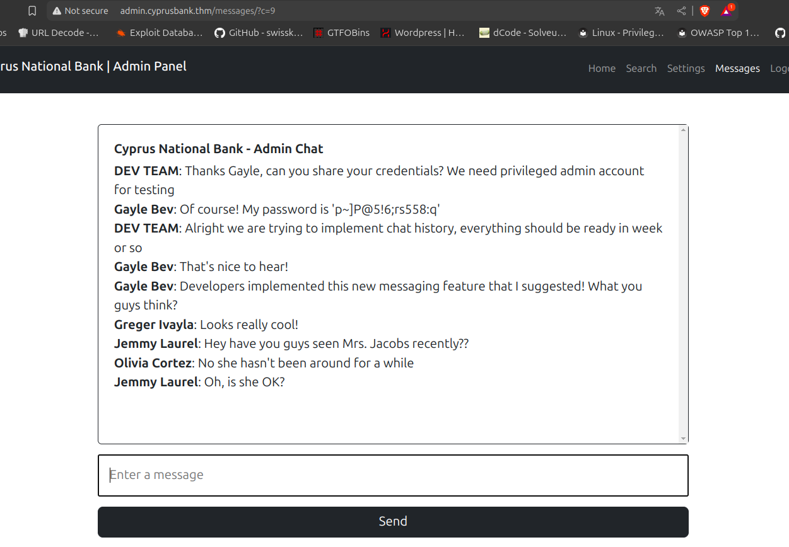
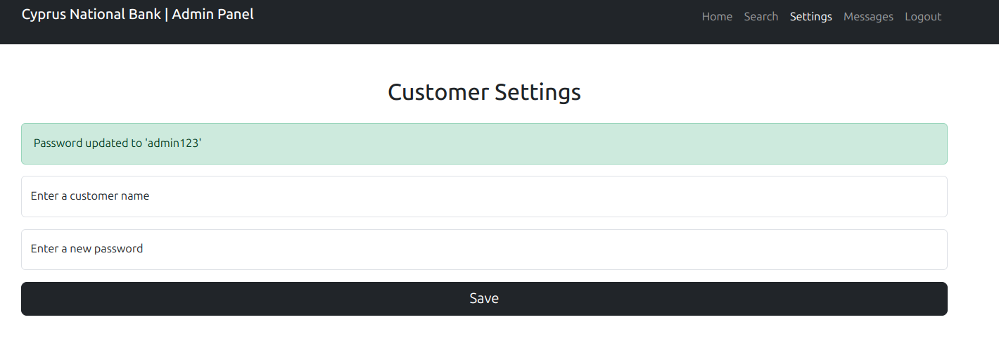
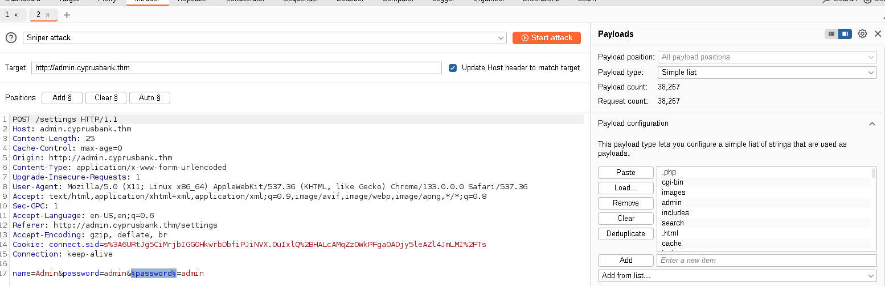
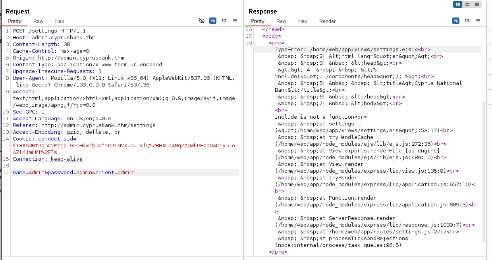
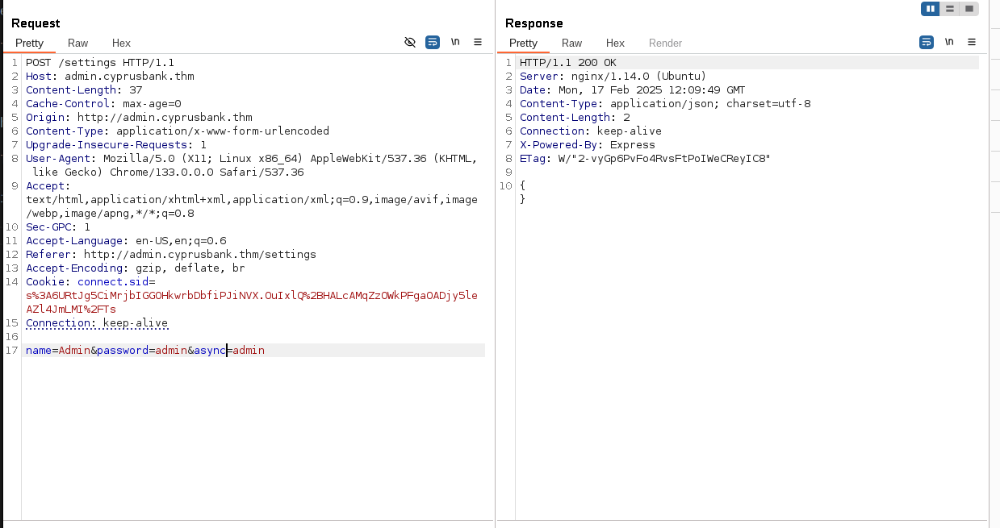

### Link: https://tryhackme.com/room/whiterose
--------------------------------------------------------------------
### Recon:
```bash
$nmap -sV -vv -A -T4 -p- <IP>
PORT   STATE SERVICE REASON         VERSION
22/tcp open  ssh     syn-ack ttl 63 OpenSSH 7.6p1 Ubuntu 4ubuntu0.7 (Ubuntu Linux; protocol 2.0)
| ssh-hostkey: 
|   2048 b9:07:96:0d:c4:b6:0c:d6:22:1a:e4:6c:8e:ac:6f:7d (RSA)
| ssh-rsa AAAAB3NzaC1yc2EAAAADAQABAAABAQCddbej9ZSf75uuDvLDeym5AYM+loP/3W862HTWjmksh0UuiuIz8UNTrf3ZpgtBej4y3E3EKvOmYFvJHZpFRV/hQBq1oZB3+XXVzb5RovazcnMgvFxI4y5nCQM8qTW09YvBOpzTyYmsKjVRJOfLR+F87g90vNdZ/u8uVl7IH0B6NmhGlCjPMVLRmhz7PuZih38t0WRWPruEY5qGliW0M3ngZXL6MmL1Jo146HtM8GASdt6yV9U3GLa3/OMFVjYgysqUQPrMwvUrQ8tIDnRAH1rsKBxDFotvcfW6mJ1OvojQf8PEw7iI/PNJZWGzkg+bm4/k+6PRjO2v/0V98DlU+gnn
|   256 ba:ff:92:3e:0f:03:7e:da:30:ca:e3:52:8d:47:d9:6c (ECDSA)
| ecdsa-sha2-nistp256 AAAAE2VjZHNhLXNoYTItbmlzdHAyNTYAAAAIbmlzdHAyNTYAAABBBNMBr/zXjVQItMqdVH12/sZ3rIt2XFsPWRCy4bXCE7InUVg8Q9SVFkOW2LAi1UStP4A4W8yA8hW+1wJaEFP9ffs=
|   256 5d:e4:14:39:ca:06:17:47:93:53:86:de:2b:77:09:7d (ED25519)
|_ssh-ed25519 AAAAC3NzaC1lZDI1NTE5AAAAIIdJAkvDVqEAbac77yxYfkM0AU8puWxCyqCBJ9Pd9zCi
80/tcp open  http    syn-ack ttl 63 nginx 1.14.0 (Ubuntu)
|_http-title: Site doesn't have a title (text/html; charset=utf-8).
|_http-server-header: nginx/1.14.0 (Ubuntu)
| http-methods: 
|_  Supported Methods: GET HEAD
```

+ When access <IP> the first, we can't access the website so we need to add <IP> and domain `cyprusbank.thm` into `/etc/hosts`.
+ Now we can access domain `cyprusbank.thm` and go to enumerate directories but get nothing special.
+ So idea now is finding subdomain of `cyprusbank.thm`. We use tool `ffuf` to fuzz the subdomain:



--> We've found the subdomain `admin.cyprusbank.thm`.

***Note***: When find out the subdomain we need to add it into `/etc/hosts`.

+ Access subdomain `admin.cyprusbank.thm` and use the credential `Olivia Cortez:olivi8` to Login.
+ Login successfully we will review all features of website `Cyprus National Bank | Admin Panel`. 
+ In the feature `Messages`, we find the potential parameter `c`. We can change value of parameter to see the sensitive information:



--> We've found the vulnearbility IDOR.

+ Now we've had the credential which have privileged admin account `Gayle Bev:p~]P@5!6;rs558:q`.
+ Login again with new credential and we've found the Tyrell Wellick's phone number.
+ When we use account `Olivia Cortex` we can not access the feature `Settings` because just admin account can access. Now using account `Gayle Bev` with admin privileged
we can go `Settings`.
+ Using `Customer Settings`:



--> We've found something is weird that is the notification "Password updated to 'admin123'". New Password is reflected, we try some vulnearbility like XSS, SQLi but nothing's happened.

+ We add more parameter and use BurpSuite to fuzz the parameter. Seeing what happen next:



--> We've found some potential parameter `async`, `client`,`error`,`include`,`password` and `message`.

+ Checking `client` and `include` we get the error:



+ With `async`:




+ Research error and we get the discussion: 
```
The error you're encountering is a common issue with EJS (Embedded JavaScript) templates. The "include is not a function" error typically occurs when the EJS include syntax is not correctly implemented or when there's a version mismatch between EJS and Express.
```

+ We've known the page is using EJS templates and we continue researching the available vulnearbility which can occurs in EJS templates.
+ After researching, we've known EJS has SSTI (Server-Side Template Injection) vulnerability. You have fixed some server-side template injection vulnerabilities recently, such as CVE-2022-29078, CVE-2023-29827.
+ Searching CVE-2022-29078, we found the Poc to exploit SSTI to RCE [here](https://eslam.io/posts/ejs-server-side-template-injection-rce/) 

