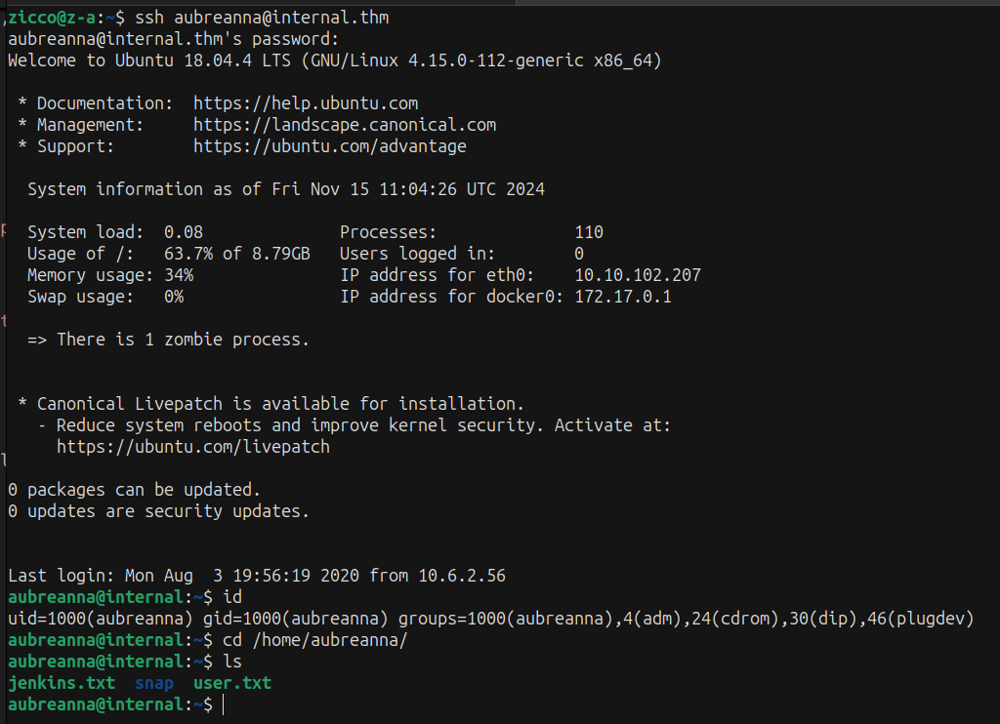

# Internal #
### Note: Having accepted the project, you are provided with the client assessment environment.  Secure the User and Root flags and submit them to the dashboard as proof of exploitation. ###



### https://tryhackme.com/r/room/internal ###

------------------------------------------------------------------------------------------

### RECON: ### 
+ Ensure that you modify your hosts file to reflect internal.thm

+ Scan the target machine with Nmap and Gobuster:

```bash

```