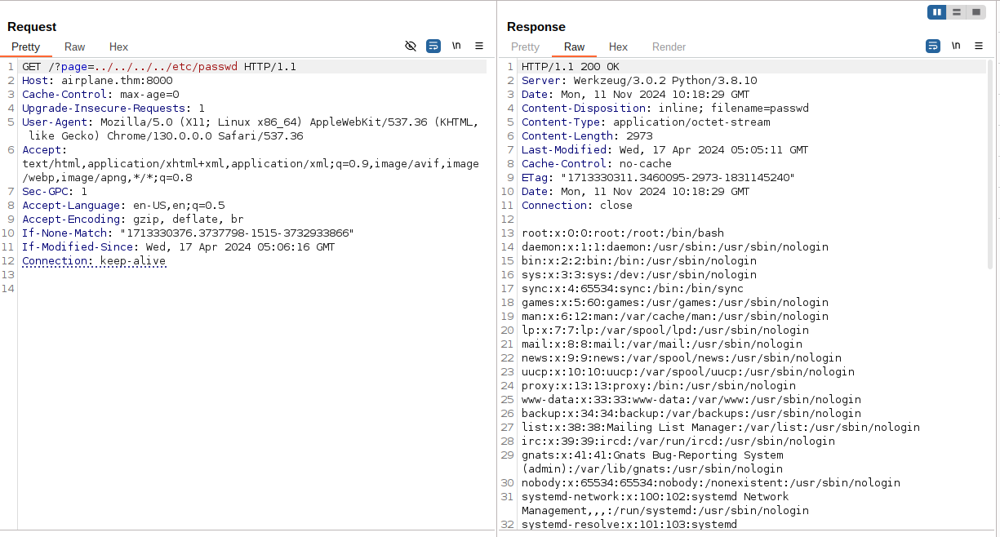
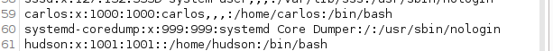
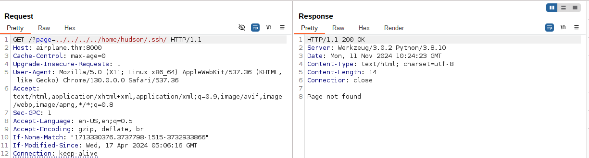
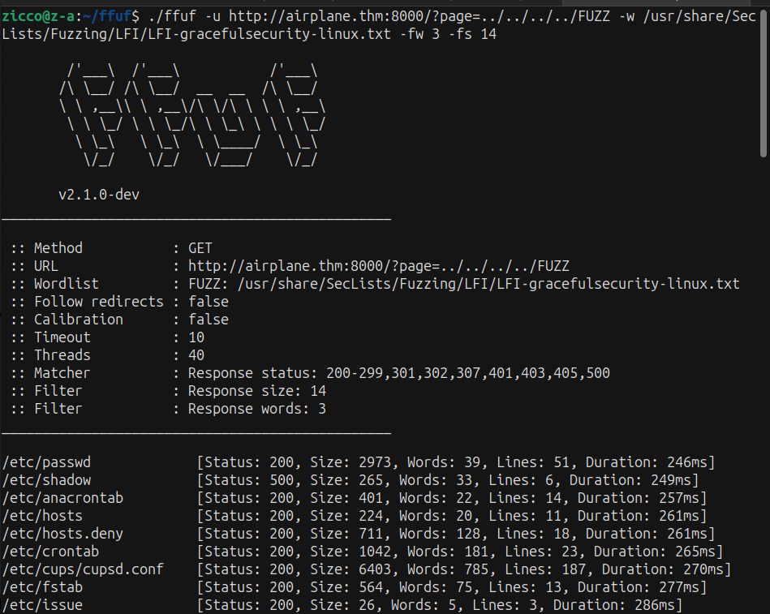
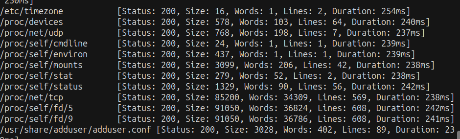
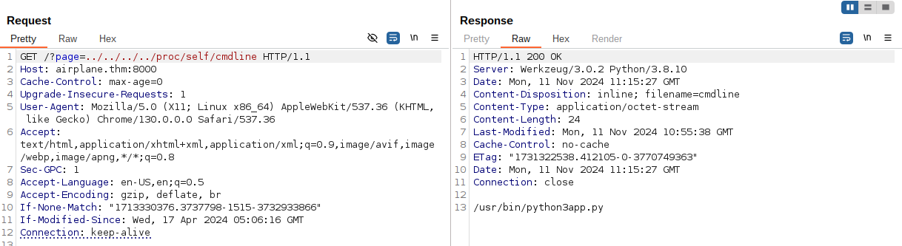
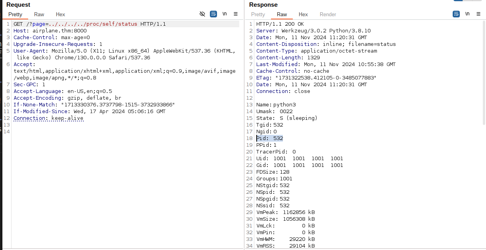
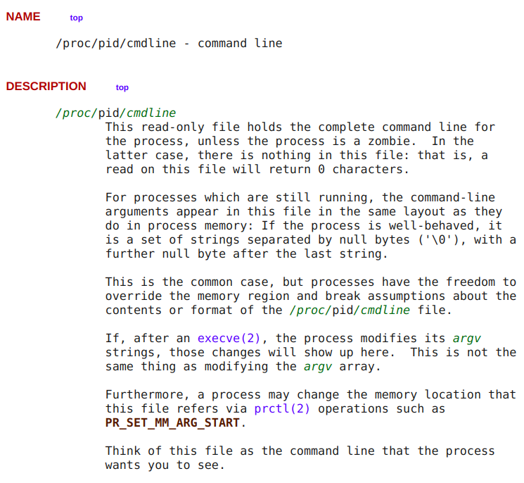

# -----AIR PLANE ROOM----- #
## Difficult: Medium

   

### Note: Are you ready to fly?

### https://tryhackme.com/r/room/airplane

--------------------------------------------
## RECON: ##

+ Scan the target machine with Nmap:

```bash
nmap -sV -vv -A -p- -T4 <IP>

```

+ After scan ports of IP target we've known the website port 8000 run with domain "airplane.thm" so we need add domain into /etc/hosts to run the website. Access again the <IP> or with domain "airplane.thm" with port 8000. 


+ Look at the url we can test the vuln LFI - Path Traversal:



+ We can access successfull /etc/passwd so we can see 2 users available carlos and hudson



--> We guess maybe there have file .ssh into /home 2 users so we can try access /home/user/.ssh/ but not success.



+ Now we can try to fuzz the directories which we can access by LFI. We will use wordlist /usr/share/SecLists/Fuzzing/LFI/LFI-gracefulsecurity-linux.txt to FUZZ.



--> We've noticed the directory /proc/



+ First we can try RCE /proc/self/environ:
https://github.com/swisskyrepo/PayloadsAllTheThings/tree/master/File%20Inclusion#lfi-to-rce-via-procselfenviron
  --> But not success!!!

+ We continue to access /proc/self/cmdline:



+ We've understand "self" is "$PID" so we can find $PID in /proc/self/status:



--> We have PID is 532.

+ We research /proc/$PID/cmdline:



--> We can FUZZ "$PID" to find more files fold the complete CL for the process.

+ We can create the number lists from 1-1000 to FUZZ PID.


