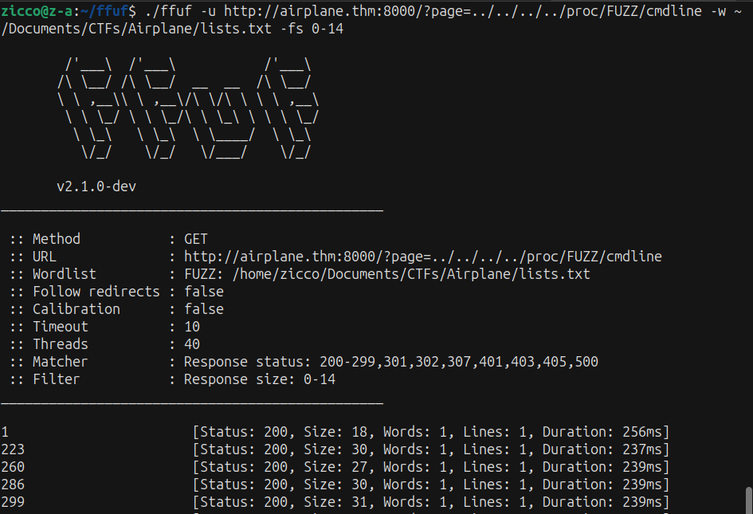
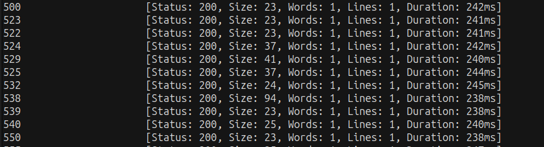
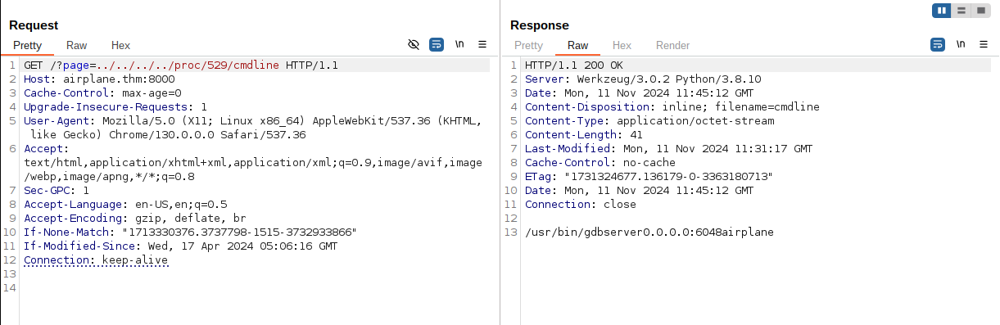

# -----AIR PLANE ROOM----- #
## Difficult: Medium

   

### Note: Are you ready to fly?

### https://tryhackme.com/r/room/airplane

--------------------------------------------
## RECON: ##

+ Scan the target machine with Nmap:

```bash
nmap -sV -vv -A -p- -T4 <IP>
PORT     STATE SERVICE  REASON         VERSION
22/tcp   open  ssh      syn-ack ttl 63 OpenSSH 8.2p1 Ubuntu 4ubuntu0.11 (Ubuntu Linux; protocol 2.0)
| ssh-hostkey: 
|   3072 b8:64:f7:a9:df:29:3a:b5:8a:58:ff:84:7c:1f:1a:b7 (RSA)
| ssh-rsa AAAAB3NzaC1yc2EAAAADAQABAAABgQCuy7X5e34bStIhDkjJIcUT3kqFt9fHoI/q8AaCCH6HqgOz2HC5GdcDiBN8W6JMoRIIDJO/9FHiFE+MNtESwOP9J+S348GOhUIsVhDux7caJiyJQElrKxXJgxA7DNUvVJNBUchhgGhFv/qCNbUYF8+uaTYc0o/HtvgVw+t/bxS6EO+OlAOpyAjUP5XZjGTyc4n4uCc8mYW6aQHXZR0t5lMaKkNJzXl5+kHxxxnKci6+Ao8vrlKshgIq25NErSqoeTs/wgBcPMkr5r++emLH+rDwmjrTvwrHb2/bKKUenvnbf9AZXbcN52nGthVi95kP6HaDGijXULjrRt2GCul99OmNhEQxJNtLmUnxpxA9ZhBEzMYe3z5EeIbLuA+E9yFSrR6nq2pagC2/qvVMJSAzD749AbwjtbcL8MOf+7DCT+SATY9VxBqtKep/9PDolKi5+prGH6gzfjCkj5YaFS2CvJeGlF/B1XBzd1ccm43Lc4Ad/F4kvQWwkHmpL38kDy4eWCE=
|   256 ad:61:3e:c7:10:32:aa:f1:f2:28:e2:de:cf:84:de:f0 (ECDSA)
| ecdsa-sha2-nistp256 AAAAE2VjZHNhLXNoYTItbmlzdHAyNTYAAAAIbmlzdHAyNTYAAABBBLYVoN15q7ky/IIo3VNrL35GRCpppImVs7x+PPFRlqO+VcfQ8C+MR2zVEFS0wosQWQFXaCZiInQhWz9swfKN6J8=
|   256 a9:d8:49:aa:ee:de:c4:48:32:e4:f1:9e:2a:8a:67:f0 (ED25519)
|_ssh-ed25519 AAAAC3NzaC1lZDI1NTE5AAAAIFIB0hj2IqNazZojgwv0jJr+ZnOF1RCzykZ7W3jKsuCb
6048/tcp open  x11?     syn-ack ttl 63
8000/tcp open  http-alt syn-ack ttl 63 Werkzeug/3.0.2 Python/3.8.10
| http-title: About Airplanes
|_Requested resource was http://airplane.thm:8000/?page=index.html
| http-methods: 
|_  Supported Methods: OPTIONS GET HEAD
|_http-server-header: Werkzeug/3.0.2 Python/3.8.10
| fingerprint-strings: 
|   FourOhFourRequest: 
|     HTTP/1.1 404 NOT FOUND
|     Server: Werkzeug/3.0.2 Python/3.8.10
|     Date: Mon, 11 Nov 2024 11:42:14 GMT
|     Content-Type: text/html; charset=utf-8
|     Content-Length: 207
|     Connection: close
|     <!doctype html>
|     <html lang=en>
|     <title>404 Not Found</title>
|     <h1>Not Found</h1>
|     <p>The requested URL was not found on the server. If you entered the URL manually please check your spelling and try again.</p>
|   GetRequest: 
|     HTTP/1.1 302 FOUND
|     Server: Werkzeug/3.0.2 Python/3.8.10
|     Date: Mon, 11 Nov 2024 11:42:08 GMT
|     Content-Type: text/html; charset=utf-8
|     Content-Length: 269
|     Location: http://airplane.thm:8000/?page=index.html
|     Connection: close
|     <!doctype html>
|     <html lang=en>
|     <title>Redirecting...</title>
|     <h1>Redirecting...</h1>
|     <p>You should be redirected automatically to the target URL: <a href="http://airplane.thm:8000/?page=index.html">http://airplane.thm:8000/?page=index.html</a>. If not, click the link.
|   Socks5: 
|     <!DOCTYPE HTML PUBLIC "-//W3C//DTD HTML 4.01//EN"
|     "http://www.w3.org/TR/html4/strict.dtd">
|     <html>
|     <head>
|     <meta http-equiv="Content-Type" content="text/html;charset=utf-8">
|     <title>Error response</title>
|     </head>
|     <body>
|     <h1>Error response</h1>
|     <p>Error code: 400</p>
|     <p>Message: Bad request syntax ('
|     ').</p>
|     <p>Error code explanation: HTTPStatus.BAD_REQUEST - Bad request syntax or unsupported method.</p>
|     </body>
|_    </html>
```

+ After scan ports of IP target we've known the website port 8000 run with domain "airplane.thm" so we need add domain into /etc/hosts to run the website. Access again the <IP> or with domain "airplane.thm" with port 8000. 


+ Look at the url we can test the vuln LFI - Path Traversal:


+ We can access successfull /etc/passwd so we can see 2 users available carlos and hudson


--> We guess maybe there have file .ssh into /home 2 users so we can try access /home/user/.ssh/ but not success.


+ Now we can try to fuzz the directories which we can access by LFI. We will use wordlist /usr/share/SecLists/Fuzzing/LFI/LFI-gracefulsecurity-linux.txt to FUZZ.


--> We've noticed the directory /proc/


+ First we can try RCE /proc/self/environ:
https://github.com/swisskyrepo/PayloadsAllTheThings/tree/master/File%20Inclusion#lfi-to-rce-via-procselfenviron
  --> But not success!!!

+ We continue to access /proc/self/cmdline:


+ We've understand "self" is "$PID" so we can find $PID in /proc/self/status:


--> We have PID is 532.

+ We research /proc/$PID/cmdline:


--> We can FUZZ "$PID" to find more files fold the complete CL for the process.

+ We can create the number lists from 1-1000 to FUZZ PID with command

```bash
seq 1 1000 > lists.txt
```

+ We start fuzzing with lists.txt:



+ We can check PIDs near PID 532:



+ After checking, we've found intesting information of PID 529:



+ Back when we scan the opened ports with Nmap, we've found the port 6048:

```bash
6048/tcp open  x11?     syn-ack ttl 63
```

--> First we did not know which server is port 6048 so now we've had the answer that is "gdbserver".

+ Researching "gdbserver" we can upload and execute revershell by GdbServer.
"https://book.hacktricks.xyz/network-services-pentesting/pentesting-remote-gdbserver#upload-and-execute".

+ 


