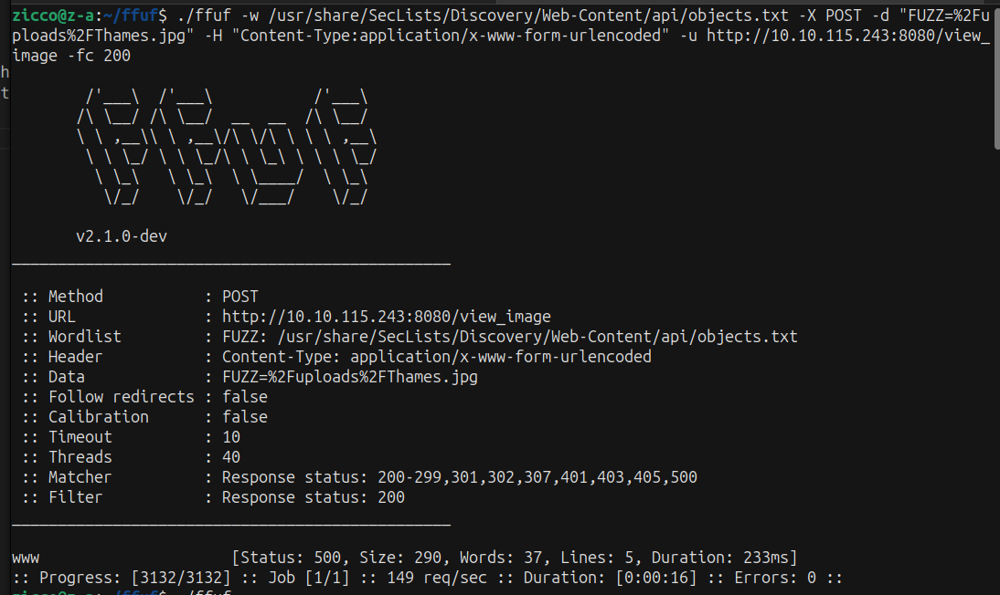
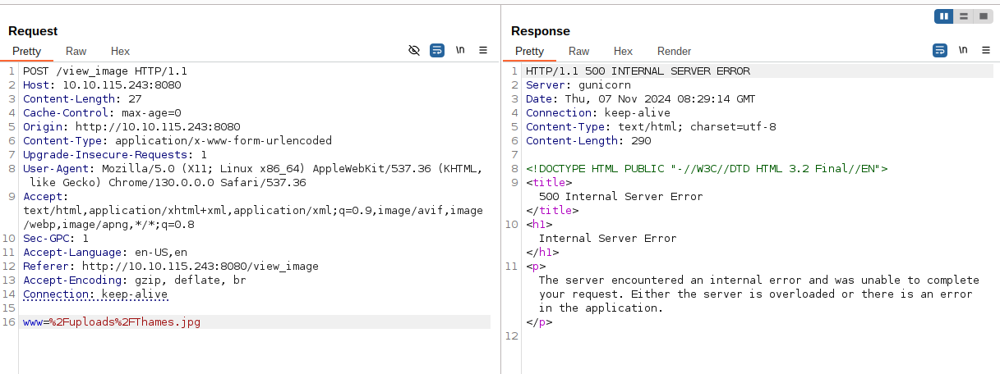
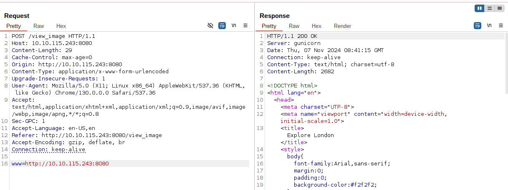
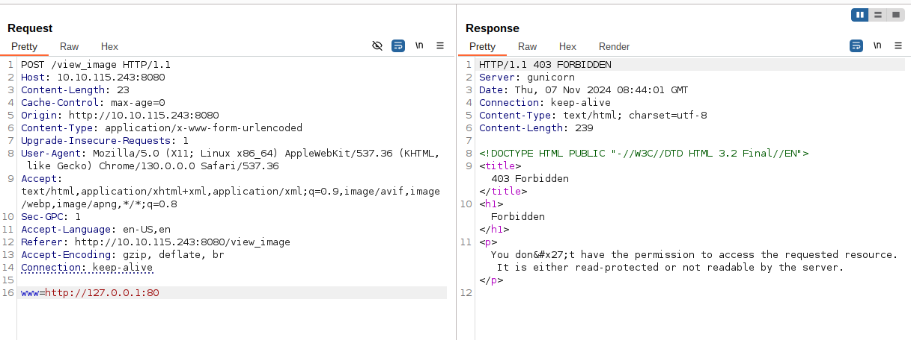
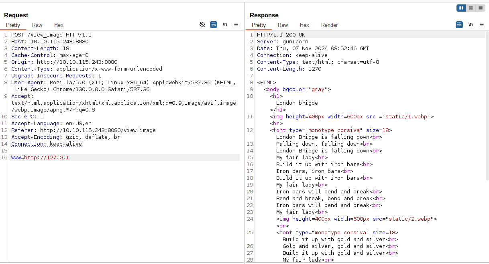
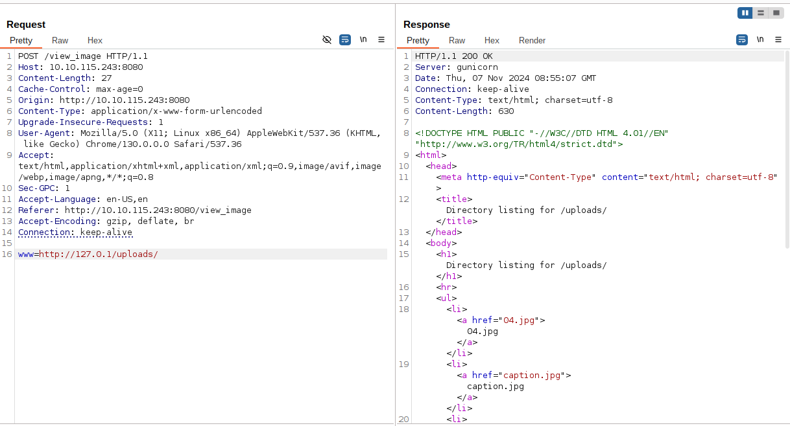
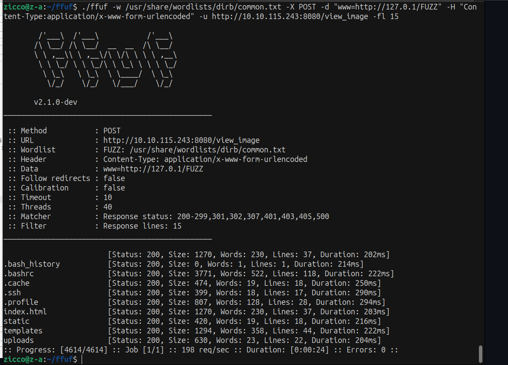
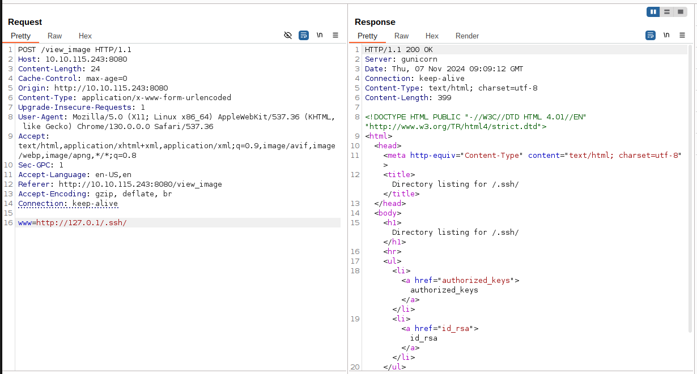
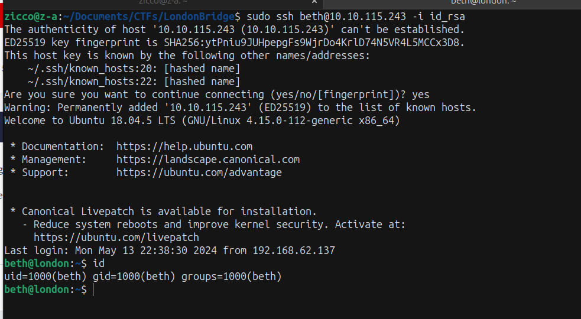

## Difficult: Medium ##
### Note: This is a classic boot2root CTF-style room. Make sure to get all the flags.
### Link: https://tryhackme.com/r/room/thelondonbridge
-------------------------------------------------------

### Recon: ###

+ Scan the machine with Nmap and Gobuster:

```bash
nmap -sV -vv -A -p- <IP>
PORT     STATE SERVICE    REASON         VERSION
22/tcp   open  ssh        syn-ack ttl 63 OpenSSH 7.6p1 Ubuntu 4ubuntu0.7 (Ubuntu Linux; protocol 2.0)
| ssh-hostkey: 
|   2048 58:c1:e4:79:ca:70:bc:3b:8d:b8:22:17:2f:62:1a:34 (RSA)
| ssh-rsa AAAAB3NzaC1yc2EAAAADAQABAAABAQDziNs6aSHIQOJFilv8PhCPd676iD1TrhMYe4p4Mj2E3yaAl4xb8DNT2dhpcv6H8EvtCJnAbXmnFTTOZy14fd7FKc2/Mr4MNLsINFpMU8hc85g6S9ZEnWKlU8dw5jUUeZnAbHSTnq6ARvEbT/Y5seiWEJ7IBiUqptlUA2eiOU7g0DFwrYH7n40aDe0m6PKPIfI9G0XO0cJHISeJ0bsSES1uun2WHLM0sRx+17hrBgM2YfD9OevcltVMlQqWasP9lqf2ooOdBvQTq4eH5UyyuEzaRtQwBYP/wWQEVFacejJE1iT2VD6ZAilhlzo9mww9vqTEwGTvatH65wiyCZHMvrSb
|   256 2a:b4:1f:2c:72:35:7a:c3:7a:5c:7d:47:d6:d0:73:c8 (ECDSA)
| ecdsa-sha2-nistp256 AAAAE2VjZHNhLXNoYTItbmlzdHAyNTYAAAAIbmlzdHAyNTYAAABBBJuZrGZxDIlI4pU1KNZ8A87cWFcgHxRSt7yFgBtJoUQMhNmcw8FSVC54b7sBYXCgBsgISZfWYPjBM9kikh8Jnkw=
|   256 1c:7e:d2:c9:dd:c2:e4:ac:11:7e:45:6a:2f:44:af:0f (ED25519)
|_ssh-ed25519 AAAAC3NzaC1lZDI1NTE5AAAAICkCeqFADY/YvhJyJabcs5DVTYbl/DEKEpBoluTuDdB1
8080/tcp open  http-proxy syn-ack ttl 63 gunicorn
|_http-title: Explore London
| http-methods: 
|_  Supported Methods: GET HEAD OPTIONS
|_http-server-header: gunicorn
| fingerprint-strings: 
|   GetRequest: 
|     HTTP/1.0 200 OK
|     Server: gunicorn
|     Date: Tue, 05 Nov 2024 09:59:06 GMT
|     Connection: close
|     Content-Type: text/html; charset=utf-8
|     Content-Length: 2682
|     <!DOCTYPE html>
|     <html lang="en">
|     <head>
|     <meta charset="UTF-8">
|     <meta name="viewport" content="width=device-width, initial-scale=1.0">
|     <title>Explore London</title>
|     <style>
|     body {
|     font-family: Arial, sans-serif;
|     margin: 0;
|     padding: 0;
|     background-color: #f2f2f2;
|     header {
|     background-color: #333;
|     color: #fff;
|     padding: 10px 20px;
|     text-align: center;
|     background-color: #444;
|     color: #fff;
|     padding: 10px 20px;
|     text-align: center;
|     color: #fff;
|     text-decoration: none;
|     margin: 0 10p
|   HTTPOptions: 
|     HTTP/1.0 200 OK
|     Server: gunicorn
|     Date: Tue, 05 Nov 2024 09:59:07 GMT
|     Connection: close
|     Content-Type: text/html; charset=utf-8
|     Allow: GET, HEAD, OPTIONS
|_    Content-Length: 0
```


```bash
gobuster dir -u <IP> -w /usr/share/wordlists/dirbuster/directory-list-2.3-small.txt -xtxt,php,html -t64
===============================================================
Starting gobuster in directory enumeration mode
===============================================================
/contact              (Status: 200) [Size: 1703]
/feedback             (Status: 405) [Size: 178]
/gallery              (Status: 200) [Size: 1722]
/upload               (Status: 405) [Size: 178]
/dejaview             (Status: 200) [Size: 823]
Progress: 350656 / 350660 (100.00%)
===============================================================
Finished
===============================================================
```

+ Access /dejaview we see the field "Enter Image URL:" --> Enter the path of directory has images /uploads/<Name of images> --> If right the Image, it will appear.


+ Using Burpsuite capture /dejaview and commbine with hint "Check for other parameters that may been left over during the development phase."
we guess the potential parameters is "image_url". Let try to fuzz it.



--> We have parameter "www" replace "image_url", we recive the Status 500 



--> We have the vuln SSRF - Sever Side Request Forgery in here.

### EXPLOIT SSRF: ###

+ We can use payloads in here to test with each case:
"https://github.com/swisskyrepo/PayloadsAllTheThings/tree/master/Server%20Side%20Request%20Forgery" 

+ First we test with this <IP-target>:



+ We have the return of the web page, we continue to test some payloads with localhost:



--> We have the message "don't have the permission".

+ After try some payloads, we will find out the right payloads which can work. We can short-hand IP addresses by dropping the zeros.
+ "https://github.com/swisskyrepo/PayloadsAllTheThings/tree/master/Server%20Side%20Request%20Forgery#bypass-using-rare-address"      



--> We recive the short of text describe "London Brigde".

+ Next we try to access /uploads 



--> We access successfully and can read file images.

+ Now we will continue fuzzing to find available directories we can access.
+ We can use same wordlists which we use to enumerate the directories previous.



--> We have the directories are extremely remarkable. We focus /.ssh/



+ Access .ssh, we found out the 2 items are useful. That are authorized keys and id_rsa, we can use both to login SSH.
+ Read each and tranfer them into the attack machine, we use both to login SSH.




### PRIVILEGE ESCALATION: ###

+ we use tool "linpeas.sh" to scan PE vector


