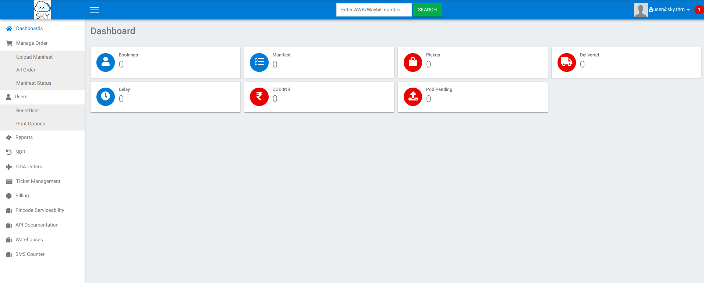
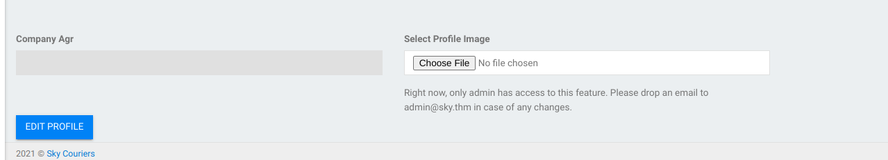
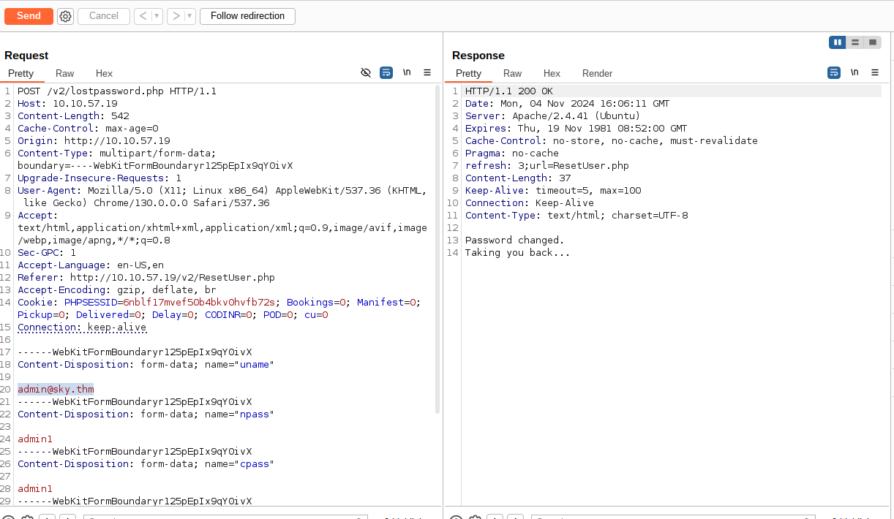
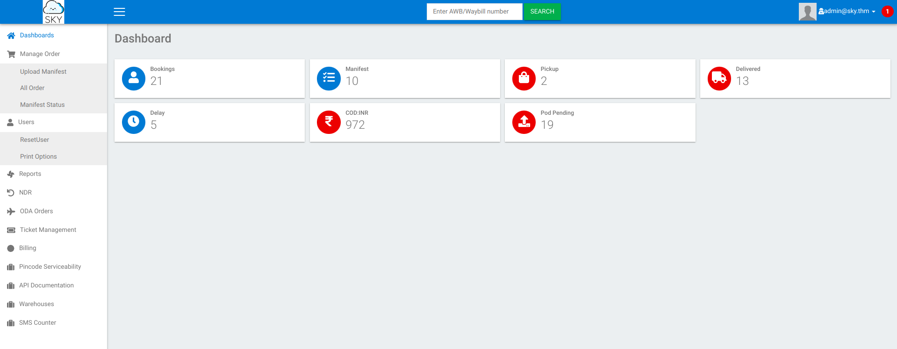
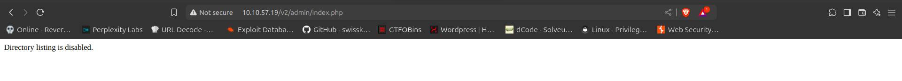
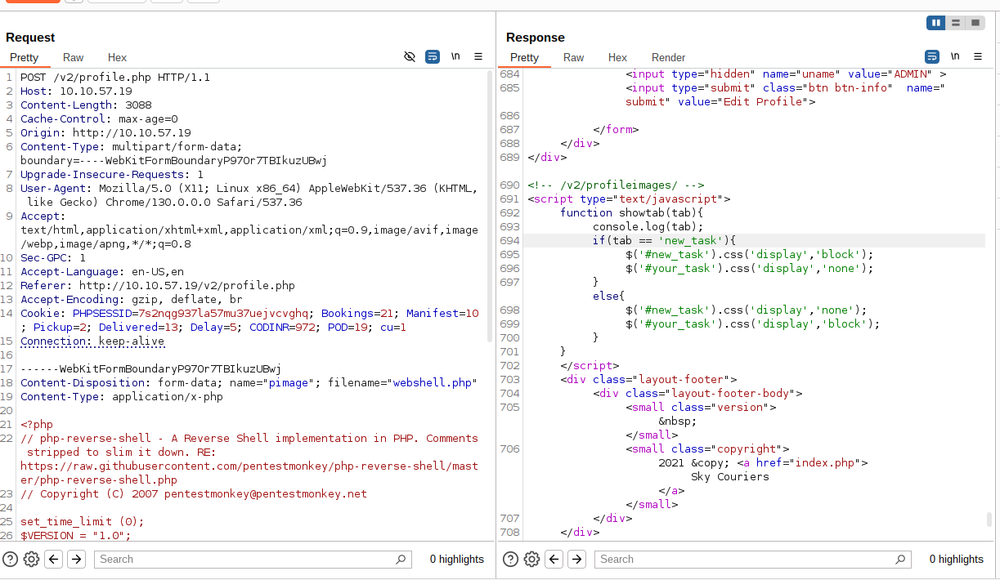
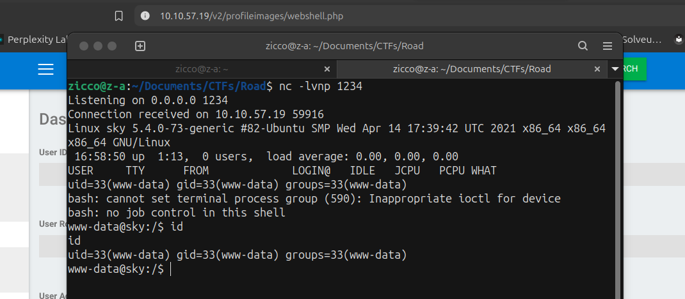

## Difficult: Medium 
### Note: Inspired by a real-world pentesting engagement
-------------------------------------------------------
### Link: https://tryhackme.com/r/room/road


## Reconnaissance:

+ Scan the machine with Nmap and Gobuster:

```bash
nmap -sV -vv -A -p- -T4 <IP>
PORT   STATE SERVICE REASON         VERSION
22/tcp open  ssh     syn-ack ttl 63 OpenSSH 8.2p1 Ubuntu 4ubuntu0.2 (Ubuntu Linux; protocol 2.0)
| ssh-hostkey: 
|   3072 e6:dc:88:69:de:a1:73:8e:84:5b:a1:3e:27:9f:07:24 (RSA)
| ssh-rsa AAAAB3NzaC1yc2EAAAADAQABAAABgQDXhjztNjrxAn+QfSDb6ugzjCwso/WiGgq/BGXMrbqex9u5Nu1CKWtv7xiQpO84MsC2li6UkIAhWSMO0F//9odK1aRpPbH97e1ogBENN6YBP0s2z27aMwKh5UMyrzo5R42an3r6K+1x8lfrmW8VOOrvR4pZg9Mo+XNR/YU88P3XWq22DNPJqwtB3q4Sw6M/nxxUjd01kcbjwd1d9G+nuDNraYkA2T/OTHfp/xbhet9K6ccFHoi+A8r6aL0GV/qqW2pm4NdfgwKxM73VQzyolkG/+DFkZc+RCH73dYLEfVjMjTbZTA+19Zd2hlPJVtay+vOZr1qJ9ZUDawU7rEJgJ4hHDqlVjxX9Yv9SfFsw+Y0iwBfb9IMmevI3osNG6+2bChAtI2nUJv0g87I31fCbU5+NF8VkaGLz/sZrj5xFvyrjOpRnJW3djQKhk/Avfs2wkZ+GiyxBOZLetSDFvTAARmqaRqW9sjHl7w4w1+pkJ+dkeRsvSQlqw+AFX0MqFxzDF7M=
|   256 6b:ea:18:5d:8d:c7:9e:9a:01:2c:dd:50:c5:f8:c8:05 (ECDSA)
| ecdsa-sha2-nistp256 AAAAE2VjZHNhLXNoYTItbmlzdHAyNTYAAAAIbmlzdHAyNTYAAABBBNBLTibnpRB37eKji7C50xC9ujq7UyiFQSHondvOZOF7fZHPDn3L+wgNXEQ0wei6gzQfiZJmjQ5vQ88vEmCZzBI=
|   256 ef:06:d7:e4:b1:65:15:6e:94:62:cc:dd:f0:8a:1a:24 (ED25519)
|_ssh-ed25519 AAAAC3NzaC1lZDI1NTE5AAAAIPv3g1IqvC7ol2xMww1gHLeYkyUIe8iKtEBXznpO25Ja
80/tcp open  http    syn-ack ttl 63 nginx 1.18.0 (Ubuntu)
|_http-favicon: Unknown favicon MD5: FB0AA7D49532DA9D0006BA5595806138
| http-methods: 
|_  Supported Methods: GET HEAD
|_http-title: Sky Couriers
|_http-server-header: nginx/1.18.0 (Ubuntu)
```

```bash
gobuster dir -u <IP> -w /usr/share/wordlists/dirb/common.txt -xtxt,php,html -t64
/assets               (Status: 301) [Size: 311] [--> http://<IP>/assets/]
/career.html          (Status: 200) [Size: 9289]
/phpMyAdmin           (Status: 301) [Size: 315] [--> http://<IP>/phpMyAdmin/]
/index.html           (Status: 200) [Size: 19607]
```

```bash
 gobuster dir -u <IP> -w /usr/share/wordlists/dirbuster/directory-list-2.3-medium.txt -xtxt,php,html -t64
/assets               (Status: 301) [Size: 311] [--> http://<IP>/assets/]
/v2                   (Status: 301) [Size: 307] [--> http://<IP>/v2/]
/career.html          (Status: 200) [Size: 9289]
```

+ Access /v2 --> we are redirected to /admin/login.html 
+ We register to login website, after register successfully we login again and access the web page:



+ Go through all features we can use, we've noticed in the /profile.php with edit profile and feature reset password user.



--> We have the information user admin@sky.thm 

+ Open BurpSuite to catch feature reset password, we can change user from user@sky.thm to admin@sky.thm and change the password of admin.
--> We found the vulnerability "Identification and Authentication Failures" relate reset password processes.  



--> After change password successfully, we are back /login.html and login user admin with new password.



+ Login admin successful, we are able to edit profile and access directory limited by admin.
+ Try to access page /assets we can not find supicious things. Continue with /admin we are disable to query with index.php



+ Back to /profile.php, we research more the Sky Couriers and find the Arbitrary File Upload Vulnerability relate "Courier Management System"
+ Link: "https://github.com/zerrr0/Zerrr0_Vulnerability/blob/main/Best%20Courier%20Management%20System%201.0/Arbitrary-File-Upload-Vulnerability.md#best-courier-management-system-10---arbitrary-file-upload-vulnerability"

+ We manipulate feature Upload Profile Image into /profile.php to put the webshell and open the listen port.

 

+ After upload and edit profile successfully, we go to /profileimages and access webshell.php




