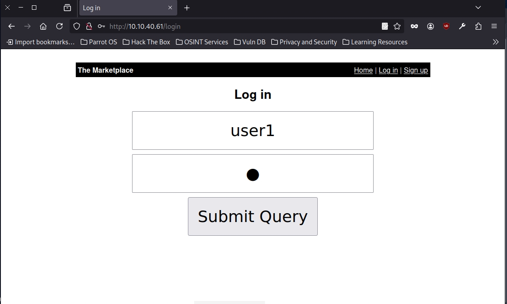
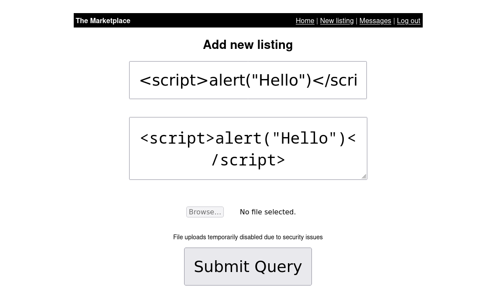
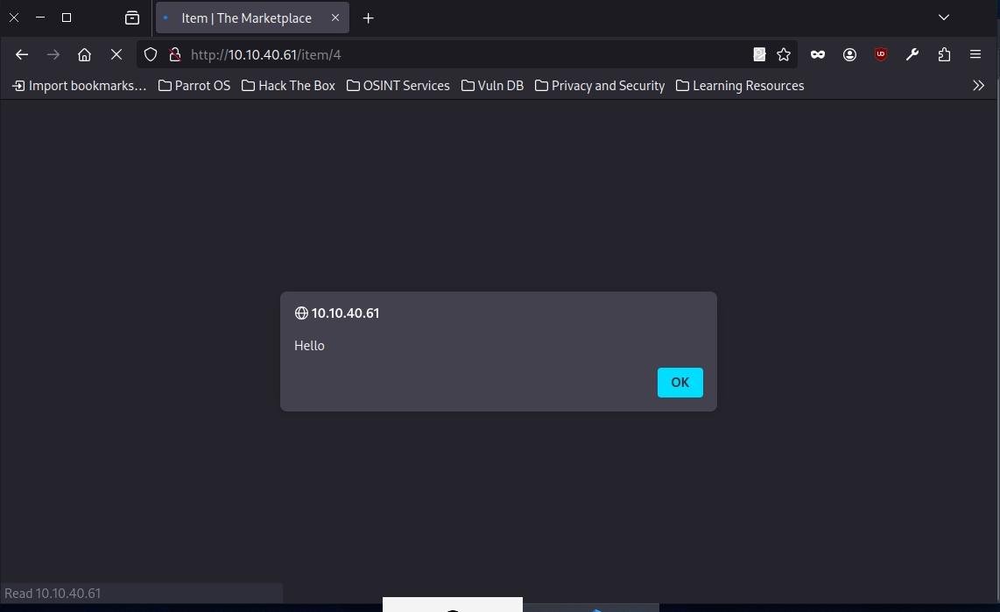
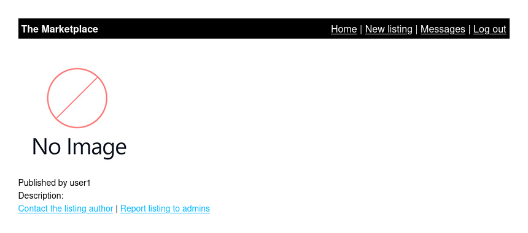
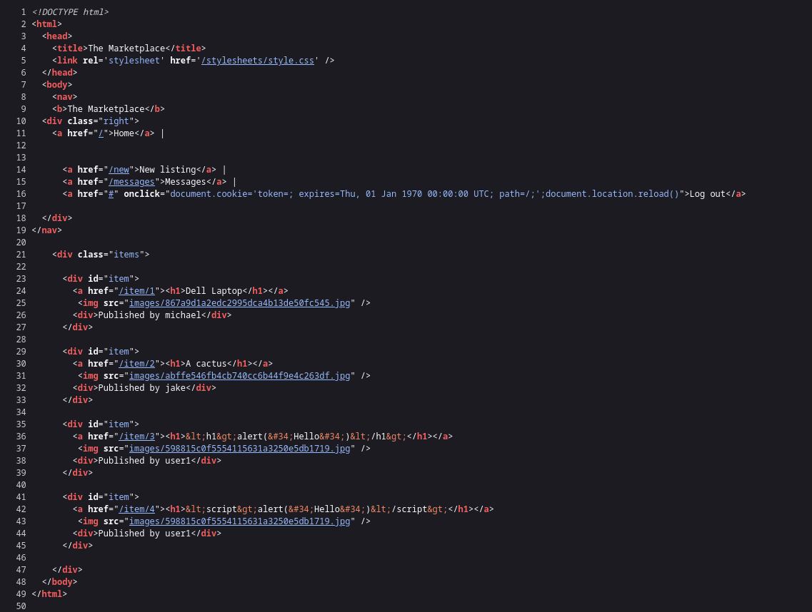
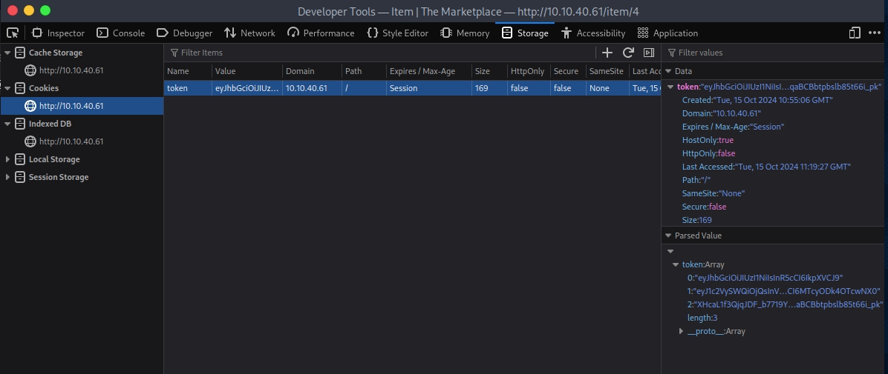

Difficult: Medium
------------------------------------------
Note: The sysadmin of The Marketplace, Michael, has given you access to an internal server of his, so you can pentest the marketplace platform he and his team has been working on. 
He said it still has a few bugs he and his team need to iron out.
Can you take advantage of this and will you be able to gain root access on his server?
------------------------------------------

Reconnaissance:
+ Scan NMAP:
```bash
	nmap -sV -vv -A -p- <IP>
	PORT      STATE SERVICE REASON         VERSION
	22/tcp    open  ssh     syn-ack ttl 63 OpenSSH 7.6p1 Ubuntu 4ubuntu0.3 (Ubuntu Linux; protocol
	 2.0)
	| ssh-hostkey: 
	|   2048 c8:3c:c5:62:65:eb:7f:5d:92:24:e9:3b:11:b5:23:b9 (RSA)
	| ssh-rsa AAAAB3NzaC1yc2EAAAADAQABAAABAQDLj5F//uf40JILlSfWp95GsOiuwSGSKLgbFmUQOACKAdzVcGOteVr3
	lFn7vBsp6xWM5iss8APYi9WqKpPQxQLr2jNBybW6qrNfpUMVH2lLcUHkiHkFBpEoTP9m/6P9bUDCe39aEhllZOCUgEtmLp
	dKl7OA3tVjhthrNHNPW+LVfkwlBgxGqnRWxlY6XtlsYEKfS1B+wODrcVwUxOHthDps/JMDUvkQUfgf/jpy99+twbOI1OZb
	CYGJFtV6dZoRqsp1Y4BpM3VjSrrvV0IzYThRdssrSUgOnYrVOZl8MrjMFAxOaFbTF2bYGAS/T68/JxVxktbpGN/1iOrq3L
	RhxbF1
	|   256 06:b7:99:94:0b:09:14:39:e1:7f:bf:c7:5f:99:d3:9f (ECDSA)
	| ecdsa-sha2-nistp256 AAAAE2VjZHNhLXNoYTItbmlzdHAyNTYAAAAIbmlzdHAyNTYAAABBBHyTgq5FoUG3grC5KNPA
	uPWDfDbnaq1XPRc8j5/VkmZVpcGuZaAjJibb9RVHDlbiAfVxO2KYoOUHrpIRzKhjHEE=
	|   256 0a:75:be:a2:60:c6:2b:8a:df:4f:45:71:61:ab:60:b7 (ED25519)
	|_ssh-ed25519 AAAAC3NzaC1lZDI1NTE5AAAAIA2ol/CJc6HIWgvu6KQ7lZ6WWgNsTk29bPKgkhCvG2Ar
	80/tcp    open  http    syn-ack ttl 62 nginx 1.19.2
	| http-methods: 
	|_  Supported Methods: POST OPTIONS
	|_http-title: The Marketplace
	|_http-server-header: nginx/1.19.2
	| http-robots.txt: 1 disallowed entry 
	|_/admin
	32768/tcp open  http    syn-ack ttl 62 Node.js (Express middleware)
	| http-methods: 
	|_  Supported Methods: HEAD OPTIONS
	|_http-title: The Marketplace

```

+ Scan Gobuster:
```bash
	gobuster dir -u http://<IP>/ -w /usr/share/wordlists/dirb/common.txt -xtxt -t64
	===============================================================
	/admin                (Status: 403) [Size: 392]
	/Admin                (Status: 403) [Size: 392]
	/ADMIN                (Status: 403) [Size: 392]
	/images               (Status: 301) [Size: 179] [--> /images/]
	/login                (Status: 200) [Size: 857]
	/Login                (Status: 200) [Size: 857]
	/messages             (Status: 302) [Size: 28] [--> /login]
	/new                  (Status: 302) [Size: 28] [--> /login]
	/robots.txt           (Status: 200) [Size: 31]
	/robots.txt           (Status: 200) [Size: 31]
	/signup               (Status: 200) [Size: 667]
	/stylesheets          (Status: 301) [Size: 189] [--> /stylesheets/]
	Progress: 9228 / 9230 (99.98%)
	===============================================================
	Finished
	===============================================================

```

+ First, we will sign up to create a new account.
+ Create new USER "username:user1 & password:1"
+ Log in /Login with the credential which is created.



+ After Login successful, we can look around the web page and we find some new page like /messages and /new.
+ Check each page /new we have the page 'Add new listing' with blank fields 'Title' and 'Description'.
+ In the situation, we can try some tag html like script, h1,...





--> Bingo! The pop up message appear. We found the security vulnerability XSS
(Cross-Site Scripting).

+ Back to the home page we see the page list which we created. Go inside the page /item, we have 2 features: 



+ Feature 1: Contact with the author, we will send message to current user and that is user1.
+ Feature 2: Report to admins and the message report will be sent to admin.

--> We think some ideas that we can inject XSS vuln to retrive some sensitive information about the Admin.

+ View page source:


--> We know that we can exploit XSS base cookie or sensitive access token with "document.cookie" and "document.location"

+ Open "Developer Tools" or use Burpsuite:



--> We recive the token with value encoded. Decode the value we know that is the information user1.

+ We can manipulate cookie token by XSS to grant admin and access /admin.


```bash
sqlmap -r request.txt --dbms=mysql --dump
# -r uses the intercepted request you saved earlier
# --dbms tells SQLMap what type of database management system it is
# --dump attempts to outputs the entire database
```


